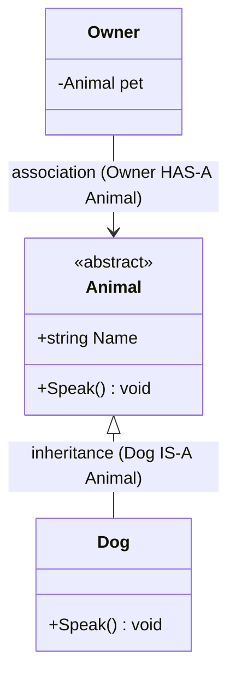
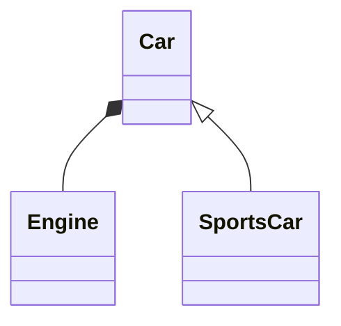

# What Are Design Patterns?

## 🧠 Intuition

A design pattern is a **named, reusable solution to a problem that keeps coming up** in software
design. It's not code you copy-paste — it's a *recipe*, a description of how to arrange classes and
objects to solve a recurring problem.

> 💡 **Analogy — architecture.** A builder doesn't reinvent "how to make a doorway" each time —
> there's a known, proven way (a frame, a lintel, a door). Design patterns are those proven
> arrangements for software. When two developers say "let's use a Strategy here," they've
> communicated an entire design in two words.

Patterns came from the 1994 book *Design Patterns* by the "Gang of Four" (GoF), which cataloged 23
patterns. They give you (1) **proven solutions** so you don't reinvent flawed ones, and (2) a
**shared vocabulary** so teams can discuss design quickly.

> ⚠️ Patterns are a tool, not a goal. Forcing a pattern where simple code would do is itself a
> mistake (see [Anti-Patterns](../05-Practice-and-Beyond/01.Anti-Patterns.md)). Learn the *problem*
> each one solves, and apply it only when you have that problem.

## 📐 The Three Categories

The GoF patterns split into three families by *what they're about*:

| Category | About | Question it answers | Examples |
|----------|-------|---------------------|----------|
| **Creational** | Object creation | "How do I create objects flexibly?" | Factory, Builder, Singleton |
| **Structural** | Object composition | "How do I assemble objects into bigger structures?" | Adapter, Decorator, Composite |
| **Behavioral** | Object interaction | "How do objects communicate and divide responsibility?" | Strategy, Observer, Command |

This course adds a fourth practical group — [Modern & Enterprise](../04-Modern-and-Enterprise/README.md)
(Dependency Injection, CQRS, …) — patterns that postdate GoF but are everyday tools for senior devs.

## 🧾 How to Read a UML Class Diagram

Every pattern file shows a **Mermaid class diagram**. You need to read three things: classes,
their members, and the *relationships* (the arrows). Here's the whole vocabulary you need:

| Symbol | Meaning | Read as |
|--------|---------|---------|
| `<|--` | Inheritance / implementation | "is a" (Dog **is an** Animal) |
| `-->` | Association | "has a" / "uses a" |
| `o--` | Aggregation | "has a" (weak; parts can outlive the whole) |
| `*--` | Composition | "owns a" (strong; parts die with the whole) |
| `..>` | Dependency | "depends on" (uses temporarily) |
| `+` / `-` / `#` | public / private / protected | member visibility |
| `<<interface>>` `<<abstract>>` | stereotypes | the kind of type |

That's enough to read every diagram in this course. **Inheritance arrow = "is-a"**, plain arrow =
"has-a/uses-a" — those two carry 90% of the meaning.

## ⚖️ Why Learn Patterns (and the honest caveats)

**Pros**
- Proven, tested solutions — fewer design mistakes.
- A shared vocabulary that makes design discussions fast.
- They push you toward flexible, decoupled code (most embody [SOLID](03.SOLID-Principles.md)).

**Cons / cautions**
- **Over-engineering:** applying patterns you don't need adds complexity. Simple code beats a
  clever pattern that isn't required.
- **Cargo-culting:** using a pattern because it's "best practice" without understanding the problem.
- Some classic patterns are partly obsolete in modern languages (e.g. Iterator is built into
  `IEnumerable`/`foreach`).

## 🌍 You've Already Used Patterns

- `foreach` over a collection → **Iterator**.
- C# `event`/`delegate` → **Observer**.
- `IComparer<T>` passed to `List.Sort` → **Strategy**.
- ASP.NET Core's service container → **Dependency Injection**.
- `Stream` wrapping (`GZipStream` over `FileStream`) → **Decorator**.

Patterns aren't exotic — they formalize things good code already does.

## 🎯 Practice (with full solutions)

### 1. Categorize the pattern — `Easy`
**Task:** For each, name the category (Creational / Structural / Behavioral):
(a) Builder, (b) Observer, (c) Adapter, (d) Singleton, (e) Strategy, (f) Composite.
**Solution:** (a) Creational, (b) Behavioral, (c) Structural, (d) Creational, (e) Behavioral,
(f) Structural.
**Why it matters:** the category tells you the *kind* of problem a pattern addresses — your first
filter when choosing one.

### 2. Read the diagram — `Easy`
**Task:** In the diagram below, what's the relationship between `Car` and `Engine`, and between
`SportsCar` and `Car`?

**Solution:** `Car *-- Engine` is **composition** — a Car *owns* an Engine (the engine doesn't
exist without the car). `Car <|-- SportsCar` is **inheritance** — a SportsCar **is a** Car.
**Why it matters:** distinguishing "is-a" (inheritance) from "has-a" (composition) is the single
most important reading skill — and the heart of [composition over inheritance](04.Composition-and-Principles.md).

## ✅ Key Takeaways

- A pattern is a **named, reusable solution** to a recurring design problem — a recipe, not code.
- They provide **proven solutions** and a **shared vocabulary**.
- Three GoF categories: **Creational** (creation), **Structural** (composition), **Behavioral**
  (interaction).
- Read UML: **`<|--` = is-a (inheritance)**, **`-->`/`*--`/`o--` = has-a (association/composition/
  aggregation)**.
- Patterns are tools — **don't force them**; learn the problem each solves.

**Self-check:**
1. What two big benefits do design patterns provide?
2. Which UML arrow means "is-a," and which means "has-a"?
3. Why can applying a pattern sometimes make code *worse*?

---
◀ Prev: [Module index](README.md) · ▲ [Module index](README.md) · ▶ Next: [OOP Recap](02.OOP-Recap.md)
