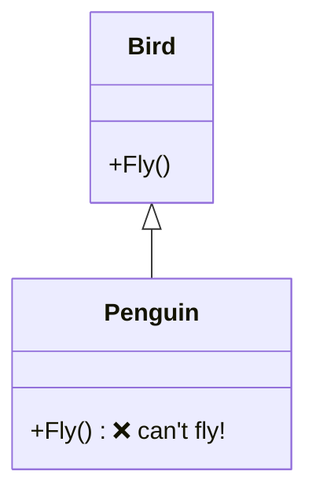

# Composition Over Inheritance & Core Principles

> The mindset that makes patterns click: **assemble behavior from parts** rather than inheriting it.

## 🧠 Intuition

Inheritance looks like the obvious reuse tool — "a SportsCar is a Car, so inherit." But deep
inheritance trees become rigid: a subclass is welded to its parent forever, and you can only pick
*one* parent. **Composition** — building an object out of other objects it *holds* — is far more
flexible. You can swap parts at runtime and mix capabilities freely.

> 💡 **Analogy — LEGO vs a carved statue.** Inheritance is carving from one block: change your mind
> and you start over. Composition is LEGO: snap parts together, swap a piece anytime, reuse pieces
> across models. Most patterns are LEGO thinking.

The GoF stated two guiding principles that the whole book (and this course) rests on:
1. **Program to an interface, not an implementation.**
2. **Favor object composition over class inheritance.**

## 📐 Why Composition Wins

### The inheritance trap



A `Penguin : Bird` inherits `Fly()` — but penguins can't fly. You're forced to override it to throw
or do nothing (an [LSP](03.SOLID-Principles.md) violation). Inheritance locked you into a wrong
"is-a." With many behaviors (can fly? can swim? can sing?), inheritance **explodes
combinatorially** — you'd need a subclass for every combination.

### The composition fix

```csharp
// Behaviors as swappable parts (interfaces)
interface IFlyBehavior { void Fly(); }
class CanFly : IFlyBehavior { public void Fly() => Console.WriteLine("flap flap"); }
class CannotFly : IFlyBehavior { public void Fly() => Console.WriteLine("...stays grounded"); }

class Bird {
    private IFlyBehavior fly;                       // HAS-A behavior (composition)
    public Bird(IFlyBehavior fly) => this.fly = fly;
    public void PerformFly() => fly.Fly();
    public void SetFly(IFlyBehavior f) => fly = f;  // swap at RUNTIME — impossible with inheritance
}

var eagle = new Bird(new CanFly());
var penguin = new Bird(new CannotFly());           // no contradiction, no override-to-throw
```

This is literally the [Strategy](../03-Behavioral/01.Strategy.md) pattern — and it's why "favor
composition" and most behavioral patterns are the same idea.

| | Inheritance | Composition |
|--|-------------|-------------|
| Coupling | Tight (subclass bound to parent) | Loose (depends on an interface) |
| Change behavior at runtime | No | **Yes** (swap the part) |
| Combine behaviors | Combinatorial explosion | Mix freely |
| Relationship | "is-a" | "has-a" / "uses-a" |

**Use inheritance** when there's a genuine, stable "is-a" *and* you want to share code (e.g.
[Template Method](../03-Behavioral/04.Template-Method.md)). **Use composition** for behavior that
varies or might change — which is most of the time.

## 🧾 The Supporting Principles (DRY, KISS, YAGNI)

| Principle | Means | Watch out for |
|-----------|-------|---------------|
| **DRY** — Don't Repeat Yourself | Each piece of knowledge lives in one place | Over-abstracting unrelated code that merely *looks* similar |
| **KISS** — Keep It Simple | Prefer the simplest thing that works | "Clever" code; unnecessary patterns |
| **YAGNI** — You Aren't Gonna Need It | Don't build for imagined future needs | Speculative generality, premature abstraction |

These are the **counterweights** to pattern enthusiasm. Patterns add structure (and complexity);
DRY/KISS/YAGNI remind you to add it **only when the problem demands it**. A pattern applied "just
in case" violates YAGNI and KISS.

## ⚖️ The Balance

- **Composition + program-to-an-interface** → flexible, testable, swappable designs (most patterns).
- **DRY/KISS/YAGNI** → don't over-engineer in the name of flexibility.
- The senior skill is holding both: reach for a pattern when there's *real, present* pain; otherwise
  keep it simple.

## 🚫 Common Mistakes

```csharp
// ❌ Inheriting to reuse code when there's no real "is-a"
class EmailList : List<string> { }          // an EmailList is NOT a List<string>
// ✅ compose
class EmailList {
    private readonly List<string> emails = new();
    public void Add(string e) { /* validate */ emails.Add(e); }
}

// ❌ YAGNI violation: a factory + 3 interfaces for a thing that has exactly one implementation
// ✅ start simple; introduce the pattern when a second implementation actually appears
```

## 🎯 Practice (with full solutions)

### 1. Escape the inheritance explosion — `Medium`
**Task:** You have `Coffee`. Customers can add Milk, Sugar, Whip in any combination. The naive
design makes a subclass per combo (`CoffeeWithMilk`, `CoffeeWithMilkAndSugar`, …). Fix it.
**Solution:** Compose add-ons by **wrapping** instead of subclassing — each add-on holds a coffee
and adds to it. (This is the [Decorator](../02-Structural/03.Decorator.md) pattern.)
```csharp
interface ICoffee { string Desc(); decimal Cost(); }
class Espresso : ICoffee { public string Desc() => "espresso"; public decimal Cost() => 2m; }
abstract class AddOn : ICoffee {
    protected readonly ICoffee inner;
    protected AddOn(ICoffee inner) => this.inner = inner;
    public abstract string Desc(); public abstract decimal Cost();
}
class Milk : AddOn {
    public Milk(ICoffee c) : base(c) {}
    public override string Desc() => inner.Desc() + " + milk";
    public override decimal Cost() => inner.Cost() + 0.5m;
}
// Any combination by composing: new Milk(new Sugar(new Espresso()))
```
**Why it matters:** composition turns an exponential class explosion into linear, mix-and-match parts.

### 2. Inheritance or composition? — `Easy`
**Task:** For each, choose: (a) `Manager` and `Employee`; (b) a `Car` and its `Engine`;
(c) a `Logger` capability used by many unrelated classes.
**Solution:** (a) **inheritance** — a Manager genuinely *is an* Employee with shared data/behavior;
(b) **composition** — a Car *has an* Engine; (c) **composition/interface** — inject an `ILogger`,
since logging is a capability unrelated to identity.
**Why it matters:** "is-a" → inheritance; "has-a"/capability → composition. This single decision
drives most design quality.

## ✅ Key Takeaways

- **Favor composition over inheritance**: it's loosely coupled, runtime-swappable, and avoids the
  subclass explosion.
- **Program to an interface, not an implementation** — the GoF motto behind most patterns.
- Use **inheritance** only for a real, stable "is-a" with shared code.
- **DRY/KISS/YAGNI** are the counterweights: add patterns/abstraction only for *real, present* pain.

**Self-check:**
1. Why does composition allow changing behavior at runtime when inheritance can't?
2. What does "program to an interface" mean in practice?
3. How do YAGNI and KISS protect you from misusing patterns?

---
◀ Prev: [SOLID Principles](03.SOLID-Principles.md) · ▲ [Module index](README.md) · ▶ Next module: [01 — Creational](../01-Creational/01.Factory-Method.md)
