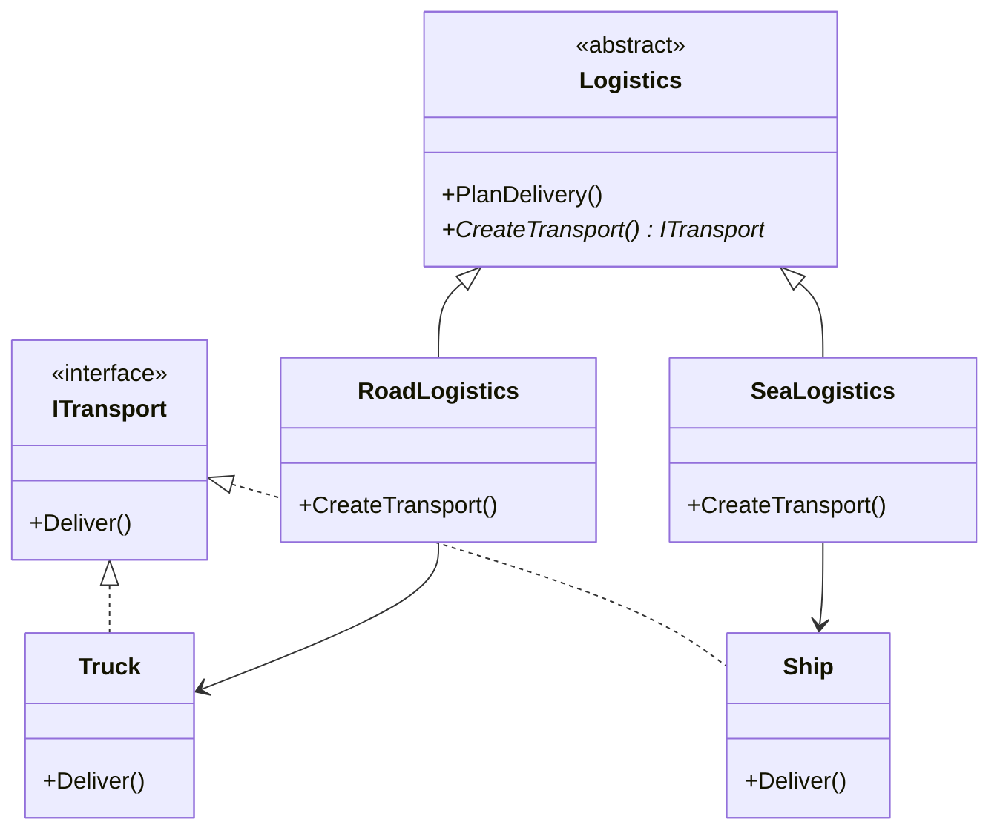

# Factory Method: Let Subclasses Decide What to Create

> **Intent:** Define an interface for creating an object, but let subclasses decide which class to
> instantiate.

## 🧠 Intuition

When code says `new Truck()`, it's permanently tied to the `Truck` class. The Factory Method
pattern moves that decision behind a method that subclasses override — so the *base* code says "I
need *a transport*, whatever kind" and the *subclass* decides it's a Truck or a Ship.

> 💡 **Analogy — a logistics company.** Head office plans deliveries the same way regardless of
> vehicle. The road division supplies trucks; the sea division supplies ships. The planning process
> is shared; *which vehicle* is decided by the division (the subclass).

## 🎯 The Problem

You start with road delivery and `new Truck()` scattered through your shipping logic. Then sea
delivery arrives:

```csharp
// ❌ Before: creation logic welded to concrete classes, repeated everywhere
class Logistics {
    public void PlanDelivery(string mode) {
        if (mode == "road") { var t = new Truck(); t.Deliver(); }
        else if (mode == "sea") { var s = new Ship(); s.Deliver(); }
        // every new transport type → edit this method (violates Open/Closed)
    }
}
```

Each new transport forces edits to this method — and similar `if/else` ladders appear everywhere
transports are created.

## 📐 Structure



**Participants:** `Product` (ITransport) — the interface of created objects · `Creator` (Logistics)
— declares the abstract factory method and uses its result · `ConcreteCreator` (Road/SeaLogistics)
— overrides the factory method to return a specific product.

## 💻 C# Implementation

```csharp
public interface ITransport { void Deliver(); }

public class Truck : ITransport { public void Deliver() => Console.WriteLine("Deliver by road"); }
public class Ship  : ITransport { public void Deliver() => Console.WriteLine("Deliver by sea"); }

public abstract class Logistics {
    public abstract ITransport CreateTransport();      // the factory method

    public void PlanDelivery() {                        // shared logic, no concrete types
        var transport = CreateTransport();
        Console.WriteLine("Planning route...");
        transport.Deliver();
    }
}

public class RoadLogistics : Logistics {
    public override ITransport CreateTransport() => new Truck();
}
public class SeaLogistics : Logistics {
    public override ITransport CreateTransport() => new Ship();
}

// Usage — pick the creator; the rest of the code never names a concrete transport
Logistics logistics = new SeaLogistics();
logistics.PlanDelivery();        // Planning route... / Deliver by sea
```

Adding "air delivery" now means writing `AirLogistics` + `Plane` — **no existing code changes**.

## ⚖️ Trade-offs

**Pros:** decouples creation from use (Open/Closed); creation logic in one overridable place;
easy to add new products.
**Cons:** introduces a parallel hierarchy of creators — more classes; overkill if you only ever
have one product type.

## ✅ When to Use / 🚫 When to Avoid

- **Use when** a class can't anticipate which concrete type it must create, or you want subclasses
  to specify it; when you want to localize creation logic.
- **Avoid when** object creation is trivial and stable — a plain `new` is fine. Don't build a
  creator hierarchy for a single product (YAGNI).
- **Misuse:** wrapping every `new` in a factory "for flexibility" you never use → needless classes.

## 🔗 Related Patterns

- **[Abstract Factory](02.Abstract-Factory.md):** creates *families* of related products; often
  implemented *with* factory methods. (Factory Method = one product; Abstract Factory = a family.)
- **[Template Method](../03-Behavioral/04.Template-Method.md):** Factory Method is often a step
  inside a template method (`PlanDelivery` above is essentially that).

## 🌍 Real-World & .NET Examples

- `System.Data.Common.DbProviderFactory` — creates provider-specific connections/commands.
- `ILoggerFactory.CreateLogger(...)` in .NET.
- Cross-platform UI toolkits creating platform-specific controls.

## 🎯 Practice (with full solutions)

### 1. Replace a creation `switch` — `Easy`
**Smelly code:**
```csharp
class DialogService {
    public IButton CreateButton(string os) {
        if (os == "win") return new WindowsButton();
        if (os == "mac") return new MacButton();
        throw new NotSupportedException();
    }
}
```
**Task:** refactor so adding a new OS doesn't touch existing code.
**Solution:** make `Dialog` abstract with a `CreateButton()` factory method; one subclass per OS.
```csharp
abstract class Dialog {
    public abstract IButton CreateButton();          // factory method
    public void Render() => CreateButton().Render();  // shared logic
}
class WindowsDialog : Dialog { public override IButton CreateButton() => new WindowsButton(); }
class MacDialog     : Dialog { public override IButton CreateButton() => new MacButton(); }
```
**Why it's better:** new OS = new subclass; `Render()` and existing dialogs are untouched (OCP).

### 2. Parameterized factory variant — `Medium`
**Scenario:** You want a single entry point that returns the right `IDocument` exporter by format
without the caller knowing concrete classes.
**Solution:** a simple (parameterized) factory method — pragmatic when a full creator hierarchy is
overkill:
```csharp
static class DocumentFactory {
    public static IExporter Create(string format) => format switch {
        "pdf"  => new PdfExporter(),
        "html" => new HtmlExporter(),
        _ => throw new NotSupportedException(format)
    };
}
```
**Why it's better:** callers depend only on `IExporter`; creation knowledge lives in one place.
(Note: this *static* form is simpler than classic Factory Method — use it when you don't need
subclassable creators. Knowing *which* to use is the real skill.)

## ✅ Key Takeaways

- Factory Method puts object creation behind an **overridable method** so subclasses choose the type.
- It upholds **Open/Closed**: add a product + creator without editing existing code.
- Cost is a **parallel creator hierarchy**; don't use it for trivial, stable creation.
- A simpler **static/parameterized factory** often suffices — pick the lightest tool.

**Self-check:**
1. What decision does Factory Method defer, and to whom?
2. How does it satisfy the Open/Closed Principle?
3. How does it differ from Abstract Factory?

---
◀ Prev: [Module index](README.md) · ▲ [Module index](README.md) · ▶ Next: [Abstract Factory](02.Abstract-Factory.md)
