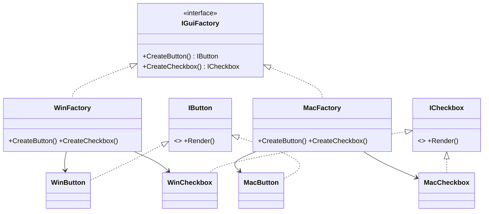

# Abstract Factory: Create Families of Related Objects

> **Intent:** Provide an interface for creating *families* of related objects without specifying
> their concrete classes.

## 🧠 Intuition

Sometimes objects must be used together as a consistent set. A "modern" UI needs a modern button
*and* a modern checkbox *and* a modern scrollbar — mixing a modern button with a retro checkbox
looks broken. An Abstract Factory produces a whole **family** of matching products, guaranteeing
they belong together.

> 💡 **Analogy — IKEA furniture lines.** The "Malm" line gives you a matching bed, dresser, and
> nightstand. You pick the *line* (the factory) and everything you get matches. Switch to the
> "Hemnes" line and you get a different, internally-consistent set.

Where [Factory Method](01.Factory-Method.md) makes *one* product, Abstract Factory makes a
**coordinated set** of them.

## 🎯 The Problem

You build a cross-platform app. Creating widgets directly couples you to one OS and risks mixing
styles:

```csharp
// ❌ Before: concrete, OS-specific, and easy to mix incompatible widgets
class Form {
    public void Build(string os) {
        IButton btn   = os == "win" ? new WinButton()   : new MacButton();
        ICheckbox chk = os == "win" ? new WinCheckbox() : new MacCheckbox();
        // nothing stops a future edit from pairing WinButton with MacCheckbox by mistake
    }
}
```

## 📐 Structure



**Participants:** `AbstractFactory` (IGuiFactory) — declares creators for each product in the
family · `ConcreteFactory` (Win/MacFactory) — produces one consistent family · `AbstractProducts`
(IButton, ICheckbox) · `ConcreteProducts` (WinButton, MacButton, …).

## 💻 C# Implementation

```csharp
public interface IButton { void Render(); }
public interface ICheckbox { void Render(); }

public class WinButton : IButton { public void Render() => Console.WriteLine("[Win Button]"); }
public class MacButton : IButton { public void Render() => Console.WriteLine("(Mac Button)"); }
public class WinCheckbox : ICheckbox { public void Render() => Console.WriteLine("[x] Win"); }
public class MacCheckbox : ICheckbox { public void Render() => Console.WriteLine("(x) Mac"); }

public interface IGuiFactory {                 // the abstract factory
    IButton CreateButton();
    ICheckbox CreateCheckbox();
}
public class WinFactory : IGuiFactory {        // one consistent family
    public IButton CreateButton() => new WinButton();
    public ICheckbox CreateCheckbox() => new WinCheckbox();
}
public class MacFactory : IGuiFactory {
    public IButton CreateButton() => new MacButton();
    public ICheckbox CreateCheckbox() => new MacCheckbox();
}

// Client depends ONLY on the abstract factory + abstract products — guaranteed-matching set
public class Form {
    private readonly IButton button;
    private readonly ICheckbox checkbox;
    public Form(IGuiFactory factory) {
        button = factory.CreateButton();
        checkbox = factory.CreateCheckbox();   // can't accidentally mix families
    }
    public void Render() { button.Render(); checkbox.Render(); }
}

// Usage — choose the family once
IGuiFactory factory = OperatingSystem.IsWindows() ? new WinFactory() : new MacFactory();
new Form(factory).Render();
```

## ⚖️ Trade-offs

**Pros:** guarantees products from one family are used together; isolates concrete classes; swap an
entire family by changing one factory.
**Cons:** adding a **new product type** to the family means changing the factory interface and
*every* concrete factory — that's rigid. Lots of classes/interfaces.

## ✅ When to Use / 🚫 When to Avoid

- **Use when** your system must work with multiple *families* of related products and you must
  enforce that products from the same family are used together (UI themes, cross-platform, DB
  providers).
- **Avoid when** there's only one family, or product types change often (the factory interface
  churns). Don't reach for it before a second family actually exists (YAGNI).

## 🔗 Related Patterns

- **[Factory Method](01.Factory-Method.md):** Abstract Factory's methods are usually factory
  methods. Factory Method = one product; Abstract Factory = a family of them.
- **[Builder](03.Builder.md):** Builder constructs one complex object step-by-step; Abstract
  Factory returns several finished related objects.
- Often implemented as a **[Singleton](05.Singleton.md)** (one factory instance).

## 🌍 Real-World & .NET Examples

- `DbProviderFactory` — creates a matching `DbConnection`, `DbCommand`, `DbParameter` family per
  database provider.
- UI theming systems (light/dark widget families).
- Cross-platform rendering backends (DirectX vs OpenGL object families).

## 🎯 Practice (with full solutions)

### 1. Enforce a matching family — `Medium`
**Scenario:** A game has two themes: "Forest" (GrassTile + OrcEnemy) and "Desert" (SandTile +
ScorpionEnemy). Code currently `new`s tiles and enemies separately, and a bug paired a SandTile
with an OrcEnemy. Refactor so a theme always produces matching pieces.
**Solution:**
```csharp
interface ITile { } interface IEnemy { }
class GrassTile : ITile {} class OrcEnemy : IEnemy {}
class SandTile  : ITile {} class ScorpionEnemy : IEnemy {}

interface ILevelFactory { ITile CreateTile(); IEnemy CreateEnemy(); }
class ForestFactory : ILevelFactory {
    public ITile CreateTile() => new GrassTile();
    public IEnemy CreateEnemy() => new OrcEnemy();
}
class DesertFactory : ILevelFactory {
    public ITile CreateTile() => new SandTile();
    public IEnemy CreateEnemy() => new ScorpionEnemy();
}
class Level {
    public Level(ILevelFactory f) { var tile = f.CreateTile(); var enemy = f.CreateEnemy(); }
}
```
**Why it's better:** the theme is chosen once; mismatched pairings become *impossible* by
construction.

### 2. Spot when it's the wrong tool — `Easy`
**Task:** You only ever create a single `IButton` (no related products, one platform). Should you
use Abstract Factory?
**Solution:** No. With one product and one family there's no "family" to coordinate — a
[Factory Method](01.Factory-Method.md) or a plain `new` is simpler. Abstract Factory here is
over-engineering (violates YAGNI/KISS).
**Why it matters:** Abstract Factory's value is *coordinating multiple related products* — without
that, it's just extra classes.

## ✅ Key Takeaways

- Abstract Factory creates **families of related objects** that are guaranteed to match.
- Swap the whole family by swapping one concrete factory; clients stay decoupled from concretions.
- Adding a **new product to the family** is expensive (changes the interface + all factories).
- Use only when **multiple coordinated families** genuinely exist.

**Self-check:**
1. How does Abstract Factory differ from Factory Method?
2. What does it guarantee about the products it returns?
3. Why is adding a new *product type* (not family) hard?

---
◀ Prev: [Factory Method](01.Factory-Method.md) · ▲ [Module index](README.md) · ▶ Next: [Builder](03.Builder.md)
