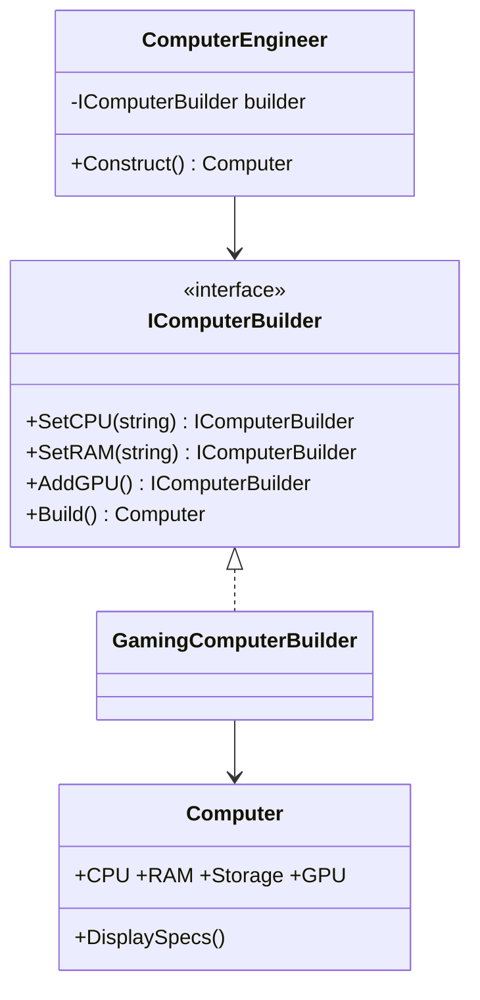

# Builder: Construct Complex Objects Step by Step

> **Intent:** Separate the construction of a complex object from its representation, so the same
> process can build different results.

## 🧠 Intuition

Some objects have many parts, many of them optional. Cramming them all into a constructor gives you
the dreaded *telescoping constructor* — `new Pizza(12, true, false, true, false, true, "thin")` —
unreadable and error-prone. A Builder lets you construct the object **one named step at a time**,
then hand back the finished product.

> 💡 **Analogy — ordering a custom burger.** You don't shout one giant sentence with every option.
> You build it up: "add cheese… add bacon… no onions… extra sauce… done." Each step is clear, and
> you only mention what you want.

## 🎯 The Problem

```csharp
// ❌ Before: telescoping constructors — which bool is which? what's optional?
var pc1 = new Computer("i9", "32GB", "2TB", true, false, true);   // unreadable
var pc2 = new Computer("i5", "16GB", "512GB");                     // overload explosion
// Every optional combo needs another constructor overload, or a wall of nullable params.
```

## 📐 Structure



**Participants:** `Product` (Computer) — the complex object · `Builder` (IComputerBuilder) — steps
to build parts · `ConcreteBuilder` — implements the steps and tracks the product · `Director`
(optional) — encapsulates a reusable build sequence.

## 💻 C# Implementation

### Fluent builder (the most common modern form)

```csharp
public class Computer {
    public string CPU, RAM, Storage;
    public bool GPU;
    public void DisplaySpecs() => Console.WriteLine($"{CPU} / {RAM} / {Storage} / GPU:{GPU}");
}

public class ComputerBuilder {
    private readonly Computer pc = new();
    public ComputerBuilder SetCPU(string cpu) { pc.CPU = cpu; return this; }   // return this → chaining
    public ComputerBuilder SetRAM(string ram) { pc.RAM = ram; return this; }
    public ComputerBuilder SetStorage(string s) { pc.Storage = s; return this; }
    public ComputerBuilder AddGPU() { pc.GPU = true; return this; }
    public Computer Build() => pc;
}

// Usage — readable, only set what you want, order-independent
var gamingPc = new ComputerBuilder()
    .SetCPU("Ryzen 9").SetRAM("64GB").SetStorage("4TB").AddGPU()
    .Build();
gamingPc.DisplaySpecs();
```

### Director (optional) — reuse a fixed recipe

```csharp
public class ComputerEngineer {
    private readonly ComputerBuilder builder;
    public ComputerEngineer(ComputerBuilder b) => builder = b;
    public Computer BuildOfficePc() =>
        builder.SetCPU("i5").SetRAM("16GB").SetStorage("512GB").Build();   // no GPU
}
```

## ⚖️ Trade-offs

**Pros:** readable step-by-step construction; avoids telescoping constructors; can enforce
validation in `Build()`; the same builder can produce variants; great for immutable objects.
**Cons:** more code than a constructor; overkill for simple objects; a half-built builder can be in
an incomplete state until `Build()`.

## ✅ When to Use / 🚫 When to Avoid

- **Use when** an object has many parameters (especially optional ones), needs step-by-step or
  validated construction, or you want a fluent/readable creation API.
- **Avoid when** the object has a few required fields — a constructor or object initializer is
  simpler. Don't add a builder "just in case" (YAGNI).
- **Misuse:** a builder for a 2-field DTO; or a builder whose `Build()` doesn't validate, letting
  invalid objects through.

## 🔗 Related Patterns

- **[Abstract Factory](02.Abstract-Factory.md):** returns a product immediately; Builder constructs
  it gradually and returns it at the end.
- **[Factory Method](01.Factory-Method.md):** one call vs many steps.
- C# **object initializers** (`new Computer { CPU = "i9" }`) cover simple cases without a builder.

## 🌍 Real-World & .NET Examples

- `StringBuilder` (append step by step, then `ToString()`).
- ASP.NET Core's `WebApplicationBuilder` / `HostBuilder` (fluent configuration).
- EF Core's fluent `ModelBuilder`; LINQ query building.

## 🎯 Practice (with full solutions)

### 1. Kill the telescoping constructor — `Medium`
**Smelly code:**
```csharp
class Pizza {
    public Pizza(int size, bool cheese, bool pepperoni, bool mushrooms, bool olives) { /*...*/ }
}
var p = new Pizza(12, true, false, true, false);   // what do these booleans mean?!
```
**Task:** make construction readable and optional-friendly.
**Solution:** a fluent builder:
```csharp
class Pizza { public int Size; public List<string> Toppings = new(); }
class PizzaBuilder {
    private readonly Pizza p = new();
    public PizzaBuilder Size(int s) { p.Size = s; return this; }
    public PizzaBuilder Add(string topping) { p.Toppings.Add(topping); return this; }
    public Pizza Build() {
        if (p.Size == 0) throw new InvalidOperationException("size required"); // validate here
        return p;
    }
}
var pizza = new PizzaBuilder().Size(12).Add("cheese").Add("mushrooms").Build();
```
**Why it's better:** self-documenting, only specify what you want, and `Build()` validates.

### 2. Add validation/immutability — `Medium`
**Scenario:** A `Url` must always have a scheme and host; port and query are optional. Ensure no
invalid `Url` can exist.
**Solution:** builder collects parts; `Build()` enforces invariants and returns an immutable object:
```csharp
class Url {
    public string Scheme { get; }
    public string Host { get; }
    public int? Port { get; }
    internal Url(string scheme, string host, int? port) { Scheme = scheme; Host = host; Port = port; }
}
class UrlBuilder {
    private string scheme, host; private int? port;
    public UrlBuilder Scheme(string s) { scheme = s; return this; }
    public UrlBuilder Host(string h) { host = h; return this; }
    public UrlBuilder Port(int p) { port = p; return this; }
    public Url Build() {
        if (string.IsNullOrEmpty(scheme) || string.IsNullOrEmpty(host))
            throw new InvalidOperationException("scheme and host are required");
        return new Url(scheme, host, port);
    }
}
```
**Why it's better:** invariants are enforced in one place; the resulting object is immutable and
always valid.

## ✅ Key Takeaways

- Builder constructs complex objects **step by step**, avoiding telescoping constructors.
- The **fluent** form (`return this`) reads naturally; `Build()` is the place to **validate**.
- A **Director** captures reusable construction recipes (optional).
- Great for many/optional parameters and immutable objects; overkill for simple ones.

**Self-check:**
1. What constructor smell does Builder eliminate?
2. Where should validation live in a builder, and why?
3. When is an object initializer enough instead of a builder?

---
◀ Prev: [Abstract Factory](02.Abstract-Factory.md) · ▲ [Module index](README.md) · ▶ Next: [Prototype](04.Prototype.md)
