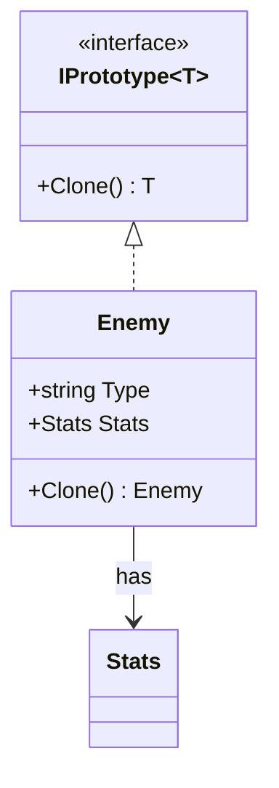

# Prototype: Create New Objects by Cloning Existing Ones

> **Intent:** Create new objects by copying an existing instance (the prototype) instead of
> constructing from scratch.

## 🧠 Intuition

Sometimes building an object from zero is expensive (heavy computation, a database hit, complex
setup) or you simply want a copy of a configured object with a few tweaks. Prototype says: keep one
ready-made instance and **clone** it whenever you need another.

> 💡 **Analogy — a photocopier.** Instead of re-typing a document every time, you keep the original
> and photocopy it, then edit the copy. Far faster than recreating it, and the copy starts from a
> known-good state.

The key subtlety is **deep vs shallow copy**: does the clone share the original's nested objects,
or get its own copies?

## 🎯 The Problem

```csharp
// ❌ Before: rebuilding an expensive, heavily-configured object every time
var enemy1 = new Enemy();
enemy1.LoadModel("orc.mesh");        // slow disk read
enemy1.Configure(/* 20 settings */); // lots of setup
var enemy2 = new Enemy();
enemy2.LoadModel("orc.mesh");        // repeat ALL the expensive work...
enemy2.Configure(/* same 20 settings */);
```

## 📐 Structure



**Participants:** `Prototype` (IPrototype) — declares `Clone()` · `ConcretePrototype` (Enemy) —
implements cloning (deciding deep vs shallow) · `Client` — copies prototypes instead of `new`-ing.

## 💻 C# Implementation

```csharp
public class Stats { public int Health, Attack; }

public class Enemy {
    public string Type;
    public Stats Stats = new();

    // Shallow copy: clone shares the SAME Stats object as the original
    public Enemy ShallowClone() => (Enemy)MemberwiseClone();

    // Deep copy: clone gets its OWN Stats — independent of the original
    public Enemy DeepClone() {
        var copy = (Enemy)MemberwiseClone();
        copy.Stats = new Stats { Health = Stats.Health, Attack = Stats.Attack };
        return copy;
    }
}

// Usage — configure once, clone many
var orcPrototype = new Enemy { Type = "Orc", Stats = new Stats { Health = 100, Attack = 15 } };

var orc1 = orcPrototype.DeepClone();
var orc2 = orcPrototype.DeepClone();
orc2.Stats.Health = 50;            // only orc2 changes — DeepClone gave it its own Stats
```

> **Shallow vs deep is the whole game.** `MemberwiseClone()` copies fields *as-is* — reference-type
> fields end up *shared*. If the clone must be independent, deep-copy the nested objects.

## ⚖️ Trade-offs

**Pros:** cheap creation when construction is expensive; clone configured/runtime state without
knowing the concrete class; reduces subclassing compared to factories in some cases.
**Cons:** **deep cloning is tricky** — circular references, nested mutable objects, events; easy to
introduce shared-state bugs with shallow copies.

## ✅ When to Use / 🚫 When to Avoid

- **Use when** creating an object is costly, or you need many copies of a configured instance, or
  the concrete type is decided at runtime.
- **Avoid when** objects are cheap to construct, or are immutable (just reuse them — no clone
  needed).
- **Misuse:** shallow-cloning objects with mutable nested state and getting spooky shared-state bugs.

## 🔗 Related Patterns

- **[Abstract Factory](02.Abstract-Factory.md)/[Factory Method](01.Factory-Method.md):** alternative
  creation strategies — construct fresh vs copy existing.
- **[Memento](../03-Behavioral/09.Memento.md):** also captures object state, but to restore later
  rather than to spawn copies.
- C#'s `ICloneable` exists but is discouraged (it doesn't specify deep vs shallow) — prefer an
  explicit `Clone()`/copy constructor or a `record` `with` expression.

## 🌍 Real-World & .NET Examples

- `record` types: `var b = a with { Price = 9.99m };` is a built-in shallow-clone-with-changes.
- Object pools / game entity spawning from a template.
- Copying default configuration objects, then tweaking per use.

## 🎯 Practice (with full solutions)

### 1. Fix the shared-state bug — `Medium`
**Smelly code:**
```csharp
class Document { public List<string> Pages = new(); }
var template = new Document();
template.Pages.Add("Cover");
var copy = (Document)template.MemberwiseClone();   // shallow!
copy.Pages.Add("Chapter 1");
// BUG: template.Pages now ALSO contains "Chapter 1" — they share the same list
```
**Task:** make `copy` independent.
**Solution:** deep-clone the list:
```csharp
class Document {
    public List<string> Pages = new();
    public Document DeepClone() {
        var c = (Document)MemberwiseClone();
        c.Pages = new List<string>(Pages);   // own copy of the list
        return c;
    }
}
```
**Why it's better:** the clone owns its own `Pages`; mutating one document no longer corrupts the other.

### 2. Use `record` for copy-with-change — `Easy`
**Scenario:** You have an immutable `Order` and need a copy with a different status.
**Solution:** C# records give Prototype semantics for free:
```csharp
record Order(int Id, string Customer, string Status);
var paid = original with { Status = "Paid" };   // shallow clone + change, original untouched
```
**Why it's better:** zero boilerplate, and immutability sidesteps the shallow-copy pitfalls entirely.

## ✅ Key Takeaways

- Prototype creates objects by **cloning** a configured instance instead of building from scratch.
- The crux is **deep vs shallow copy** — deep-clone nested mutable state to avoid shared-state bugs.
- Great when construction is expensive or you need many copies of a configured object.
- Prefer explicit `Clone()`/copy constructors or `record ... with` over the vague `ICloneable`.

**Self-check:**
1. What's the difference between a shallow and a deep copy, and when does it bite you?
2. When is Prototype preferable to a factory?
3. How do C# records give you Prototype behavior?

---
◀ Prev: [Builder](03.Builder.md) · ▲ [Module index](README.md) · ▶ Next: [Singleton](05.Singleton.md)
