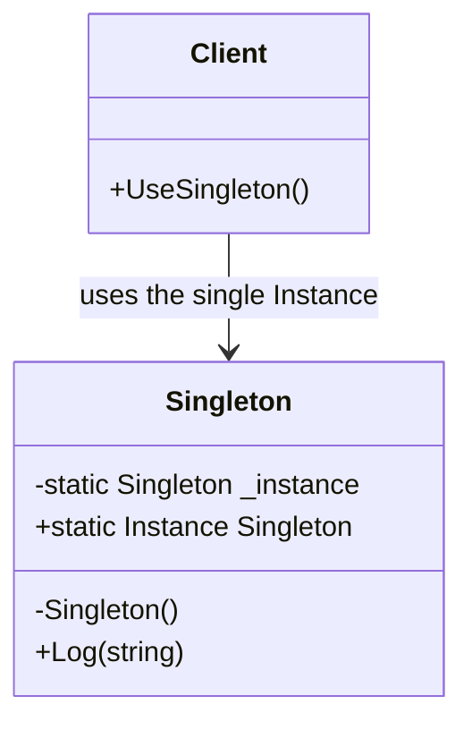

# Singleton: One Instance, Global Access (Handle With Care)

> **Intent:** Ensure a class has only one instance and provide a global point of access to it.

## 🧠 Intuition

Some things should exist exactly once: a single configuration registry, one logger, one connection
pool. Singleton enforces "only one" by hiding the constructor and exposing a single shared instance.

> 💡 **Analogy — a country's government.** There's one official government; everyone refers to *the*
> government, not a new one each time. Singleton is that "there is exactly one, and here's how you
> reach it."

⚠️ **Important up front:** Singleton is the most *over-used and criticized* GoF pattern. It's
essentially a controlled global variable, and globals bring hidden coupling and hard-to-test code.
Modern apps usually get "one instance" from a [DI container](../04-Modern-and-Enterprise/01.Dependency-Injection.md)
instead. Learn it — and learn when *not* to use it.

## 🎯 The Problem

You need a single logger shared everywhere, and creating one is expensive. Passing it through every
constructor is tedious; creating a new one each time wastes resources and scatters state.

## 📐 Structure



**Participants:** `Singleton` — private constructor, a static field holding the sole instance, and a
static accessor (`Instance`). `Client` — uses `Singleton.Instance` instead of `new`.

## 💻 C# Implementation

### Thread-safe lazy Singleton (the idiomatic form)

```csharp
public sealed class Logger {
    // Lazy<T> gives thread-safe, on-demand initialization for free
    private static readonly Lazy<Logger> _instance = new(() => new Logger());
    public static Logger Instance => _instance.Value;

    private Logger() { }                       // private → no external `new`

    public void Log(string message) =>
        Console.WriteLine($"[LOG {DateTime.UtcNow:T}] {message}");
}

// Usage
Logger.Instance.Log("Application started");
// var bad = new Logger();   // compile error — constructor is private
```

`sealed` blocks subclassing; `Lazy<T>` handles thread-safe one-time creation (no manual locking or
the error-prone double-checked-locking of old C++/Java code).

## ⚖️ Trade-offs

**Pros:** guarantees a single instance; lazy, controlled initialization; globally reachable.
**Cons (the big ones):**
- **Hidden dependencies** — code that calls `Logger.Instance` doesn't *declare* it needs a logger;
  coupling is invisible.
- **Hard to unit-test** — you can't easily substitute a fake; global state leaks between tests.
- **Global mutable state** — the classic source of subtle bugs.
- Can hide that you actually have **two responsibilities** (managing the single-ness *and* the work).

## ✅ When to Use / 🚫 When to Avoid

- **Use (sparingly) when** there genuinely must be exactly one instance and global access is
  acceptable — e.g. a stateless logger facade, or hardware/device access.
- **Prefer instead:** register the type as a **singleton lifetime in a [DI container](../04-Modern-and-Enterprise/01.Dependency-Injection.md)**
  and inject it. You get "one instance" *and* testability, without global access.
- **Misuse (anti-pattern):** using Singleton as a dumping ground for global state, or to avoid
  passing dependencies. This is the most common design smell of all.

## 🔗 Related Patterns

- **[Dependency Injection](../04-Modern-and-Enterprise/01.Dependency-Injection.md):** the modern
  replacement — "singleton lifetime" gives one instance without the downsides.
- **[Abstract Factory](02.Abstract-Factory.md)/Facade:** are often (debatably) implemented as singletons.
- **Monostate:** a variant where all instances share static state.

## 🌍 Real-World & .NET Examples

- Loggers, configuration providers, caches.
- In .NET DI: `services.AddSingleton<IClock, SystemClock>()` — one instance for the app's lifetime,
  but injected and mockable (the *good* way to get "one instance").

## 🎯 Practice (with full solutions)

### 1. Make a naive Singleton thread-safe — `Easy`
**Smelly code:**
```csharp
public class Config {
    private static Config _instance;
    public static Config Instance => _instance ??= new Config();  // race condition under threads
    private Config() { }
}
```
**Task:** make initialization thread-safe.
**Solution:** use `Lazy<T>`:
```csharp
public sealed class Config {
    private static readonly Lazy<Config> _instance = new(() => new Config());
    public static Config Instance => _instance.Value;
    private Config() { }
}
```
**Why it's better:** `Lazy<T>` guarantees exactly one thread-safe initialization; the `??=` version
can create two instances under concurrency.

### 2. Refactor away from Singleton for testability — `Medium`
**Smelly code:**
```csharp
class OrderService {
    public void Place(Order o) {
        Logger.Instance.Log("placing order");   // hidden dependency, can't mock in tests
        // ...
    }
}
```
**Task:** make the dependency explicit and testable.
**Solution:** depend on an interface and inject it (DIP + DI):
```csharp
interface ILogger { void Log(string m); }
class OrderService {
    private readonly ILogger logger;
    public OrderService(ILogger logger) => this.logger = logger;   // explicit, mockable
    public void Place(Order o) { logger.Log("placing order"); /* ... */ }
}
// Register once as a singleton lifetime in DI: services.AddSingleton<ILogger, FileLogger>();
```
**Why it's better:** you still get one shared logger (singleton *lifetime*), but the dependency is
declared and you can pass a fake `ILogger` in tests. This is the senior-level takeaway about
Singleton.

## ✅ Key Takeaways

- Singleton = one instance + global access, via a **private constructor** and a static accessor.
- Use **`Lazy<T>`** + `sealed` for a correct, thread-safe implementation.
- It's heavily **criticized**: hidden dependencies, global state, hard to test.
- **Prefer DI's singleton lifetime** — same "one instance" guarantee, but injected and mockable.

**Self-check:**
1. How does `Lazy<T>` solve Singleton's thread-safety problem?
2. Why is Singleton hard to unit-test, and what fixes that?
3. How does a DI container give you "one instance" without the anti-pattern downsides?

---
◀ Prev: [Prototype](04.Prototype.md) · ▲ [Module index](README.md) · ▶ Next module: [02 — Structural](../02-Structural/01.Adapter.md)
