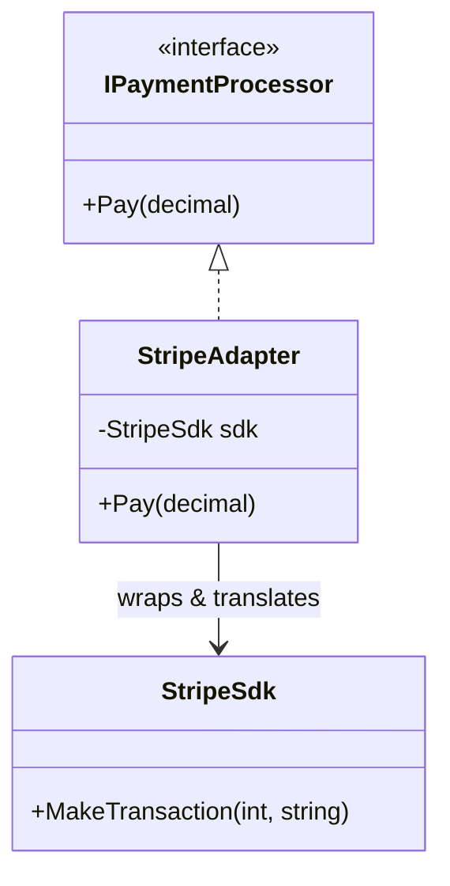

# Adapter: Make Incompatible Interfaces Work Together

> **Intent:** Convert the interface of a class into another interface clients expect, letting
> otherwise-incompatible classes collaborate.

## 🧠 Intuition

You have code that expects one interface, and an existing class (a third-party library, legacy
code) that does the job but exposes a *different* interface. An Adapter is a thin wrapper that
translates one to the other — without changing either side.

> 💡 **Analogy — a travel power plug adapter.** Your laptop charger has US prongs; the European
> socket is different. You don't rewire the laptop or the wall — you slot in an adapter that
> translates between them. The Adapter pattern is that plug adapter for code.

## 🎯 The Problem

Your app speaks `IPaymentProcessor.Pay(amount)`, but you're integrating a third-party SDK whose
method is `MakeTransaction(cents, currency)`. You can't edit the SDK, and you don't want its weird
shape leaking through your codebase:

```csharp
// ❌ Before: the foreign interface leaks everywhere, coupling your code to the SDK
var stripe = new StripeSdk();
stripe.MakeTransaction((int)(amount * 100), "USD");   // repeated, awkward, SDK-specific
```

## 📐 Structure



**Participants:** `Target` (IPaymentProcessor) — the interface your code wants · `Adaptee`
(StripeSdk) — the existing incompatible class · `Adapter` (StripeAdapter) — implements Target and
translates calls to the Adaptee.

## 💻 C# Implementation

```csharp
public interface IPaymentProcessor { void Pay(decimal amount); }   // what our app expects

public class StripeSdk {                                            // the Adaptee (can't change it)
    public void MakeTransaction(int cents, string currency) =>
        Console.WriteLine($"Stripe charged {cents} {currency}");
}

public class StripeAdapter : IPaymentProcessor {                    // the Adapter
    private readonly StripeSdk sdk = new();
    public void Pay(decimal amount) =>
        sdk.MakeTransaction((int)(amount * 100), "USD");           // translate the call
}

// Usage — the rest of the app only sees IPaymentProcessor
IPaymentProcessor processor = new StripeAdapter();
processor.Pay(19.99m);     // Stripe charged 1999 USD
```

Swap to PayPal later? Write a `PayPalAdapter : IPaymentProcessor` — your app code never changes.

## ⚖️ Trade-offs

**Pros:** lets incompatible code work together without modifying either side; isolates third-party
quirks behind your own interface; supports Open/Closed (swap adapters).
**Cons:** adds an extra layer/indirection; too many adapters can clutter; doesn't add features,
only translates.

## ✅ When to Use / 🚫 When to Avoid

- **Use when** you must integrate an existing class whose interface doesn't match what your code
  needs (third-party SDKs, legacy code, incompatible data formats).
- **Avoid when** you control both sides — just make them compatible directly.
- **Misuse:** an adapter that *adds behavior* (that's a [Decorator](03.Decorator.md)) or *simplifies
  a subsystem* (that's a [Facade](02.Facade.md)). Adapter only **translates** one interface to another.

## 🔗 Related Patterns

- **[Decorator](03.Decorator.md):** same interface in and out, *adds* behavior. Adapter *changes*
  the interface, doesn't add behavior.
- **[Facade](02.Facade.md):** simplifies a whole subsystem behind a new interface; Adapter makes one
  existing interface match an expected one.
- **[Bridge](06.Bridge.md):** designed up front to vary two sides; Adapter is applied after the fact
  to fix a mismatch.

## 🌍 Real-World & .NET Examples

- `System.IO` wrappers; `TextReader`/`StreamReader` adapting streams to text.
- Logging facades (`Microsoft.Extensions.Logging`) adapting Serilog/NLog.
- Any wrapper class that makes a third-party library fit your domain interface.

## 🎯 Practice (with full solutions)

### 1. Adapt a legacy logger — `Easy`
**Scenario:** Your app uses `ILogger.Log(string)`. A legacy `OldLogger` only has
`WriteEntry(string severity, string text)`. Make it usable without changing either.
**Solution:**
```csharp
interface ILogger { void Log(string message); }
class OldLogger { public void WriteEntry(string severity, string text) => Console.WriteLine($"{severity}: {text}"); }

class OldLoggerAdapter : ILogger {
    private readonly OldLogger legacy = new();
    public void Log(string message) => legacy.WriteEntry("INFO", message);   // translate
}
```
**Why it's better:** the app codes against `ILogger`; the legacy logger's odd signature is contained
in one adapter.

### 2. Adapt a data shape — `Medium`
**Scenario:** A reporting module expects `IEnumerable<Customer>`. A third-party feed returns
`LegacyContact[]` with different field names. Adapt it lazily.
**Solution:**
```csharp
record Customer(string Name, string Email);
class LegacyContact { public string FullName; public string Mail; }

class ContactAdapter {
    public static IEnumerable<Customer> Adapt(IEnumerable<LegacyContact> contacts) =>
        contacts.Select(c => new Customer(c.FullName, c.Mail));   // map foreign → domain shape
}
```
**Why it's better:** the reporting module stays clean and domain-focused; the field-name mismatch
lives in one place.

## ✅ Key Takeaways

- Adapter **translates** an existing interface into the one your code expects — a wrapper, not a
  rewrite.
- It isolates third-party/legacy quirks behind your own clean interface.
- It only **converts**; it doesn't add behavior ([Decorator](03.Decorator.md)) or simplify a
  subsystem ([Facade](02.Facade.md)).

**Self-check:**
1. What does an Adapter change that a Decorator doesn't?
2. When would you reach for an Adapter over fixing both sides directly?
3. Name the three participants (Target, Adaptee, Adapter) in your own words.

---
◀ Prev: [Module index](README.md) · ▲ [Module index](README.md) · ▶ Next: [Facade](02.Facade.md)
