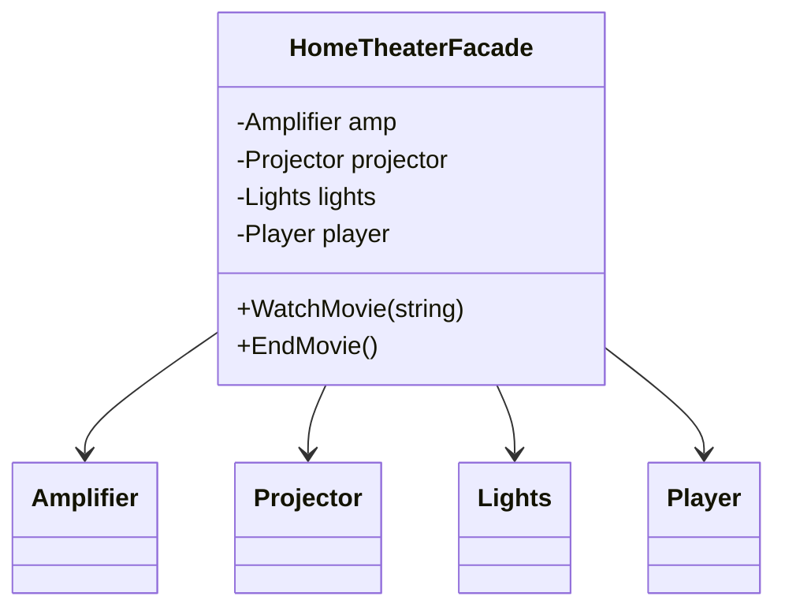

# Facade: A Simple Front Door to a Complex Subsystem

> **Intent:** Provide a unified, simplified interface to a set of interfaces in a subsystem.

## 🧠 Intuition

A complex subsystem has many moving parts that clients must orchestrate in the right order. A
Facade is a single, friendly entry point that hides that complexity behind one or a few simple
methods.

> 💡 **Analogy — a restaurant.** You order "the steak dinner." Behind the kitchen doors, the chef,
> grill cook, and plater coordinate a dozen steps. You don't talk to each of them — the waiter (the
> facade) gives you one simple interface to a complex operation.

## 🎯 The Problem

Starting a movie means juggling several subsystems in the correct sequence — and every client that
wants to "watch a movie" repeats this dance:

```csharp
// ❌ Before: the client must know and orchestrate every subsystem
amplifier.On(); amplifier.SetVolume(5);
projector.On(); projector.SetInput("HDMI"); projector.WideScreen();
lights.Dim(10);
player.On(); player.Play("Inception");
// ...and the reverse to stop. Repeated everywhere, fragile to ordering changes.
```

## 📐 Structure



**Participants:** `Facade` (HomeTheaterFacade) — exposes simple methods and orchestrates the
subsystem · `Subsystem classes` (Amplifier, Projector, …) — do the real work, unaware of the facade.

## 💻 C# Implementation

```csharp
// Subsystem classes (complex, many of them)
public class Amplifier { public void On() {} public void SetVolume(int v) {} public void Off() {} }
public class Projector { public void On() {} public void SetInput(string s) {} public void Off() {} }
public class Lights { public void Dim(int pct) {} public void On() {} }
public class Player { public void On() {} public void Play(string m) {} public void Off() {} }

// Facade: one simple interface over the whole subsystem
public class HomeTheaterFacade {
    private readonly Amplifier amp = new();
    private readonly Projector projector = new();
    private readonly Lights lights = new();
    private readonly Player player = new();

    public void WatchMovie(string movie) {
        lights.Dim(10);
        amp.On(); amp.SetVolume(5);
        projector.On(); projector.SetInput("HDMI");
        player.On(); player.Play(movie);
    }
    public void EndMovie() {
        player.Off(); projector.Off(); amp.Off(); lights.On();
    }
}

// Usage — one call
var theater = new HomeTheaterFacade();
theater.WatchMovie("Inception");
```

> A Facade doesn't *hide* the subsystem — advanced clients can still use the subsystem classes
> directly. It just offers an easy default path.

## ⚖️ Trade-offs

**Pros:** dramatically simplifies client code; decouples clients from subsystem internals; a natural
place to enforce correct ordering/usage.
**Cons:** can become a "god object" if it grows to know too much; risks hiding useful flexibility if
overused.

## ✅ When to Use / 🚫 When to Avoid

- **Use when** a subsystem is complex and most clients need a simple, common path; to decouple your
  code from a third-party library's many classes; to layer a system (each layer gets a facade).
- **Avoid when** the subsystem is already simple — a facade just adds a pointless layer.
- **Misuse:** letting the facade absorb business logic until it's a bloated god object.

## 🔗 Related Patterns

- **[Adapter](01.Adapter.md):** makes *one* interface match an expected one; Facade defines a *new*
  simpler interface over *many* classes.
- **[Mediator](../03-Behavioral/08.Mediator.md):** also centralizes, but coordinates two-way
  communication between peers; a facade is a one-way simplification.
- Often combined with **[Singleton](../01-Creational/05.Singleton.md)** (one facade instance).

## 🌍 Real-World & .NET Examples

- `HttpClient` — a facade over sockets, DNS, TLS, HTTP parsing.
- ASP.NET Core's `WebApplication` startup — a facade over hosting, DI, middleware setup.
- ORM `DbContext` — a facade over connections, command building, change tracking.

## 🎯 Practice (with full solutions)

### 1. Wrap a noisy subsystem — `Easy`
**Scenario:** Placing an order requires `inventory.Reserve()`, `payment.Charge()`,
`shipping.Schedule()`, and `email.SendConfirmation()`, always in that order. Clients keep getting
the order wrong. Simplify it.
**Solution:**
```csharp
class OrderFacade {
    private readonly Inventory inventory = new();
    private readonly Payment payment = new();
    private readonly Shipping shipping = new();
    private readonly Email email = new();

    public void PlaceOrder(Cart cart, Card card) {
        inventory.Reserve(cart);
        payment.Charge(card, cart.Total);
        shipping.Schedule(cart);
        email.SendConfirmation(cart);
    }
}
```
**Why it's better:** clients call `PlaceOrder(...)`; the correct sequence lives in one tested place.

### 2. Facade vs Adapter — `Easy`
**Task:** You wrap a single third-party `LegacyXmlParser` so it implements your `IParser`
interface. Is that a Facade or an Adapter?
**Solution:** an **Adapter** — you're matching *one* existing class to an expected interface. A
Facade would simplify *many* classes behind a new interface.
**Why it matters:** Facade = simplify a subsystem (many parts); Adapter = translate one interface.

## ✅ Key Takeaways

- Facade gives a **simple, unified entry point** to a complex subsystem.
- It **decouples** clients from subsystem internals and centralizes correct usage.
- It doesn't forbid direct subsystem access — it offers an easy default.
- Beware the facade growing into a **god object**.

**Self-check:**
1. How does a Facade differ from an Adapter?
2. What's the risk if a facade keeps absorbing responsibilities?
3. Name a .NET class that acts as a facade and what it hides.

---
◀ Prev: [Adapter](01.Adapter.md) · ▲ [Module index](README.md) · ▶ Next: [Decorator](03.Decorator.md)
