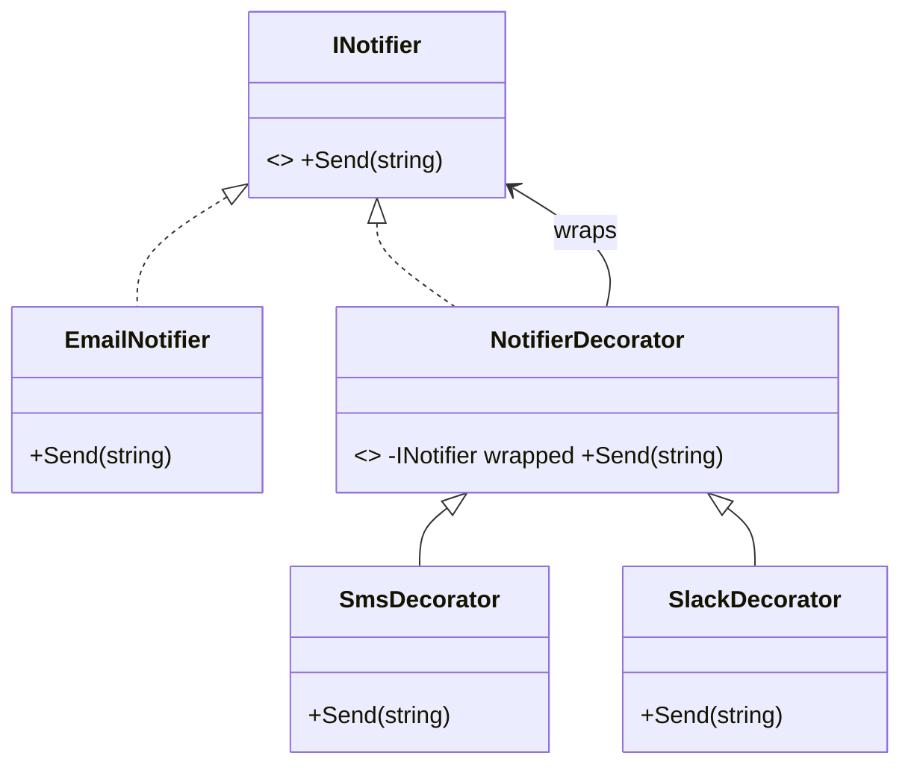

# Decorator: Add Behavior by Wrapping

> **Intent:** Attach additional responsibilities to an object dynamically, as a flexible
> alternative to subclassing.

## 🧠 Intuition

You want to add features to an object — logging, compression, extra notifications — but not to
*every* object of that class, and not by exploding your class hierarchy. A Decorator **wraps** the
object in another object that shares its interface, adds its bit of behavior, and delegates the
rest. You can stack wrappers like layers.

> 💡 **Analogy — getting dressed (or Russian nesting dolls).** Your body is the core object; you add
> a shirt, then a sweater, then a coat. Each layer adds warmth and delegates "being you" to what's
> underneath. You add or remove layers at runtime, in any combination.

This is the pattern embodiment of [composition over inheritance](../00-Foundations/04.Composition-and-Principles.md)
— it solves the "subclass explosion" problem directly.

## 🎯 The Problem

A notifier should sometimes also send SMS, sometimes Slack, sometimes both. Subclassing every combo
explodes:

```csharp
// ❌ Before: a subclass per combination — combinatorial explosion
class EmailNotifier { }
class EmailAndSmsNotifier { }
class EmailAndSlackNotifier { }
class EmailAndSmsAndSlackNotifier { }   // ...and it keeps growing
```

## 📐 Structure



**Participants:** `Component` (INotifier) — shared interface · `ConcreteComponent` (EmailNotifier) —
the core object · `Decorator` (NotifierDecorator) — implements the interface and holds a wrapped
component · `ConcreteDecorators` (Sms/Slack) — add behavior around the delegate call.

## 💻 C# Implementation

```csharp
public interface INotifier { void Send(string message); }

public class EmailNotifier : INotifier {               // core component
    public void Send(string m) => Console.WriteLine($"Email: {m}");
}

public abstract class NotifierDecorator : INotifier {  // base decorator
    protected readonly INotifier wrapped;
    protected NotifierDecorator(INotifier inner) => wrapped = inner;
    public virtual void Send(string m) => wrapped.Send(m);   // delegate
}

public class SmsDecorator : NotifierDecorator {
    public SmsDecorator(INotifier inner) : base(inner) {}
    public override void Send(string m) {
        base.Send(m);                                  // delegate to inner first
        Console.WriteLine($"SMS: {m}");                // then add behavior
    }
}
public class SlackDecorator : NotifierDecorator {
    public SlackDecorator(INotifier inner) : base(inner) {}
    public override void Send(string m) {
        Console.WriteLine($"Slack: {m}");              // add behavior, then delegate
        base.Send(m);
    }
}

// Usage — stack capabilities at runtime, in any combination
INotifier notifier = new EmailNotifier();
notifier = new SmsDecorator(notifier);
notifier = new SlackDecorator(notifier);
notifier.Send("Server down!");   // Slack → Email → SMS
```

## ⚖️ Trade-offs

**Pros:** add/remove responsibilities at runtime; combine features freely (no subclass explosion);
each decorator has a single responsibility; follows Open/Closed.
**Cons:** many small wrapper classes; a deep stack is hard to debug; order of decorators can matter;
the wrapped object's identity is hidden (reference equality breaks).

## ✅ When to Use / 🚫 When to Avoid

- **Use when** you need to add responsibilities to individual objects dynamically and transparently,
  or when subclassing would cause a combinatorial explosion (streams, middleware, UI embellishments).
- **Avoid when** behavior is fixed and simple — a plain class or one subclass is clearer.
- **Misuse:** confusing it with [Adapter](01.Adapter.md) (which changes the interface) or
  [Proxy](04.Proxy.md) (which controls access). Decorator keeps the **same interface** and **adds
  behavior**.

## 🔗 Related Patterns

- **[Proxy](04.Proxy.md):** same wrapping structure, but Proxy *controls access* (lazy/caching/
  security) rather than adding feature behavior.
- **[Adapter](01.Adapter.md):** changes the interface; Decorator keeps it.
- **[Composite](05.Composite.md):** also recursive; Composite builds trees, Decorator builds a chain.

## 🌍 Real-World & .NET Examples

- `Stream` decorators: `new GZipStream(new CryptoStream(new FileStream(...)))` — compression over
  encryption over a file.
- ASP.NET Core middleware pipeline (each middleware wraps the next).
- `TextWriter`/`BufferedStream` wrappers.

## 🎯 Practice (with full solutions)

### 1. Replace subclass explosion — `Medium`
**Scenario:** A `DataSource` can read/write text. You need optional **encryption** and optional
**compression**, in any combination. Avoid one class per combo.
**Solution:** decorate the data source:
```csharp
interface IDataSource { void Write(string data); string Read(); }
class FileDataSource : IDataSource {
    private string content = "";
    public void Write(string data) => content = data;
    public string Read() => content;
}
abstract class DataSourceDecorator : IDataSource {
    protected readonly IDataSource wrappee;
    protected DataSourceDecorator(IDataSource w) => wrappee = w;
    public virtual void Write(string d) => wrappee.Write(d);
    public virtual string Read() => wrappee.Read();
}
class EncryptionDecorator : DataSourceDecorator {
    public EncryptionDecorator(IDataSource w) : base(w) {}
    public override void Write(string d) => wrappee.Write(Encode(d));
    public override string Read() => Decode(wrappee.Read());
    private string Encode(string s) => Convert.ToBase64String(System.Text.Encoding.UTF8.GetBytes(s));
    private string Decode(string s) => System.Text.Encoding.UTF8.GetString(Convert.FromBase64String(s));
}
// Compose: new EncryptionDecorator(new CompressionDecorator(new FileDataSource()))
```
**Why it's better:** N features → N decorators (not 2^N subclasses), composed at runtime.

### 2. Add logging without touching the class — `Easy`
**Scenario:** You have `IService.Execute()` from a library and want to log around calls without
modifying it.
**Solution:**
```csharp
class LoggingService : IService {
    private readonly IService inner;
    public LoggingService(IService inner) => this.inner = inner;
    public void Execute() {
        Console.WriteLine("before");
        inner.Execute();
        Console.WriteLine("after");
    }
}
// var svc = new LoggingService(new RealService());
```
**Why it's better:** cross-cutting concern (logging) added transparently, Open/Closed respected.

## ✅ Key Takeaways

- Decorator **wraps** an object to add behavior, keeping the **same interface** — stackable layers.
- It's the cure for **subclass explosion** and a poster child for composition over inheritance.
- Distinguish from **Proxy** (controls access) and **Adapter** (changes interface).
- Watch out for deep stacks and order-dependence.

**Self-check:**
1. How does Decorator avoid the subclass explosion problem?
2. What's the difference between Decorator and Proxy, given they share a structure?
3. Why does `new GZipStream(new FileStream(...))` qualify as Decorator?

---
◀ Prev: [Facade](02.Facade.md) · ▲ [Module index](README.md) · ▶ Next: [Proxy](04.Proxy.md)
