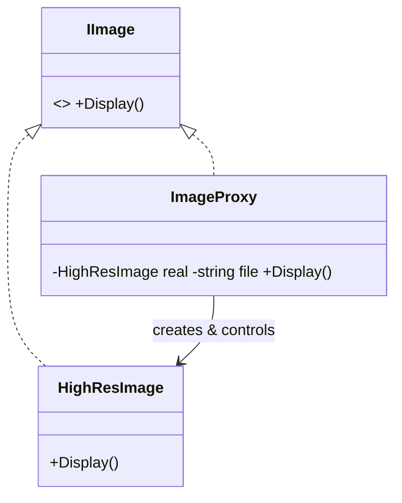

# Proxy: A Stand-In That Controls Access

> **Intent:** Provide a surrogate or placeholder for another object to control access to it.

## 🧠 Intuition

A Proxy is a stand-in that looks exactly like the real object (same interface) but sits in front of
it to **control access** — delaying its creation, caching its results, checking permissions, or
talking to it over the network. Clients can't tell they're talking to the proxy.

> 💡 **Analogy — a celebrity's agent.** You don't call the celebrity directly. You call the agent,
> who screens requests, schedules, and only forwards what's appropriate. Same "interface" (you make
> a request), but access is controlled.

Same wrapping *shape* as [Decorator](03.Decorator.md), but the **intent differs**: Decorator adds
*features*, Proxy controls *access*.

## 🎯 The Problem

A high-resolution image is expensive to load. You don't want to load every image up front — only
when it's actually displayed:

```csharp
// ❌ Before: loading everything eagerly, even images never shown
var images = files.Select(f => new HighResImage(f)).ToList();   // slow: loads ALL from disk now
```

## 📐 Structure



**Participants:** `Subject` (IImage) — the shared interface · `RealSubject` (HighResImage) — the
real, expensive object · `Proxy` (ImageProxy) — same interface, controls access to the RealSubject.

## 💻 C# Implementation (virtual / lazy-loading proxy)

```csharp
public interface IImage { void Display(); }

public class HighResImage : IImage {            // expensive RealSubject
    private readonly string file;
    public HighResImage(string file) {
        this.file = file;
        Console.WriteLine($"Loading {file} from disk...");   // costly
    }
    public void Display() => Console.WriteLine($"Displaying {file}");
}

public class ImageProxy : IImage {              // controls when the real object is created
    private readonly string file;
    private HighResImage? real;
    public ImageProxy(string file) => this.file = file;

    public void Display() {
        real ??= new HighResImage(file);        // create ONLY on first real use (lazy)
        real.Display();
    }
}

// Usage — nothing loads until Display() is actually called
IImage image = new ImageProxy("photo.png");     // cheap, no disk read yet
image.Display();                                 // now it loads, then displays
```

### Common proxy flavors
- **Virtual proxy:** lazy-create an expensive object (above).
- **Protection proxy:** check permissions before forwarding.
- **Caching proxy:** return cached results for repeat calls.
- **Remote proxy:** represent an object living in another process/machine.

## ⚖️ Trade-offs

**Pros:** controls access transparently (lazy loading, caching, security, remoting); adds
cross-cutting control without touching the real object; respects Open/Closed.
**Cons:** extra indirection/latency; another class to maintain; lazy behavior can hide timing of
expensive work.

## ✅ When to Use / 🚫 When to Avoid

- **Use when** you need lazy initialization, access control, caching, logging of access, or a local
  stand-in for a remote object.
- **Avoid when** there's no access concern — direct use is simpler.
- **Misuse:** calling it a Proxy when you're really *adding feature behavior* (that's
  [Decorator](03.Decorator.md)).

## 🔗 Related Patterns

- **[Decorator](03.Decorator.md):** identical structure; Decorator **adds behavior**, Proxy
  **controls access**. (The classic interview distinction.)
- **[Adapter](01.Adapter.md):** changes the interface; Proxy keeps the same interface.
- **[Facade](02.Facade.md):** simplifies a subsystem; Proxy stands in for one object.

## 🌍 Real-World & .NET Examples

- EF Core **lazy-loading proxies** (navigation properties load on first access).
- `Lazy<T>` (a virtual-proxy-like idea).
- WCF/gRPC client stubs (remote proxies); `RealProxy`/`DispatchProxy` in .NET.
- Caching layers in front of a repository.

## 🎯 Practice (with full solutions)

### 1. Add a protection proxy — `Medium`
**Scenario:** `IDocument.Read()` should only work for users with permission, but you can't change
`SecretDocument`. Add access control.
**Solution:**
```csharp
interface IDocument { string Read(); }
class SecretDocument : IDocument { public string Read() => "top secret"; }

class ProtectedDocument : IDocument {
    private readonly IDocument real;
    private readonly string userRole;
    public ProtectedDocument(IDocument real, string userRole) { this.real = real; this.userRole = userRole; }
    public string Read() =>
        userRole == "admin" ? real.Read() : throw new UnauthorizedAccessException();
}
// var doc = new ProtectedDocument(new SecretDocument(), currentUser.Role);
```
**Why it's better:** access control is enforced transparently; the real document stays unchanged
(Open/Closed), and callers still code against `IDocument`.

### 2. Add a caching proxy — `Medium`
**Scenario:** `IWeatherApi.GetForecast(city)` is a slow network call; repeated calls for the same
city should be cached.
**Solution:**
```csharp
class CachingWeatherApi : IWeatherApi {
    private readonly IWeatherApi real;
    private readonly Dictionary<string, string> cache = new();
    public CachingWeatherApi(IWeatherApi real) => this.real = real;
    public string GetForecast(string city) {
        if (!cache.TryGetValue(city, out var f)) cache[city] = f = real.GetForecast(city);
        return f;   // subsequent calls skip the network
    }
}
```
**Why it's better:** caching (a cross-cutting concern / access optimization) is added without
touching the real API client — the essence of a caching proxy.

## ✅ Key Takeaways

- Proxy is a same-interface **stand-in that controls access** to a real object.
- Flavors: **virtual** (lazy), **protection** (security), **caching**, **remote**.
- Structurally identical to **Decorator**, but the intent is *control access*, not *add features*.
- Great for lazy loading, security, caching, and remoting — transparently.

**Self-check:**
1. What's the one-line difference between Proxy and Decorator?
2. Name three kinds of proxy and what each controls.
3. Why can a client not tell it's using a proxy?

---
◀ Prev: [Decorator](03.Decorator.md) · ▲ [Module index](README.md) · ▶ Next: [Composite](05.Composite.md)
