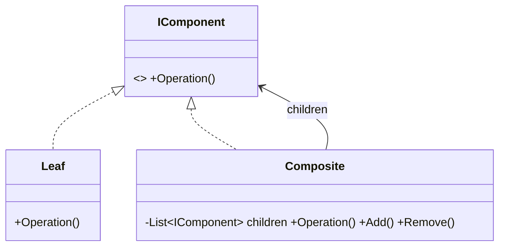

# Composite: Treat Individual Objects and Groups Uniformly

> **Intent:** Compose objects into tree structures and let clients treat individual objects and
> compositions the same way.

## 🧠 Intuition

Tree-shaped data is everywhere: files and folders, UI panels containing controls, org charts. The
annoying part is that "a single thing" and "a group of things" usually need different code.
Composite makes them share **one interface**, so a folder and a file (or a group and a shape)
respond to the same operation — and the operation naturally recurses through the tree.

> 💡 **Analogy — folders and files.** "Calculate the size of this folder" works whether you point at
> a single file or a deeply nested folder. The folder just asks each child for *its* size — and
> children that are folders do the same, all the way down. You treat them uniformly.

## 🎯 The Problem

```csharp
// ❌ Before: clients must constantly check "is this one item or a group?"
void Render(object node) {
    if (node is Shape s) s.Draw();
    else if (node is List<object> group) foreach (var c in group) Render(c);  // special-casing everywhere
}
```

## 📐 Structure



**Participants:** `Component` (IComponent) — the shared interface for both leaves and groups · `Leaf`
— an individual object, no children · `Composite` — holds children and implements the operation by
recursing into them.

## 💻 C# Implementation

```csharp
public interface IFileSystemItem { long GetSize(); }

public class FileItem : IFileSystemItem {                 // Leaf
    private readonly long size;
    public FileItem(long size) => this.size = size;
    public long GetSize() => size;
}

public class Folder : IFileSystemItem {                   // Composite
    private readonly List<IFileSystemItem> children = new();
    public void Add(IFileSystemItem item) => children.Add(item);
    public long GetSize() => children.Sum(c => c.GetSize());   // recurse — uniform call on each child
}

// Usage — same GetSize() call on a file or a whole tree
var root = new Folder();
root.Add(new FileItem(100));
var sub = new Folder();
sub.Add(new FileItem(50));
sub.Add(new FileItem(25));
root.Add(sub);
Console.WriteLine(root.GetSize());   // 175 — recursion handled by the structure
```

> **Design choice:** child-management methods (`Add`/`Remove`) can live on the **Component**
> interface (*transparent* — uniform but leaves must reject them) or only on **Composite** (*safe* —
> no nonsensical `file.Add()`, but clients must type-check). The size-only interface above is the
> cleaner, safe variant.

## ⚖️ Trade-offs

**Pros:** clients treat leaves and groups uniformly (no type-checking); recursive operations fall
out naturally; easy to add new component types; matches naturally tree-shaped domains.
**Cons:** the shared interface can become too general (leaves forced to implement `Add`/`Remove`);
can make the design overly uniform when leaves and composites genuinely differ.

## ✅ When to Use / 🚫 When to Avoid

- **Use when** your data is a **part-whole hierarchy** (trees) and you want clients to ignore the
  difference between a single item and a group.
- **Avoid when** there's no real tree structure, or leaves and composites have little in common.
- **Misuse:** forcing `Add`/`Remove` onto leaves that then throw — pick the safe variant if that
  bothers you.

## 🔗 Related Patterns

- **[Decorator](03.Decorator.md):** also recursive composition, but a single-child *chain* that adds
  behavior; Composite is a multi-child *tree*.
- **[Iterator](../03-Behavioral/06.Iterator.md):** often used to traverse a composite.
- **[Visitor](../03-Behavioral/10.Visitor.md):** add operations across a composite without changing
  the element classes.

## 🌍 Real-World & .NET Examples

- The file system (files/folders); UI trees (WPF/HTML DOM — panels containing controls/elements).
- Expression trees and ASTs; organization charts; menus with sub-menus.

## 🎯 Practice (with full solutions)

### 1. Uniform pricing over a tree — `Medium`
**Scenario:** A "box" can contain products *and* other boxes. You need the total price of any box,
no matter how nested.
**Solution:**
```csharp
interface IBoxItem { decimal Price(); }
class Product : IBoxItem {                          // Leaf
    private readonly decimal price;
    public Product(decimal price) => this.price = price;
    public decimal Price() => price;
}
class Box : IBoxItem {                              // Composite
    private readonly List<IBoxItem> items = new();
    public void Add(IBoxItem item) => items.Add(item);
    public decimal Price() => items.Sum(i => i.Price());   // recurse uniformly
}
```
**Why it's better:** `Price()` works identically on a product or a deeply nested box — no
type-checking, recursion handled by the structure.

### 2. Render a UI tree — `Easy`
**Scenario:** A `Panel` contains `Button`s and other `Panel`s. `Render()` should draw the whole tree.
**Solution:**
```csharp
interface IUiComponent { void Render(int depth = 0); }
class Button : IUiComponent {
    private readonly string label;
    public Button(string label) => this.label = label;
    public void Render(int depth = 0) => Console.WriteLine(new string(' ', depth*2) + $"[Button {label}]");
}
class Panel : IUiComponent {
    private readonly List<IUiComponent> children = new();
    public void Add(IUiComponent c) => children.Add(c);
    public void Render(int depth = 0) {
        Console.WriteLine(new string(' ', depth*2) + "<Panel>");
        foreach (var c in children) c.Render(depth + 1);
    }
}
```
**Why it's better:** one `Render()` contract handles any nesting; adding new component types doesn't
change traversal code.

## ✅ Key Takeaways

- Composite gives **one interface for leaves and groups**, so clients ignore the difference.
- Operations **recurse** through the tree naturally.
- Choose **transparent** (uniform, leaves reject child ops) vs **safe** (child ops only on
  composites) based on your priorities.
- Use it whenever the domain is genuinely a **part-whole tree**.

**Self-check:**
1. What problem does Composite remove from client code?
2. What's the transparent-vs-safe trade-off?
3. How does Composite differ from Decorator, given both are recursive?

---
◀ Prev: [Proxy](04.Proxy.md) · ▲ [Module index](README.md) · ▶ Next: [Bridge](06.Bridge.md)
