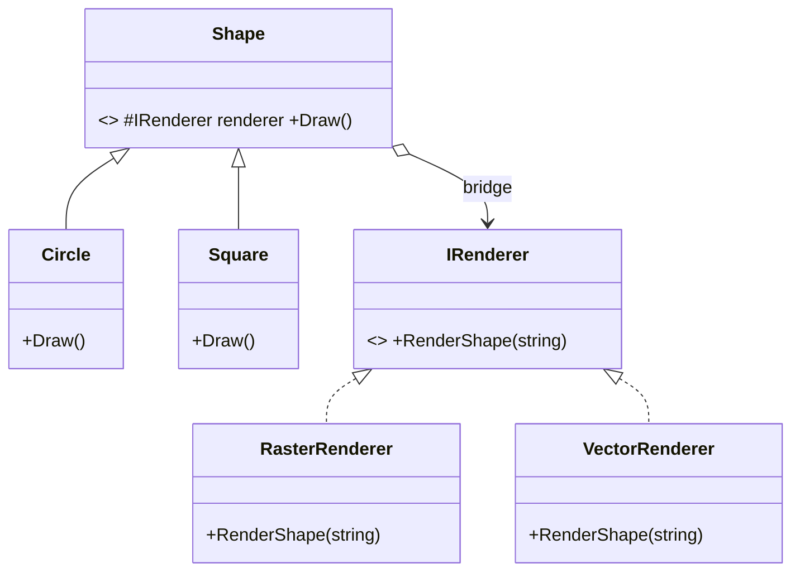

# Bridge: Decouple an Abstraction From Its Implementation

> **Intent:** Separate an abstraction from its implementation so the two can vary independently.

## 🧠 Intuition

Sometimes a thing varies along *two* independent dimensions at once. If you model both with
inheritance, you get a combinatorial explosion of subclasses. Bridge splits the two dimensions into
**two separate hierarchies** and connects them with a reference (the "bridge"), so each side can
grow on its own.

> 💡 **Analogy — a TV and its remote.** "Kind of remote" (basic, advanced, voice) and "brand of TV"
> (Sony, Samsung) vary independently. You don't build a `SonyVoiceRemote`, `SamsungBasicRemote`, …
> for every combo. The remote *holds a reference* to a TV interface and works with any TV. Two
> hierarchies, bridged by composition.

## 🎯 The Problem

A `Shape` can be a Circle or Square, and can render via raster or vector. Modeling both with
inheritance explodes:

```csharp
// ❌ Before: every shape × every renderer = a class
class RasterCircle { } class VectorCircle { }
class RasterSquare { } class VectorSquare { }
// add a Triangle → 2 more classes; add a 3rd renderer → 3 more. m × n explosion.
```

## 📐 Structure



**Participants:** `Abstraction` (Shape) — high-level control, holds an Implementor · `Refined
Abstraction` (Circle, Square) · `Implementor` (IRenderer) — the interface for the other dimension ·
`Concrete Implementors` (Raster/Vector).

## 💻 C# Implementation

```csharp
public interface IRenderer { void RenderShape(string shape); }   // Implementor dimension

public class RasterRenderer : IRenderer {
    public void RenderShape(string shape) => Console.WriteLine($"Drawing {shape} as pixels");
}
public class VectorRenderer : IRenderer {
    public void RenderShape(string shape) => Console.WriteLine($"Drawing {shape} as vectors");
}

public abstract class Shape {                  // Abstraction dimension
    protected readonly IRenderer renderer;     // the BRIDGE (composition, not inheritance)
    protected Shape(IRenderer renderer) => this.renderer = renderer;
    public abstract void Draw();
}
public class Circle : Shape {
    public Circle(IRenderer r) : base(r) {}
    public override void Draw() => renderer.RenderShape("circle");
}
public class Square : Shape {
    public Square(IRenderer r) : base(r) {}
    public override void Draw() => renderer.RenderShape("square");
}

// Usage — mix any shape with any renderer; no combo classes
Shape s1 = new Circle(new VectorRenderer());   s1.Draw();   // circle as vectors
Shape s2 = new Square(new RasterRenderer());   s2.Draw();   // square as pixels
```

Adding a `Triangle` (1 class) or a `Web3DRenderer` (1 class) costs **m + n**, not **m × n**.

## ⚖️ Trade-offs

**Pros:** the two dimensions vary independently (no class explosion); implementation can be swapped
at runtime; both hierarchies stay focused (SRP); follows Open/Closed.
**Cons:** more upfront indirection/complexity; only worth it when you genuinely have two varying
dimensions.

## ✅ When to Use / 🚫 When to Avoid

- **Use when** a class varies along **two independent dimensions**, or you want to switch
  implementations at runtime, or avoid binding an abstraction permanently to one implementation.
- **Avoid when** there's only one dimension of variation — that's just normal inheritance/strategy.
- **Misuse:** applying Bridge speculatively before a second dimension exists (YAGNI).

## 🔗 Related Patterns

- **[Strategy](../03-Behavioral/01.Strategy.md):** structurally similar (hold an interface, delegate).
  Strategy swaps an *algorithm*; Bridge separates an *abstraction* from its *implementation*
  (intent + scale differ — Bridge is a larger structural split).
- **[Adapter](01.Adapter.md):** Adapter fixes a mismatch after the fact; Bridge is designed up front
  to decouple two sides.
- **[Abstract Factory](../01-Creational/02.Abstract-Factory.md):** can create the right implementor.

## 🌍 Real-World & .NET Examples

- Device drivers: an OS abstraction over many hardware implementations.
- `System.Drawing`/rendering backends; cross-platform UI where controls bridge to native renderers.
- Persistence abstraction over multiple database engines.

## 🎯 Practice (with full solutions)

### 1. Split the explosion — `Medium`
**Scenario:** A `Notification` can be Urgent or Normal, and can be delivered by Email or SMS. The
naive design has `UrgentEmail`, `UrgentSms`, `NormalEmail`, `NormalSms`. Refactor with Bridge.
**Solution:**
```csharp
interface IMessageSender { void Send(string text); }      // implementation dimension
class EmailSender : IMessageSender { public void Send(string t) => Console.WriteLine($"Email: {t}"); }
class SmsSender   : IMessageSender { public void Send(string t) => Console.WriteLine($"SMS: {t}"); }

abstract class Notification {                              // abstraction dimension
    protected readonly IMessageSender sender;
    protected Notification(IMessageSender sender) => this.sender = sender;
    public abstract void Notify(string text);
}
class UrgentNotification : Notification {
    public UrgentNotification(IMessageSender s) : base(s) {}
    public override void Notify(string text) => sender.Send("[URGENT] " + text);
}
class NormalNotification : Notification {
    public NormalNotification(IMessageSender s) : base(s) {}
    public override void Notify(string text) => sender.Send(text);
}
// new UrgentNotification(new SmsSender()).Notify("server down");
```
**Why it's better:** urgency and delivery vary independently; adding a "Push" sender or a "Low"
priority is one class each, not a multiplied set.

### 2. Bridge vs Strategy — `Easy`
**Task:** You hold an `ISortStrategy` in a class purely to swap *how it sorts*. Bridge or Strategy?
**Solution:** **Strategy** — you're swapping a single algorithm, not separating an abstraction
hierarchy from an implementation hierarchy. Bridge applies when *both* sides form hierarchies that
vary independently.
**Why it matters:** same structure, different intent and scale — a common interview distinction.

## ✅ Key Takeaways

- Bridge splits **two independent dimensions** into two hierarchies joined by composition.
- It turns an **m × n** subclass explosion into **m + n** classes.
- Implementation can be chosen/swapped at runtime.
- Use only when two dimensions genuinely vary — otherwise it's over-engineering.

**Self-check:**
1. What problem (in terms of class counts) does Bridge solve?
2. How is Bridge different from Strategy despite looking similar?
3. Why is composition (the "bridge" reference) central to the pattern?

---
◀ Prev: [Composite](05.Composite.md) · ▲ [Module index](README.md) · ▶ Next: [Flyweight](07.Flyweight.md)
