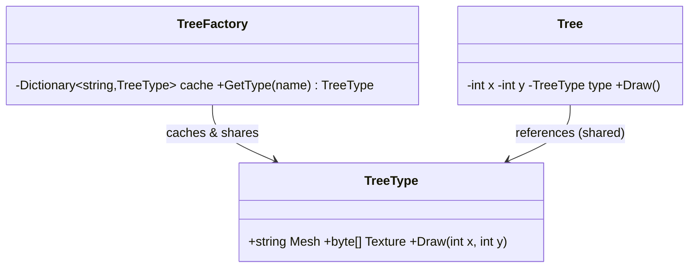

# Flyweight: Share Objects to Save Memory

> **Intent:** Use sharing to support large numbers of fine-grained objects efficiently.

## 🧠 Intuition

When you need a *huge* number of similar objects, the memory adds up fast. Flyweight notices that
much of each object's data is **the same across many instances** (intrinsic state) and only a little
is unique (extrinsic state). It stores the shared part **once** and passes the unique part in when
needed.

> 💡 **Analogy — a text document.** A 100-page document has millions of characters but only ~100
> distinct letters/fonts. You don't store a full font definition per character — you store each
> glyph *once* and reuse it, supplying only the position (the part that varies) per character.

Flyweight is a pure optimization: same behavior, dramatically less memory.

## 🎯 The Problem

A game renders a forest of 1,000,000 trees. Each tree object stores its mesh, texture, and color —
megabytes duplicated a million times:

```csharp
// ❌ Before: every tree carries its own copy of the heavy, identical data
class Tree {
    string mesh;       // identical across all "oak" trees — duplicated 1,000,000×
    byte[] texture;    // huge, identical
    int x, y;          // the only truly unique part
}
var forest = Enumerable.Range(0, 1_000_000).Select(_ => new Tree { mesh = "oak.mesh", /*...*/ });
// → out of memory
```

## 📐 Structure



**Participants:** `Flyweight` (TreeType) — holds **intrinsic** (shared) state · `FlyweightFactory`
(TreeFactory) — caches and reuses flyweights · `Context` (Tree) — holds **extrinsic** (unique) state
and a reference to a shared flyweight.

## 💻 C# Implementation

```csharp
// Flyweight: the heavy, SHARED (intrinsic) state — stored once per type
public class TreeType {
    public string Mesh { get; }
    public string Texture { get; }
    public TreeType(string mesh, string texture) { Mesh = mesh; Texture = texture; }
    public void Draw(int x, int y) => Console.WriteLine($"Draw {Mesh} at ({x},{y})");
}

// Factory: ensures each distinct type exists only ONCE
public class TreeFactory {
    private readonly Dictionary<string, TreeType> cache = new();
    public TreeType GetTreeType(string mesh, string texture) {
        string key = mesh + texture;
        if (!cache.TryGetValue(key, out var type))
            cache[key] = type = new TreeType(mesh, texture);   // create once, reuse forever
        return type;
    }
}

// Context: tiny per-instance (extrinsic) state + a reference to the shared flyweight
public class Tree {
    private readonly int x, y;
    private readonly TreeType type;     // SHARED reference, not a copy
    public Tree(int x, int y, TreeType type) { this.x = x; this.y = y; this.type = type; }
    public void Draw() => type.Draw(x, y);
}

// Usage — a million trees share a handful of TreeType objects
var factory = new TreeFactory();
var oak = factory.GetTreeType("oak.mesh", "oak.png");   // created once
var forest = new List<Tree>();
for (int i = 0; i < 1_000_000; i++)
    forest.Add(new Tree(i % 1000, i / 1000, oak));      // each tree stores only x, y + a reference
```

The heavy data exists once per *type*; each tree carries only two ints and a pointer.

## ⚖️ Trade-offs

**Pros:** massive memory savings when many objects share state; can improve cache performance.
**Cons:** complexity (splitting intrinsic vs extrinsic state); flyweights must be **immutable**
(they're shared!); trades a little CPU (passing extrinsic state) for memory; pointless if objects
don't actually share much.

## ✅ When to Use / 🚫 When to Avoid

- **Use when** you have a *very large* number of objects, memory is a constraint, and much of their
  state is shareable/identical.
- **Avoid when** object counts are modest, or each object's state is mostly unique (no sharing to
  exploit) — it just adds complexity.
- **Misuse:** making flyweights mutable (shared mutation corrupts everyone), or applying it without
  a real memory problem.

## 🔗 Related Patterns

- **[Factory](../01-Creational/01.Factory-Method.md):** the flyweight factory caches/reuses instances
  (often combined with [Singleton](../01-Creational/05.Singleton.md)).
- **[Prototype](../01-Creational/04.Prototype.md):** opposite reflex — Prototype *copies*, Flyweight
  *shares*.
- **[Composite](05.Composite.md):** flyweights are often the shared leaves of a composite tree.

## 🌍 Real-World & .NET Examples

- .NET **string interning** (identical string literals share one instance).
- `char`/glyph and font rendering; game engines sharing meshes/textures across instances.
- `Boolean.TrueString`, cached small integers — shared immutable instances.

## 🎯 Practice (with full solutions)

### 1. Share particle data — `Medium`
**Scenario:** A bullet-hell game spawns 500,000 bullets; each currently stores sprite + color +
damage (identical per bullet type) plus position/velocity (unique). Cut the memory.
**Solution:** split into a shared `BulletType` flyweight + a tiny per-bullet context:
```csharp
class BulletType {                         // intrinsic (shared)
    public string Sprite { get; }
    public int Damage { get; }
    public BulletType(string sprite, int damage) { Sprite = sprite; Damage = damage; }
}
class BulletTypeFactory {
    private readonly Dictionary<string, BulletType> cache = new();
    public BulletType Get(string sprite, int damage) {
        var key = $"{sprite}:{damage}";
        if (!cache.TryGetValue(key, out var t)) cache[key] = t = new BulletType(sprite, damage);
        return t;
    }
}
struct Bullet {                            // extrinsic (unique) — struct, tiny
    public float X, Y, Vx, Vy;
    public BulletType Type;
}
```
**Why it's better:** thousands of bullets of the same kind share one `BulletType`; per-bullet memory
drops to a few floats + a reference.

### 2. Why must flyweights be immutable? — `Easy`
**Task:** Explain what breaks if `TreeType.Texture` were mutable and one tree changed it.
**Solution:** every tree sharing that `TreeType` would see the change — because they all reference
the *same* object. Shared state must be **immutable** so sharing is safe.
**Why it matters:** immutability is the safety condition that makes sharing (the whole point) correct.

## ✅ Key Takeaways

- Flyweight splits state into **intrinsic (shared, stored once)** and **extrinsic (unique, passed
  in)** to save memory at scale.
- A **factory** caches and reuses flyweights; flyweights must be **immutable**.
- It's a pure optimization — only worth it with *many* objects sharing *substantial* state.
- Opposite reflex to [Prototype](../01-Creational/04.Prototype.md) (share vs copy).

**Self-check:**
1. What's the difference between intrinsic and extrinsic state?
2. Why must flyweight (intrinsic) state be immutable?
3. When is Flyweight *not* worth the added complexity?

---
◀ Prev: [Bridge](06.Bridge.md) · ▲ [Module index](README.md) · ▶ Next module: [03 — Behavioral](../03-Behavioral/01.Strategy.md)
