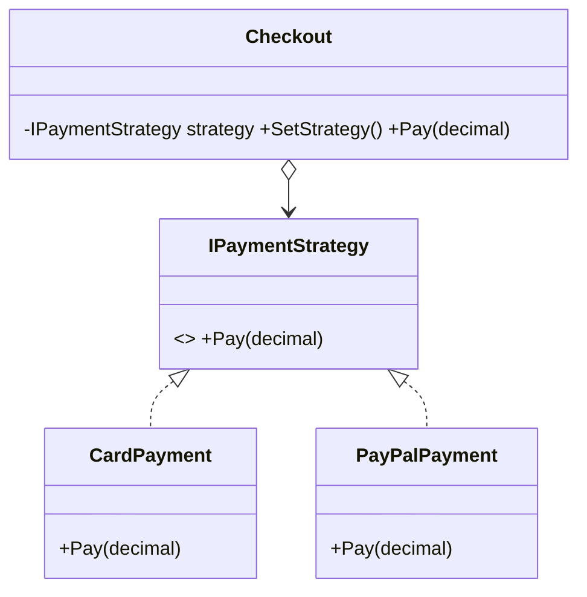

# Strategy: Swap Interchangeable Algorithms at Runtime

> **Intent:** Define a family of algorithms, encapsulate each one, and make them interchangeable.

## 🧠 Intuition

When a class needs to do something "one of several ways" — sort by different criteria, pay by
different methods, compress with different codecs — don't bury the choices in a giant `if/else`.
Pull each algorithm into its own object behind a common interface, and let the client **plug in**
whichever one it wants, even at runtime.

> 💡 **Analogy — getting to the airport.** The goal is "get there"; the strategy is car, train, or
> bike. You pick the strategy based on time/budget, and you can switch on the day. The trip
> (context) doesn't change — only the travel strategy does.

This is the most-used behavioral pattern and the direct embodiment of
[composition over inheritance](../00-Foundations/04.Composition-and-Principles.md) and the
[Open/Closed Principle](../00-Foundations/03.SOLID-Principles.md).

## 🎯 The Problem

```csharp
// ❌ Before: every new payment method means editing this method (violates Open/Closed)
class Checkout {
    public void Pay(string method, decimal amount) {
        if (method == "card") { /* card logic */ }
        else if (method == "paypal") { /* paypal logic */ }
        else if (method == "crypto") { /* ... */ }   // grows forever
    }
}
```

## 📐 Structure



**Participants:** `Strategy` (IPaymentStrategy) — the common algorithm interface · `ConcreteStrategy`
(Card/PayPal) — an implementation · `Context` (Checkout) — holds a strategy and delegates to it.

## 💻 C# Implementation

```csharp
public interface IPaymentStrategy { void Pay(decimal amount); }

public class CardPayment : IPaymentStrategy {
    public void Pay(decimal amount) => Console.WriteLine($"Paid {amount:C} by card");
}
public class PayPalPayment : IPaymentStrategy {
    public void Pay(decimal amount) => Console.WriteLine($"Paid {amount:C} via PayPal");
}

public class Checkout {
    private IPaymentStrategy strategy;
    public Checkout(IPaymentStrategy strategy) => this.strategy = strategy;
    public void SetStrategy(IPaymentStrategy s) => strategy = s;   // swap at runtime
    public void Pay(decimal amount) => strategy.Pay(amount);       // delegate
}

// Usage
var checkout = new Checkout(new CardPayment());
checkout.Pay(50m);
checkout.SetStrategy(new PayPalPayment());     // change behavior on the fly
checkout.Pay(20m);
```

In C#, a strategy is often just a **delegate** (`Func`/`Action`) — `List.Sort(Comparison<T>)` takes
a strategy as a lambda. Use a full interface when the strategy needs state or multiple methods.

## ⚖️ Trade-offs

**Pros:** swap algorithms at runtime; eliminates conditional sprawl; each algorithm is isolated and
testable; add new strategies without touching the context (Open/Closed).
**Cons:** more classes/objects; the client must know the strategies exist to choose one.

## ✅ When to Use / 🚫 When to Avoid

- **Use when** you have several variants of an algorithm, want to choose/switch at runtime, or want
  to replace a big conditional that selects behavior.
- **Avoid when** there's only one algorithm, or the variants never change — a plain method is fine.
- **Misuse:** creating a strategy interface with a single implementation "for flexibility" you never
  use (YAGNI).

## 🔗 Related Patterns

- **[State](05.State.md):** *identical structure*, different intent. Strategy is chosen by the
  client and is usually stateless; State changes itself based on internal conditions. (Classic
  interview pair.)
- **[Template Method](04.Template-Method.md):** Template Method varies steps via *inheritance*;
  Strategy varies the whole algorithm via *composition* (preferred).
- **[Bridge](../02-Structural/06.Bridge.md):** similar structure, larger structural intent.

## 🌍 Real-World & .NET Examples

- `List<T>.Sort(IComparer<T>)` / `OrderBy(keySelector)` — sorting strategy injected.
- Compression codec selection; pluggable validation rules; ASP.NET Core auth handlers.

## 🎯 Practice (with full solutions)

### 1. Replace the payment `if/else` — `Easy`
**Task:** Refactor the `Checkout.Pay(string method, ...)` from the Problem so a new method is a new
class, not an edit.
**Solution:** the `IPaymentStrategy` implementation above. Adding crypto = `class CryptoPayment :
IPaymentStrategy` — `Checkout` is untouched.
**Why it's better:** Open/Closed; each method is isolated and testable; runtime-swappable.

### 2. Strategy as a delegate — `Easy`
**Scenario:** A `ShippingCalculator` computes cost differently per carrier. Use the lightest form.
**Solution:** pass the algorithm as a `Func`:
```csharp
class ShippingCalculator {
    public decimal Calculate(Order o, Func<Order, decimal> rate) => rate(o);
}
// usage
var calc = new ShippingCalculator();
calc.Calculate(order, o => o.Weight * 2m);          // flat-by-weight strategy
calc.Calculate(order, o => o.Express ? 25m : 5m);   // express strategy
```
**Why it's better:** for stateless single-method strategies, a lambda is the cleanest "Strategy"
there is — no interface or class needed.

## ✅ Key Takeaways

- Strategy encapsulates interchangeable algorithms behind a common interface and **delegates** to
  the chosen one.
- It replaces behavior-selecting **conditionals** and supports runtime swapping (Open/Closed).
- In C#, a **delegate/lambda** is often the simplest strategy.
- Same structure as **State** — the difference is *intent* (client-chosen vs self-changing).

**Self-check:**
1. How does Strategy uphold the Open/Closed Principle?
2. What's the difference between Strategy and State?
3. When is a `Func<>` a better strategy than an interface?

---
◀ Prev: [Module index](README.md) · ▲ [Module index](README.md) · ▶ Next: [Observer](02.Observer.md)
