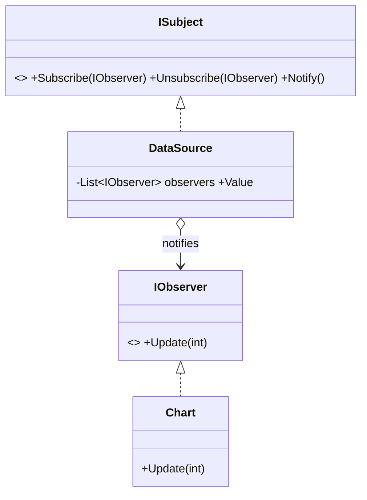

# Observer: One-to-Many Notification (Pub/Sub)

> **Intent:** Define a one-to-many dependency so that when one object changes state, all its
> dependents are notified automatically.

## 🧠 Intuition

When one object's state changes, several others need to react — but you don't want the source to be
hard-wired to each of them. Observer lets interested objects **subscribe**; when the subject
changes, it **broadcasts** to all subscribers without knowing who they are.

> 💡 **Analogy — a newsletter.** The publisher doesn't know each subscriber personally. People
> subscribe; when a new issue comes out, everyone subscribed gets it. Subscribe/unsubscribe anytime,
> and the publisher's job doesn't change.

This is the backbone of event systems, UI data-binding, and pub/sub messaging.

## 🎯 The Problem

A data value changes and a chart, a spreadsheet, and a log must all update. Hard-coding those calls
couples the data source to every consumer:

```csharp
// ❌ Before: the subject knows every consumer by name — add one, edit this class
class DataSource {
    public void SetValue(int v) {
        value = v;
        chart.Update(v);        // tightly coupled
        spreadsheet.Update(v);  // add a new consumer → edit here
        logger.Update(v);
    }
}
```

## 📐 Structure



**Participants:** `Subject` (DataSource) — keeps a subscriber list and notifies them · `Observer`
(IObserver) — the update interface · `ConcreteObservers` (Chart, …) — react to notifications.

## 💻 C# Implementation

### Classic form

```csharp
public interface IObserver { void Update(int value); }

public class DataSource {
    private readonly List<IObserver> observers = new();
    public void Subscribe(IObserver o) => observers.Add(o);
    public void Unsubscribe(IObserver o) => observers.Remove(o);

    private int value;
    public int Value {
        get => value;
        set { this.value = value; Notify(); }      // change → broadcast
    }
    private void Notify() { foreach (var o in observers) o.Update(value); }
}

public class Chart : IObserver {
    public void Update(int value) => Console.WriteLine($"Chart: {value}");
}

// Usage
var data = new DataSource();
data.Subscribe(new Chart());
data.Value = 42;     // Chart: 42  (and any other subscriber)
```

### The idiomatic C# form: events

```csharp
public class DataSource {
    public event Action<int>? ValueChanged;          // built-in observer support
    private int value;
    public int Value { get => value; set { this.value = value; ValueChanged?.Invoke(value); } }
}
// usage: data.ValueChanged += v => Console.WriteLine($"Chart: {v}");
```

C# `event`/`delegate` **is** the Observer pattern, built into the language — prefer it for most cases.

## ⚖️ Trade-offs

**Pros:** loose coupling (subject doesn't know concrete observers); subscribe/unsubscribe at
runtime; supports broadcast to many.
**Cons:** notification order isn't guaranteed; cascading updates can be hard to follow; **memory
leaks** if observers don't unsubscribe (the subject keeps them alive — a classic C# event leak);
debugging "who fired what" can be tricky.

## ✅ When to Use / 🚫 When to Avoid

- **Use when** a change to one object must update an open-ended set of others, and you want them
  decoupled (events, UI binding, pub/sub).
- **Avoid when** there's exactly one fixed dependent — a direct call is simpler.
- **Misuse:** forgetting to unsubscribe → leaks; or building deep observer chains that trigger
  storms of cascading updates.

## 🔗 Related Patterns

- **[Mediator](08.Mediator.md):** centralizes *many-to-many* communication; Observer is
  *one-to-many* broadcast.
- **[Command](03.Command.md):** often the payload that observers react to.
- C# **events**, `IObservable<T>`/Reactive Extensions are framework realizations.

## 🌍 Real-World & .NET Examples

- C# `event`/`delegate`; `INotifyPropertyChanged` (WPF/MAUI data-binding).
- `IObservable<T>`/`IObserver<T>` and Rx; message buses; DOM event listeners.

## 🎯 Practice (with full solutions)

### 1. Decouple the data source — `Easy`
**Task:** Refactor the hard-coded `DataSource` from the Problem so new consumers don't require
editing it.
**Solution:** the subscribe/notify implementation above (or the `event` form). New consumer →
`Subscribe(...)`, no edit to `DataSource`.
**Why it's better:** Open/Closed; the subject is unaware of concrete consumers.

### 2. Use events + avoid the leak — `Medium`
**Scenario:** A long-lived `StockTicker` raises `PriceChanged`; short-lived UI widgets subscribe.
Show the leak and fix it.
**Solution:**
```csharp
class StockTicker { public event Action<decimal>? PriceChanged;
    public void Set(decimal p) => PriceChanged?.Invoke(p); }

class Widget : IDisposable {
    private readonly StockTicker ticker;
    public Widget(StockTicker t) { ticker = t; ticker.PriceChanged += OnPrice; }
    private void OnPrice(decimal p) { /* update UI */ }
    public void Dispose() => ticker.PriceChanged -= OnPrice;   // ✅ unsubscribe → no leak
}
```
**Why it's better:** without `-=`, the ticker keeps every widget alive forever (memory leak); proper
unsubscription is the senior-level detail of Observer in C#.

## ✅ Key Takeaways

- Observer = **one-to-many** auto-notification with loose coupling (subscribe/notify).
- In C#, **events/delegates** are the built-in implementation — prefer them.
- Beware **memory leaks**: observers must **unsubscribe** (the subject holds references).
- Distinguish from **Mediator** (many-to-many coordination).

**Self-check:**
1. How does Observer keep the subject decoupled from its consumers?
2. Why are C# events a form of Observer?
3. What causes the classic Observer memory leak, and how do you prevent it?

---
◀ Prev: [Strategy](01.Strategy.md) · ▲ [Module index](README.md) · ▶ Next: [Command](03.Command.md)
