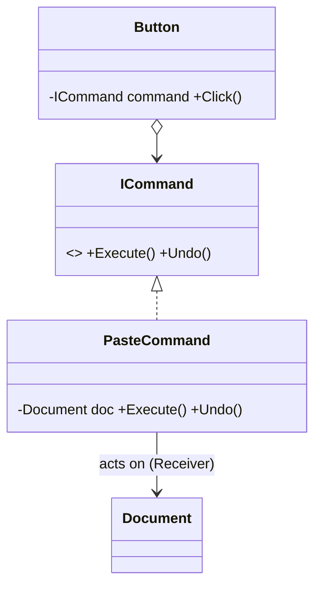

# Command: Encapsulate a Request as an Object

> **Intent:** Turn a request into a standalone object, letting you parameterize, queue, log, and
> undo operations.

## 🧠 Intuition

Normally you *call* a method directly. Command wraps "do this action" into an **object** — with all
the info needed to perform it. Once an action is an object, you can store it, pass it around, put it
in a queue, log it, or keep a history to **undo** it.

> 💡 **Analogy — a restaurant order ticket.** The waiter writes your order on a ticket (a command
> object) instead of running to tell the chef directly. The ticket can be queued, reordered, logged,
> and the kitchen processes tickets without knowing who placed them. Cancel = tear up the ticket.

## 🎯 The Problem

A UI button must trigger an action. Hard-coding the action into the button couples them, and
supporting **undo** becomes a nightmare:

```csharp
// ❌ Before: the button knows exactly what it does; undo is impossible to generalize
class Button {
    public void OnClick() { document.Paste(); }   // welded to one action, no undo, no queue
}
```

## 📐 Structure



**Participants:** `Command` (ICommand) — declares `Execute()` (and often `Undo()`) ·
`ConcreteCommand` (PasteCommand) — binds a `Receiver` to an action · `Receiver` (Document) — does the
real work · `Invoker` (Button) — triggers the command without knowing what it does.

## 💻 C# Implementation

```csharp
public interface ICommand { void Execute(); void Undo(); }

public class Document {                          // Receiver
    public string Text = "";
    public void Add(string s) => Text += s;
    public void RemoveLast(int len) => Text = Text[..^len];
}

public class AddTextCommand : ICommand {         // ConcreteCommand
    private readonly Document doc;
    private readonly string text;
    public AddTextCommand(Document doc, string text) { this.doc = doc; this.text = text; }
    public void Execute() => doc.Add(text);
    public void Undo() => doc.RemoveLast(text.Length);   // knows how to reverse itself
}

public class Editor {                            // Invoker + history
    private readonly Stack<ICommand> history = new();
    public void Run(ICommand cmd) { cmd.Execute(); history.Push(cmd); }
    public void Undo() { if (history.Count > 0) history.Pop().Undo(); }
}

// Usage
var doc = new Document();
var editor = new Editor();
editor.Run(new AddTextCommand(doc, "Hello "));
editor.Run(new AddTextCommand(doc, "World"));
editor.Undo();                                   // removes "World"
Console.WriteLine(doc.Text);                     // "Hello "
```

Because each command knows how to **undo** itself, a simple stack of commands gives you full
undo/redo.

## ⚖️ Trade-offs

**Pros:** decouples invoker from receiver; enables undo/redo, queuing, logging, macros, and
scheduling; new commands don't change existing code (Open/Closed).
**Cons:** a class per action can proliferate; simple actions get heavier than a direct call.

## ✅ When to Use / 🚫 When to Avoid

- **Use when** you need undo/redo, command queues, transaction logs, macros, or to decouple "what
  triggers an action" from "what the action does" (menus, buttons, job schedulers).
- **Avoid when** an action is a one-off direct call with no need for history/queuing — a method or
  delegate is enough.
- **Misuse:** wrapping every trivial call in a command class for no benefit.

## 🔗 Related Patterns

- **[Memento](09.Memento.md):** often paired for undo (command triggers it; memento stores the state
  to restore).
- **[Strategy](01.Strategy.md):** both wrap behavior; Strategy swaps an algorithm, Command captures
  a request (with execute/undo and a receiver).
- **CQRS** in [Modern patterns](../04-Modern-and-Enterprise/03.CQRS.md) generalizes commands.

## 🌍 Real-World & .NET Examples

- WPF `ICommand` / `RoutedCommand` (button/menu bindings).
- Undo/redo in editors; task queues / background job systems; `MediatR` request handlers.
- Transactional command logs in databases.

## 🎯 Practice (with full solutions)

### 1. Add undo to a remote control — `Medium`
**Scenario:** A remote's buttons turn a light on/off. Make buttons configurable and support an undo
button.
**Solution:**
```csharp
interface ICommand { void Execute(); void Undo(); }
class Light { public void On() => Console.WriteLine("on"); public void Off() => Console.WriteLine("off"); }
class LightOnCommand : ICommand {
    private readonly Light light; public LightOnCommand(Light l) => light = l;
    public void Execute() => light.On();
    public void Undo() => light.Off();
}
class RemoteControl {
    private ICommand? last;
    public void Press(ICommand cmd) { cmd.Execute(); last = cmd; }
    public void PressUndo() => last?.Undo();
}
```
**Why it's better:** any button can be assigned any command; undo works generically because each
command reverses itself.

### 2. Queue commands — `Easy`
**Scenario:** You want to record a batch of edits and replay them later (a macro).
**Solution:** store commands in a list and execute on demand:
```csharp
var macro = new List<ICommand> {
    new AddTextCommand(doc, "Dear "), new AddTextCommand(doc, "Sir")
};
foreach (var cmd in macro) cmd.Execute();   // replay the recorded sequence
```
**Why it's better:** because actions are objects, you can store, reorder, and replay them — something
direct method calls can't do.

## ✅ Key Takeaways

- Command turns a **request into an object** (with `Execute`/`Undo` and a receiver).
- This unlocks **undo/redo, queues, logging, macros, scheduling** — anything that needs actions as
  data.
- It decouples the **invoker** (button) from the **receiver** (the thing acted upon).
- Pair with **Memento** for state-restoring undo; it generalizes to **CQRS**.

**Self-check:**
1. What capabilities does turning a request into an object unlock?
2. Who are the invoker and receiver, and why decouple them?
3. How does each command support undo?

---
◀ Prev: [Observer](02.Observer.md) · ▲ [Module index](README.md) · ▶ Next: [Template Method](04.Template-Method.md)
