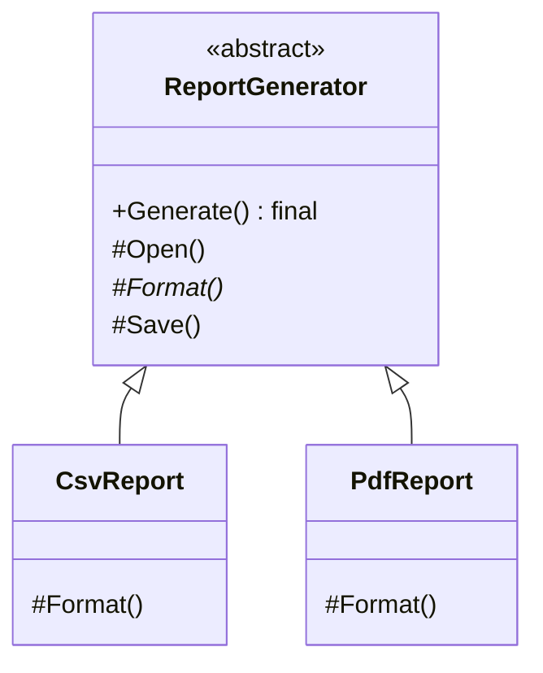

# Template Method: Fix the Skeleton, Let Subclasses Fill the Steps

> **Intent:** Define the skeleton of an algorithm in a base class, deferring some steps to
> subclasses.

## 🧠 Intuition

Several processes share the *same overall sequence* but differ in a few steps. Template Method puts
the fixed sequence in a base-class method (the "template") and leaves the variable steps as
overridable hooks. Subclasses customize the steps without touching the order.

> 💡 **Analogy — a recipe template for "make a hot drink."** Boil water → add main ingredient →
> pour into cup → add condiments. The *sequence* is fixed; tea and coffee differ only in "add main
> ingredient" (steep tea bag vs brew grounds) and "add condiments" (lemon vs milk).

## 🎯 The Problem

```csharp
// ❌ Before: two near-identical methods with duplicated structure
class CsvReport { public void Generate() { Open(); /*csv format*/ Save(); } }
class PdfReport { public void Generate() { Open(); /*pdf format*/ Save(); } }
// Open() and Save() are identical; only the formatting step differs — but it's all copy-pasted.
```

## 📐 Structure



**Participants:** `AbstractClass` (ReportGenerator) — defines the template method (the fixed
sequence) plus abstract/hook steps · `ConcreteClass` (Csv/PdfReport) — overrides the variable steps.

## 💻 C# Implementation

```csharp
public abstract class ReportGenerator {
    // The TEMPLATE METHOD: fixed algorithm skeleton. Not virtual → subclasses can't reorder it.
    public void Generate() {
        Open();
        string body = Format();      // the step that varies
        Save(body);
    }
    private void Open() => Console.WriteLine("Opening data source...");   // shared
    protected abstract string Format();                                   // subclasses MUST define
    protected virtual void Save(string body) => Console.WriteLine("Saving: " + body);  // optional hook
}

public class CsvReport : ReportGenerator {
    protected override string Format() => "a,b,c";
}
public class PdfReport : ReportGenerator {
    protected override string Format() => "%PDF body";
    protected override void Save(string body) => Console.WriteLine("Saving PDF: " + body);  // hook override
}

// Usage
ReportGenerator report = new CsvReport();
report.Generate();    // Open → Format(csv) → Save
```

The base class controls the flow (this is the **Hollywood Principle**: "don't call us, we'll call
you" — the framework calls your overrides, not the reverse).

## ⚖️ Trade-offs

**Pros:** removes duplication of the shared structure; enforces the sequence; lets subclasses
customize only what varies.
**Cons:** uses **inheritance** (tighter coupling, one base class only); can be rigid; subclasses are
constrained by the skeleton; overusing hooks gets confusing. Often [Strategy](01.Strategy.md)
(composition) is more flexible.

## ✅ When to Use / 🚫 When to Avoid

- **Use when** several algorithms share an identical structure but differ in specific steps, and you
  want to avoid duplicating the structure.
- **Avoid when** you need to vary the *whole* algorithm or swap behavior at runtime — prefer
  [Strategy](01.Strategy.md) (composition over inheritance).
- **Misuse:** deep inheritance trees of template methods; forcing inheritance where composition fits.

## 🔗 Related Patterns

- **[Strategy](01.Strategy.md):** the composition-based alternative. Template Method varies *steps*
  via inheritance; Strategy varies the *whole algorithm* via a plugged-in object. (Key comparison.)
- **[Factory Method](../01-Creational/01.Factory-Method.md):** frequently *is* a step within a
  template method.

## 🌍 Real-World & .NET Examples

- ASP.NET Core middleware/`ControllerBase` lifecycle hooks; `HostedService.StartAsync`/`StopAsync`.
- `Stream`'s template operations; xUnit/NUnit `[SetUp]`/`[TearDown]` around your test method.
- Sorting frameworks calling your `Compare` (a step) within a fixed sort skeleton.

## 🎯 Practice (with full solutions)

### 1. De-duplicate the report structure — `Easy`
**Task:** Refactor the duplicated `CsvReport`/`PdfReport` from the Problem.
**Solution:** the `ReportGenerator` template above — shared `Open`/`Save`, abstract `Format`.
**Why it's better:** the sequence lives once; each report defines only its differing step.

### 2. Beverage maker with hooks — `Medium`
**Scenario:** Tea and coffee both: boil water → brew → pour → add condiments. Tea steeps a bag with
lemon; coffee brews grounds with milk. Some drinks skip condiments.
**Solution:**
```csharp
abstract class Beverage {
    public void Make() {                       // template method
        BoilWater();
        Brew();
        Pour();
        if (WantsCondiments()) AddCondiments(); // hook controls an optional step
    }
    private void BoilWater() => Console.WriteLine("boiling");
    private void Pour() => Console.WriteLine("pouring");
    protected abstract void Brew();
    protected abstract void AddCondiments();
    protected virtual bool WantsCondiments() => true;   // overridable hook
}
class Tea : Beverage {
    protected override void Brew() => Console.WriteLine("steeping tea");
    protected override void AddCondiments() => Console.WriteLine("adding lemon");
}
class BlackCoffee : Beverage {
    protected override void Brew() => Console.WriteLine("brewing coffee");
    protected override void AddCondiments() { }
    protected override bool WantsCondiments() => false;  // skip the optional step
}
```
**Why it's better:** the brewing *sequence* is defined once; subclasses customize only the steps,
and a **hook** toggles the optional condiments step.

## ✅ Key Takeaways

- Template Method fixes an **algorithm skeleton** in a base class and defers **steps** to subclasses.
- The template method itself is non-overridable; the **Hollywood Principle** — the base calls your
  overrides.
- It uses **inheritance**; for runtime flexibility prefer [Strategy](01.Strategy.md) (composition).
- **Hooks** let subclasses optionally customize or skip steps.

**Self-check:**
1. Why is the template method itself usually not virtual?
2. What's the trade-off between Template Method and Strategy?
3. What is a "hook" in this pattern?

---
◀ Prev: [Command](03.Command.md) · ▲ [Module index](README.md) · ▶ Next: [State](05.State.md)
