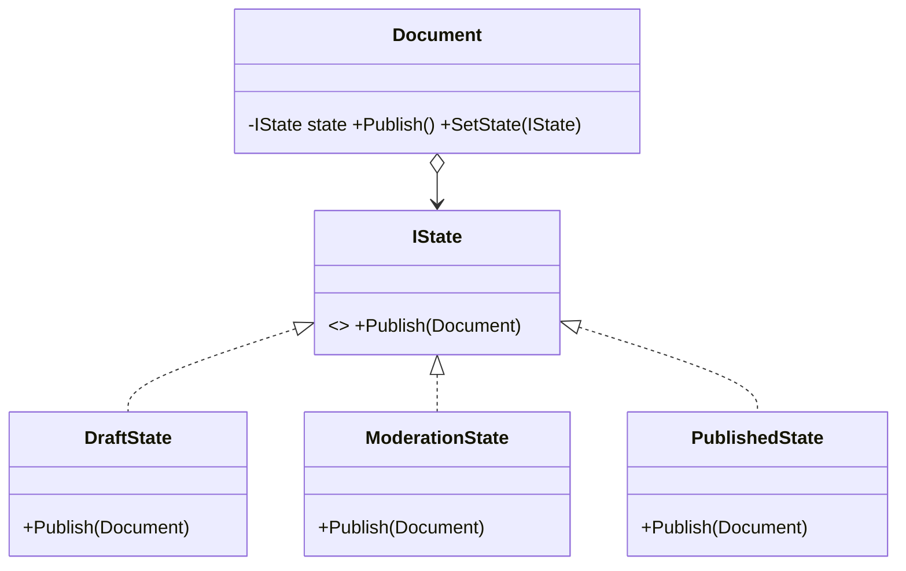

# State: Behavior Changes With Internal State

> **Intent:** Allow an object to alter its behavior when its internal state changes — it appears to
> change its class.

## 🧠 Intuition

An object that behaves differently depending on what "mode" it's in usually ends up riddled with
`switch (state)` statements in every method. State puts each mode into its **own class**, and the
object **delegates** to the current state object. Transitions become "swap the current state
object." Adding a new state doesn't touch the others.

> 💡 **Analogy — a traffic light.** Red, Yellow, Green each behave differently and each knows what
> comes next. The light itself just holds "the current state" and asks it what to do; the state
> decides the behavior and the transition.

Structurally it's identical to [Strategy](01.Strategy.md) — but the **intent** differs: here the
object changes its *own* state, often the states drive the transitions.

## 🎯 The Problem

```csharp
// ❌ Before: every method branches on a state flag — fragile, hard to extend
class Document {
    string state = "Draft";
    public void Publish() {
        if (state == "Draft") state = "Moderation";
        else if (state == "Moderation") state = "Published";
        else if (state == "Published") { /* nothing */ }
    }
    public void Edit() { if (state == "Published") throw new(); /* ... */ }
    // every new state → edit EVERY method's switch
}
```

## 📐 Structure



**Participants:** `Context` (Document) — holds a reference to the current state and delegates to it ·
`State` (IState) — the interface for state-specific behavior · `ConcreteStates` (Draft/Moderation/
Published) — implement behavior and trigger transitions.

## 💻 C# Implementation

```csharp
public interface IDocState { void Publish(Document doc); }

public class Document {
    public IDocState State { get; set; }
    public Document() => State = new DraftState();
    public void Publish() => State.Publish(this);     // delegate to current state
}

public class DraftState : IDocState {
    public void Publish(Document doc) {
        Console.WriteLine("Draft → Moderation");
        doc.State = new ModerationState();            // the state drives the transition
    }
}
public class ModerationState : IDocState {
    public void Publish(Document doc) {
        Console.WriteLine("Moderation → Published");
        doc.State = new PublishedState();
    }
}
public class PublishedState : IDocState {
    public void Publish(Document doc) => Console.WriteLine("Already published — no-op");
}

// Usage
var doc = new Document();
doc.Publish();   // Draft → Moderation
doc.Publish();   // Moderation → Published
doc.Publish();   // Already published
```

Each method's `switch` is gone — behavior and transitions live in the state classes.

## ⚖️ Trade-offs

**Pros:** eliminates sprawling state conditionals; each state is isolated and easy to add/modify
(Open/Closed); transitions are explicit.
**Cons:** more classes (one per state); for simple two-state cases it's overkill; transition logic
is spread across states (can be harder to see the whole machine at a glance).

## ✅ When to Use / 🚫 When to Avoid

- **Use when** an object's behavior depends on its state and you have many state-dependent
  conditionals, or a genuine **state machine** (orders, documents, connections, game entities).
- **Avoid when** there are only two simple states or behavior barely changes — a boolean/enum is
  fine.
- **Misuse:** modeling something that isn't really a state machine; or letting state classes know
  too much about each other.

## 🔗 Related Patterns

- **[Strategy](01.Strategy.md):** *same structure*. Strategy is set by the **client** and usually
  doesn't change itself; State **changes itself** and the states often decide transitions. (The
  classic interview distinction.)
- **[Singleton](../01-Creational/05.Singleton.md):** stateless state objects can be shared singletons.

## 🌍 Real-World & .NET Examples

- Workflow/order/document status machines; TCP connection states (Listen, Established, Closed).
- Game character states (Idle, Running, Jumping); UI wizard steps; parser states.

## 🎯 Practice (with full solutions)

### 1. Vending machine — `Medium`
**Scenario:** A vending machine behaves differently when NoCoin vs HasCoin vs Sold. Replace the
state `switch`es with State.
**Solution:**
```csharp
interface IVendState { void InsertCoin(VendingMachine m); void Dispense(VendingMachine m); }
class NoCoinState : IVendState {
    public void InsertCoin(VendingMachine m) { Console.WriteLine("coin accepted"); m.State = new HasCoinState(); }
    public void Dispense(VendingMachine m) => Console.WriteLine("insert a coin first");
}
class HasCoinState : IVendState {
    public void InsertCoin(VendingMachine m) => Console.WriteLine("coin already inserted");
    public void Dispense(VendingMachine m) { Console.WriteLine("dispensing"); m.State = new NoCoinState(); }
}
class VendingMachine {
    public IVendState State = new NoCoinState();
    public void InsertCoin() => State.InsertCoin(this);
    public void Dispense() => State.Dispense(this);
}
```
**Why it's better:** each state's rules and transitions are localized; adding a "SoldOut" state is a
new class, not edits across every method.

### 2. State vs Strategy — `Easy`
**Task:** A class lets the *caller* pick a compression algorithm that never changes during use.
State or Strategy?
**Solution:** **Strategy** — the behavior is chosen externally and is stable; there are no
self-driven transitions. State is for when the object *changes its own* behavior over its lifecycle.
**Why it matters:** identical structure, opposite intent — knowing which to name shows understanding.

## ✅ Key Takeaways

- State puts each "mode" in its own class and **delegates** to the current one — killing state
  `switch` statements.
- States typically **drive the transitions** to the next state.
- Structurally identical to **Strategy**; the difference is intent (self-changing vs client-chosen).
- Ideal for genuine **state machines**; overkill for trivial two-state logic.

**Self-check:**
1. What code smell does State remove?
2. Who usually triggers the transition between states?
3. How do you decide between State and Strategy?

---
◀ Prev: [Template Method](04.Template-Method.md) · ▲ [Module index](README.md) · ▶ Next: [Iterator](06.Iterator.md)
