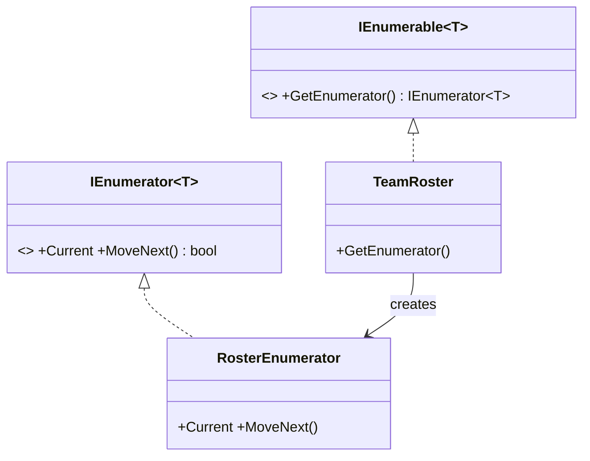

# Iterator: Traverse a Collection Without Exposing It

> **Intent:** Provide a way to access the elements of a collection sequentially without exposing its
> underlying representation.

## 🧠 Intuition

You want to walk through a collection's elements one by one — but you shouldn't have to know whether
it's an array, a linked list, or a tree inside. An Iterator is a separate object that knows how to
step through the collection, exposing a simple "is there a next? give me the next" interface.

> 💡 **Analogy — a TV remote's channel button.** You press "next channel" without knowing how
> channels are stored or ordered internally. The remote (iterator) handles "where am I, what's
> next"; you just keep pressing.

In C# this pattern is so fundamental it's **built into the language** — `IEnumerable`/`IEnumerator`
and `foreach` *are* Iterator. You'll rarely hand-write one, but understanding it explains how
`foreach` and `yield` work.

## 🎯 The Problem

```csharp
// ❌ Before: callers must know the internal storage, and traversal logic leaks everywhere
class TeamRoster {
    public Player[] PlayersArray;     // today it's an array...
    // ...tomorrow a List or tree → every caller's for-loop breaks
}
for (int i = 0; i < roster.PlayersArray.Length; i++) { /* coupled to the array */ }
```

## 📐 Structure



**Participants:** `Iterator` (IEnumerator) — `Current` + `MoveNext()` · `Aggregate` (IEnumerable) —
creates an iterator · concrete versions for your collection.

## 💻 C# Implementation

### The idiomatic way: `yield` (the compiler builds the iterator for you)

```csharp
public class TeamRoster : IEnumerable<string> {
    private readonly string[] players;
    public TeamRoster(params string[] players) => this.players = players;

    public IEnumerator<string> GetEnumerator() {
        foreach (var p in players)
            yield return p;          // compiler generates a full IEnumerator state machine
    }
    System.Collections.IEnumerator System.Collections.IEnumerable.GetEnumerator() => GetEnumerator();
}

// Usage — callers never touch the internal array
foreach (var player in new TeamRoster("Ana", "Ben", "Cleo"))
    Console.WriteLine(player);
```

### Manual iterator (what `yield` generates under the hood)

```csharp
public class CountdownIterator : IEnumerator<int> {
    private readonly int start; private int current;
    public CountdownIterator(int start) { this.start = start; current = start + 1; }
    public int Current => current;
    object System.Collections.IEnumerator.Current => Current;
    public bool MoveNext() { current--; return current >= 0; }   // advance; false when done
    public void Reset() => current = start + 1;
    public void Dispose() { }
}
```

## ⚖️ Trade-offs

**Pros:** decouples traversal from the collection's structure; supports multiple simultaneous
traversals; uniform iteration across different collections; lazy evaluation with `yield`.
**Cons:** for simple cases it's overhead; a custom iterator is rarely needed in C# (the language
gives it to you).

## ✅ When to Use / 🚫 When to Avoid

- **Use when** you want to expose iteration over a collection without revealing its internals, offer
  different traversal orders, or produce sequences lazily.
- **In C#:** just implement `IEnumerable<T>` (usually with `yield`) — don't reinvent it.
- **Misuse:** hand-rolling `IEnumerator` state machines when `yield return` would do it for you.

## 🔗 Related Patterns

- **[Composite](../02-Structural/05.Composite.md):** iterators are commonly used to traverse
  composites (trees).
- **[Factory Method](../01-Creational/01.Factory-Method.md):** `GetEnumerator()` is essentially a
  factory for iterators.

## 🌍 Real-World & .NET Examples

- `foreach`, `IEnumerable<T>`/`IEnumerator<T>`, and `yield return` — Iterator baked into C#.
- LINQ's deferred execution is built on lazy iterators.
- Database cursors; paging through API results.

## 🎯 Practice (with full solutions)

### 1. Make a custom type foreach-able — `Easy`
**Scenario:** A `RingBuffer<T>` stores items in a circular array. Let callers `foreach` it in logical
order without seeing the wraparound.
**Solution:**
```csharp
class RingBuffer<T> : IEnumerable<T> {
    private readonly T[] buf; private readonly int head, count;
    public RingBuffer(T[] buf, int head, int count) { this.buf = buf; this.head = head; this.count = count; }
    public IEnumerator<T> GetEnumerator() {
        for (int i = 0; i < count; i++)
            yield return buf[(head + i) % buf.Length];   // hide the modulo/wraparound
    }
    System.Collections.IEnumerator System.Collections.IEnumerable.GetEnumerator() => GetEnumerator();
}
```
**Why it's better:** callers iterate in logical order; the circular-storage detail stays hidden.

### 2. Lazy infinite sequence — `Medium`
**Scenario:** Produce Fibonacci numbers on demand without precomputing or storing them all.
**Solution:** `yield` gives lazy iteration for free:
```csharp
IEnumerable<long> Fibonacci() {
    long a = 0, b = 1;
    while (true) { yield return a; (a, b) = (b, a + b); }   // infinite, but lazy
}
// usage: Fibonacci().Take(10)  → first 10, computed one at a time
```
**Why it's better:** the iterator yields values lazily, so an "infinite" sequence is safe and
memory-light — impossible with an eager list.

## ✅ Key Takeaways

- Iterator exposes **sequential access** to a collection without revealing its internals.
- In C#, **`IEnumerable<T>` + `foreach` + `yield`** are Iterator built into the language — use them.
- It enables **lazy** sequences (LINQ, infinite generators) and multiple independent traversals.
- Hand-written `IEnumerator` state machines are rarely needed — `yield` writes them for you.

**Self-check:**
1. What does Iterator hide from the caller?
2. Which C# features implement this pattern for you?
3. How does `yield return` enable lazy/infinite sequences?

---
◀ Prev: [State](05.State.md) · ▲ [Module index](README.md) · ▶ Next: [Chain of Responsibility](07.Chain-of-Responsibility.md)
