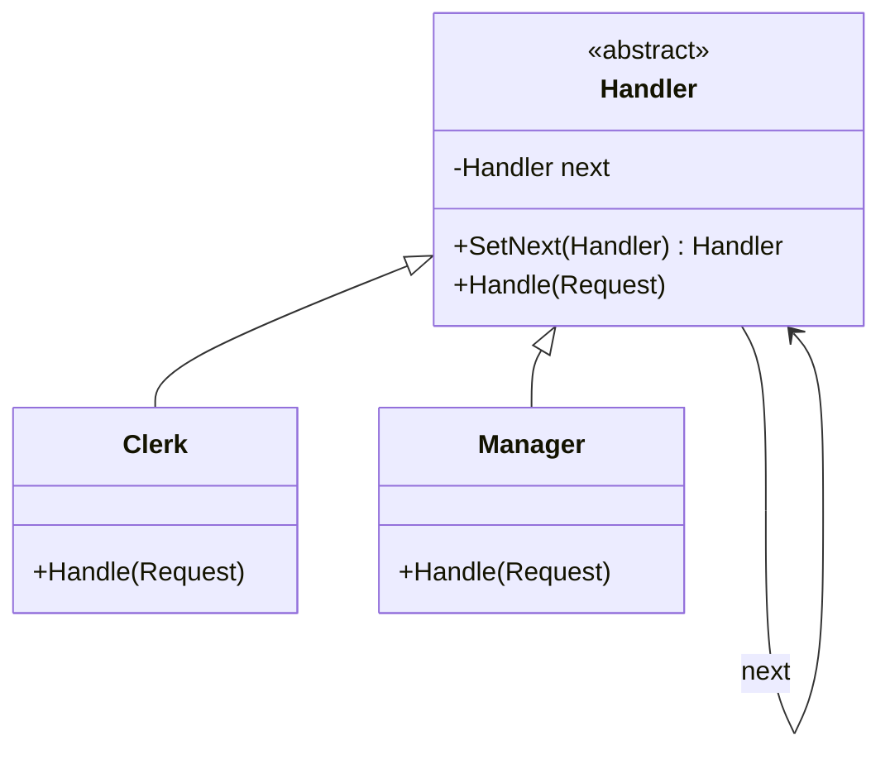

# Chain of Responsibility: Pass a Request Along a Chain of Handlers

> **Intent:** Pass a request along a chain of handlers; each decides to handle it or forward it to
> the next.

## 🧠 Intuition

Instead of one big method deciding who should handle a request, you build a **chain** of small
handlers. Each handler looks at the request, handles it if it can, or passes it to the next one. The
sender doesn't know (or care) which handler ultimately deals with it.

> 💡 **Analogy — a support escalation line.** Your ticket goes to Level 1 support. They either solve
> it or escalate to Level 2, then Level 3. Each level handles what it can and forwards the rest. You
> just submit the ticket; the chain figures out who resolves it.

## 🎯 The Problem

```csharp
// ❌ Before: one method crammed with the whole decision tree
void Handle(Request r) {
    if (r.Amount < 100) { /* clerk approves */ }
    else if (r.Amount < 1000) { /* manager approves */ }
    else if (r.Amount < 10000) { /* director approves */ }
    else { /* CEO approves */ }
    // every new approval level → edit this growing conditional
}
```

## 📐 Structure



**Participants:** `Handler` — defines the interface and holds a `next` reference · `ConcreteHandlers`
(Clerk, Manager…) — handle or forward · `Client` — builds the chain and submits requests to its head.

## 💻 C# Implementation

```csharp
public abstract class Approver {
    private Approver? next;
    public Approver SetNext(Approver next) { this.next = next; return next; }   // fluent chaining

    public void Handle(decimal amount) {
        if (CanApprove(amount)) Approve(amount);
        else if (next != null) next.Handle(amount);          // forward
        else Console.WriteLine($"No one can approve {amount:C}");
    }
    protected abstract bool CanApprove(decimal amount);
    protected abstract void Approve(decimal amount);
}

public class Clerk : Approver {
    protected override bool CanApprove(decimal a) => a < 100;
    protected override void Approve(decimal a) => Console.WriteLine($"Clerk approved {a:C}");
}
public class Manager : Approver {
    protected override bool CanApprove(decimal a) => a < 1000;
    protected override void Approve(decimal a) => Console.WriteLine($"Manager approved {a:C}");
}
public class Director : Approver {
    protected override bool CanApprove(decimal a) => a < 10000;
    protected override void Approve(decimal a) => Console.WriteLine($"Director approved {a:C}");
}

// Usage — build the chain, submit to the head
var clerk = new Clerk();
clerk.SetNext(new Manager()).SetNext(new Director());
clerk.Handle(50m);     // Clerk
clerk.Handle(500m);    // Manager
clerk.Handle(5000m);   // Director
```

Adding a "CEO" handler = one class + linking it — no existing handler changes.

## ⚖️ Trade-offs

**Pros:** decouples sender from receivers; each handler is single-responsibility; reorder/add/remove
handlers freely (Open/Closed); flexible runtime configuration.
**Cons:** a request may go **unhandled** (no handler matches); harder to trace which handler acted;
slight overhead walking the chain.

## ✅ When to Use / 🚫 When to Avoid

- **Use when** more than one object may handle a request and the handler isn't known in advance, or
  you want to issue a request to one of several handlers without coupling, or process something
  through a pipeline of steps (validation, middleware, logging, auth).
- **Avoid when** exactly one handler always applies — a direct call is clearer.
- **Misuse:** chains so long/dynamic that flow becomes unpredictable; forgetting a fallback for
  unhandled requests.

## 🔗 Related Patterns

- **[Decorator](../02-Structural/03.Decorator.md):** similar wrapping/chaining, but Decorator *adds
  behavior* and always delegates; CoR handlers *may stop* the chain.
- **[Command](03.Command.md):** the request passed along can be a command object.
- **Middleware pipelines** (ASP.NET Core) are essentially this pattern.

## 🌍 Real-World & .NET Examples

- ASP.NET Core **middleware pipeline** (`app.Use(...)` — each middleware handles or calls `next`).
- Exception handling (each `catch`/handler up the stack); event bubbling in UIs.
- Logging frameworks with chained appenders; approval workflows.

## 🎯 Practice (with full solutions)

### 1. Request validation pipeline — `Medium`
**Scenario:** An incoming request must pass: not-null check → authentication → rate-limit. Each step
either rejects or passes it on. Build a chain.
**Solution:**
```csharp
abstract class Middleware {
    private Middleware? next;
    public Middleware SetNext(Middleware m) { next = m; return m; }
    public virtual bool Check(Request r) => next?.Check(r) ?? true;   // default: pass along
}
class NotNullCheck : Middleware {
    public override bool Check(Request r) => r != null && base.Check(r);
}
class AuthCheck : Middleware {
    public override bool Check(Request r) => r.IsAuthenticated && base.Check(r);
}
class RateLimitCheck : Middleware {
    public override bool Check(Request r) => r.WithinRateLimit && base.Check(r);
}
// var pipeline = new NotNullCheck(); pipeline.SetNext(new AuthCheck()).SetNext(new RateLimitCheck());
```
**Why it's better:** each rule is isolated and reorderable; adding a rule is one class, and the
"pass to next" wiring keeps the sender ignorant of the steps.

### 2. CoR vs a big switch — `Easy`
**Task:** Why prefer a chain over the `if/else` approval ladder from the Problem?
**Solution:** the chain makes each level a standalone, testable class; you can reorder/insert levels
without editing others (Open/Closed), and configure the chain at runtime. The `if/else` must be
edited for every change and concentrates all logic in one place.
**Why it matters:** CoR trades a monolithic conditional for composable, single-responsibility handlers.

## ✅ Key Takeaways

- CoR sends a request down a **chain**; each handler handles or **forwards** it.
- The sender is **decoupled** from whichever handler responds.
- Handlers are single-responsibility and freely **reorderable/addable** (Open/Closed).
- Provide a **fallback** for unhandled requests; it's the basis of middleware pipelines.

**Self-check:**
1. What does CoR decouple, and how?
2. What's a risk if no handler matches a request?
3. How does CoR differ from Decorator, given both chain objects?

---
◀ Prev: [Iterator](06.Iterator.md) · ▲ [Module index](README.md) · ▶ Next: [Mediator](08.Mediator.md)
