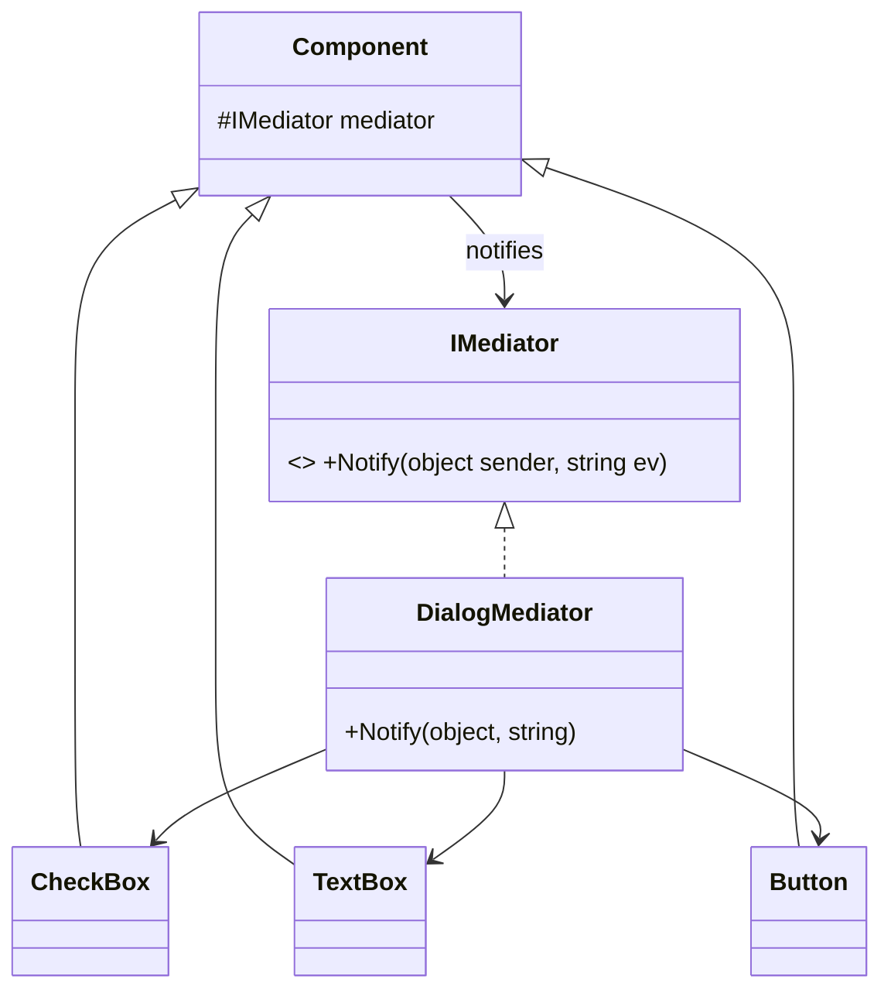

# Mediator: Centralize Complex Communication

> **Intent:** Define an object that encapsulates how a set of objects interact, so they don't refer
> to each other directly.

## 🧠 Intuition

When many objects all talk to each other directly, you get a tangled web — every object knows about
every other, and a change ripples everywhere. A Mediator is a central hub: objects talk to the
**mediator**, and it coordinates everyone. This turns a many-to-many mess into a clean hub-and-spoke.

> 💡 **Analogy — air traffic control.** Planes don't negotiate landings directly with each other
> (chaos!). They all talk to the control tower, which coordinates. Each plane only knows the tower;
> the tower knows the rules. Add a plane → it just talks to the tower.

## 🎯 The Problem

In a dialog form, every control reacts to others: the checkbox enables a textbox, the textbox
enables the button… Each control references the others directly:

```csharp
// ❌ Before: controls are entangled — each knows the others
class Checkbox { public TextBox linkedText; public Button linkedButton; /* ...refs everywhere */ }
// changing the form's logic means editing many controls; reuse is impossible
```

## 📐 Structure



**Participants:** `Mediator` (IMediator) — coordination interface · `ConcreteMediator`
(DialogMediator) — holds references to components and encodes their interactions · `Colleagues`
(controls) — know only the mediator, not each other.

## 💻 C# Implementation

```csharp
public interface IMediator { void Notify(object sender, string ev); }

public abstract class Component {
    protected IMediator mediator;
    protected Component(IMediator m) => mediator = m;
}

public class CheckBox : Component {
    public bool Checked;
    public CheckBox(IMediator m) : base(m) {}
    public void Toggle() { Checked = !Checked; mediator.Notify(this, "toggled"); }
}
public class Button : Component {
    public bool Enabled;
    public Button(IMediator m) : base(m) {}
}

public class DialogMediator : IMediator {
    public CheckBox Agree = null!;
    public Button Submit = null!;
    public void Notify(object sender, string ev) {
        if (sender == Agree && ev == "toggled")
            Submit.Enabled = Agree.Checked;        // the interaction logic lives HERE, in one place
    }
}

// Usage
var mediator = new DialogMediator();
mediator.Agree = new CheckBox(mediator);
mediator.Submit = new Button(mediator);
mediator.Agree.Toggle();      // mediator enables Submit
```

All cross-component rules live in the mediator; the controls stay ignorant of each other and become
reusable.

## ⚖️ Trade-offs

**Pros:** removes tight coupling among colleagues (many-to-many → one-to-many); centralizes
interaction logic; colleagues become reusable; easy to change how they collaborate.
**Cons:** the mediator can grow into a **god object** that knows too much; it becomes a complexity
magnet if not split up.

## ✅ When to Use / 🚫 When to Avoid

- **Use when** a set of objects communicate in complex, tangled ways and you want to decouple them,
  or reuse components independently of how they interact (dialogs/forms, chat rooms, workflow
  coordination).
- **Avoid when** interactions are simple or few — a mediator adds an unneeded hub.
- **Misuse:** letting the mediator absorb all logic until it's an unmaintainable god object.

## 🔗 Related Patterns

- **[Observer](02.Observer.md):** Observer is one-to-many *broadcast*; Mediator coordinates
  *many-to-many* with logic about *how* they interact. (Mediators are sometimes implemented using
  Observer/events.)
- **[Facade](../02-Structural/02.Facade.md):** Facade simplifies a subsystem one-way; Mediator
  enables multi-directional coordination among peers.

## 🌍 Real-World & .NET Examples

- **MediatR** library (in-process request/notification dispatching) — a popular .NET realization.
- UI form/dialog coordination; chat-room servers routing messages between users.
- Workflow engines orchestrating steps.

## 🎯 Practice (with full solutions)

### 1. Chat room — `Medium`
**Scenario:** Users send messages to a room; everyone else should receive them. Users shouldn't
reference each other directly.
**Solution:**
```csharp
interface IChatRoom { void Send(string from, string message); void Join(User u); }
class ChatRoom : IChatRoom {
    private readonly List<User> users = new();
    public void Join(User u) => users.Add(u);
    public void Send(string from, string message) {
        foreach (var u in users.Where(u => u.Name != from))
            u.Receive(from, message);          // mediator routes to everyone else
    }
}
class User {
    public string Name; private readonly IChatRoom room;
    public User(string name, IChatRoom room) { Name = name; this.room = room; room.Join(this); }
    public void Send(string m) => room.Send(Name, m);
    public void Receive(string from, string m) => Console.WriteLine($"{Name} got '{m}' from {from}");
}
```
**Why it's better:** users know only the room; adding/removing users or changing routing rules
touches only the mediator.

### 2. Mediator vs Observer — `Easy`
**Task:** You need a stock price change to notify many unrelated widgets, with no coordination
between them. Mediator or Observer?
**Solution:** **Observer** — it's a simple one-to-many broadcast with no interaction *logic* between
recipients. Use Mediator when objects must coordinate (the hub decides *how* they affect each other).
**Why it matters:** broadcast → Observer; coordination logic among peers → Mediator.

## ✅ Key Takeaways

- Mediator turns tangled **many-to-many** object communication into a clean hub-and-spoke.
- Colleagues know only the mediator → looser coupling and reusable components.
- Interaction logic is **centralized** (the upside) — but watch for it becoming a **god object**.
- Distinguish from **Observer** (broadcast) and **Facade** (one-way subsystem simplification).

**Self-check:**
1. What communication problem does Mediator solve?
2. What's the main risk of a mediator, and how do you manage it?
3. When would Observer be the better choice?

---
◀ Prev: [Chain of Responsibility](07.Chain-of-Responsibility.md) · ▲ [Module index](README.md) · ▶ Next: [Memento](09.Memento.md)
