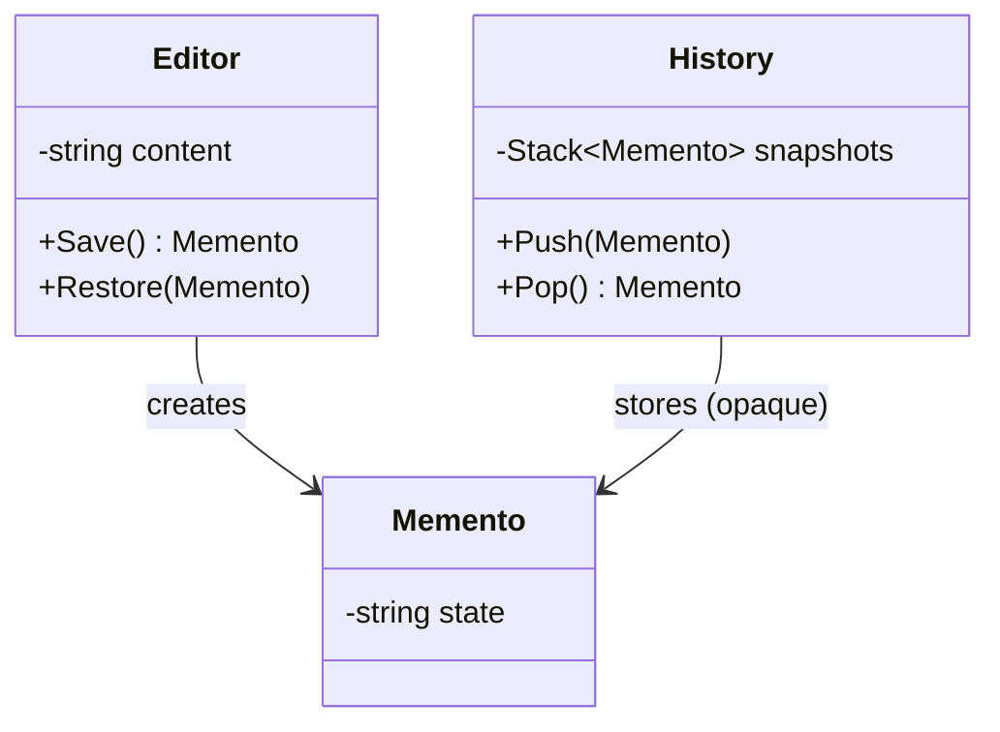

# Memento: Capture and Restore State (Undo)

> **Intent:** Capture an object's internal state so it can be restored later — without violating
> encapsulation.

## 🧠 Intuition

To support undo, you need to remember an object's past state and put it back later. But you don't
want to expose the object's private fields to do it. Memento lets the object produce an opaque
**snapshot** of itself (the memento), which something else stores and hands back when it's time to
restore — without ever peeking inside.

> 💡 **Analogy — a video game save point.** The game writes a save file capturing your full state.
> You don't read or edit the file's internals; you just "load" it later to return to that exact
> moment. The save file is the memento.

## 🎯 The Problem

A text editor needs undo. Naively exposing the editor's internals to a history manager breaks
encapsulation; not snapshotting means no undo:

```csharp
// ❌ Before: to undo, the history manager reaches into private state
class Editor { public string content; public int cursor; }   // everything public = fragile
historyManager.Save(editor.content, editor.cursor);            // leaks internals everywhere
```

## 📐 Structure



**Participants:** `Originator` (Editor) — creates a memento of its state and restores from one ·
`Memento` — the opaque snapshot (only the originator can read its contents) · `Caretaker` (History)
— keeps mementos but never inspects them.

## 💻 C# Implementation

```csharp
public class Editor {
    private string content = "";
    public void Type(string text) => content += text;
    public override string ToString() => content;

    public Memento Save() => new Memento(content);          // snapshot current state
    public void Restore(Memento m) => content = m.GetState();// restore from snapshot

    // Memento: state is opaque to everyone except the Editor
    public class Memento {
        private readonly string state;
        public Memento(string state) => this.state = state;
        public string GetState() => state;                  // only the Editor uses this
    }
}

public class History {                                       // Caretaker — stores, never peeks
    private readonly Stack<Editor.Memento> snapshots = new();
    public void Push(Editor.Memento m) => snapshots.Push(m);
    public Editor.Memento? Pop() => snapshots.Count > 0 ? snapshots.Pop() : null;
}

// Usage
var editor = new Editor();
var history = new History();
editor.Type("Hello");
history.Push(editor.Save());      // checkpoint
editor.Type(" World");
history.Push(editor.Save());
editor.Type(" — oops");
editor.Restore(history.Pop()!);   // undo last
Console.WriteLine(editor);        // "Hello World"
```

The `History` holds mementos but can't read or alter the editor's state — encapsulation intact.

## ⚖️ Trade-offs

**Pros:** clean undo/redo and checkpoints; preserves encapsulation (state isn't exposed); the
caretaker stays simple.
**Cons:** snapshots can be **memory-heavy** if state is large or saved often; capturing/restoring
complex object graphs is tricky; need a strategy to limit history size.

## ✅ When to Use / 🚫 When to Avoid

- **Use when** you need undo/redo, checkpoints, snapshots, or transactional rollback, and you want to
  keep the object's internals private.
- **Avoid when** state is huge and frequent snapshots would blow memory (consider command-based undo
  instead), or the object is trivial.
- **Misuse:** exposing the memento's contents to the caretaker (defeats the encapsulation purpose).

## 🔗 Related Patterns

- **[Command](03.Command.md):** Command-based undo *reverses operations*; Memento-based undo
  *restores a saved state*. Often combined (a command saves a memento before acting).
- **[Prototype](../01-Creational/04.Prototype.md):** also captures state, but to create copies, not
  to restore later.

## 🌍 Real-World & .NET Examples

- Editor undo/redo; database transactions/savepoints; VM/game save states.
- `IMemoryCache` snapshots; serialization-based state capture.

## 🎯 Practice (with full solutions)

### 1. Undo for a shape editor — `Medium`
**Scenario:** A `Shape` has position and color. Support undo of moves/recolors without exposing its
fields.
**Solution:**
```csharp
class Shape {
    private int x, y; private string color = "black";
    public void Move(int x, int y) { this.x = x; this.y = y; }
    public void Recolor(string c) => color = c;
    public ShapeMemento Save() => new(x, y, color);
    public void Restore(ShapeMemento m) { x = m.X; y = m.Y; color = m.Color; }
}
record ShapeMemento(int X, int Y, string Color);   // opaque snapshot (record = immutable)

class UndoStack {
    private readonly Stack<ShapeMemento> stack = new();
    public void Save(Shape s) => stack.Push(s.Save());
    public void Undo(Shape s) { if (stack.Count > 0) s.Restore(stack.Pop()); }
}
```
**Why it's better:** undo works by restoring whole snapshots; the shape's fields stay private; a
`record` makes the memento conveniently immutable.

### 2. Memento vs Command undo — `Easy`
**Task:** When is state-snapshot (Memento) undo preferable to operation-reversal (Command) undo?
**Solution:** Memento is simpler when an operation is hard to reverse precisely but the state is
small/cheap to snapshot. Command undo is better when state is large (storing snapshots is costly) but
each operation has a clean inverse.
**Why it matters:** real undo systems choose based on state size vs reversibility — sometimes
combining both.

## ✅ Key Takeaways

- Memento captures an **opaque snapshot** of an object's state for later restore, **without exposing
  internals**.
- Three roles: **Originator** (makes/uses snapshots), **Memento** (opaque), **Caretaker** (stores,
  never peeks).
- Great for undo/redo and checkpoints; watch **memory** for large/frequent snapshots.
- Pairs with **Command**; contrast with **Prototype** (copy vs restore).

**Self-check:**
1. How does Memento preserve encapsulation while enabling undo?
2. What are the three participant roles?
3. When is Command-based undo preferable to Memento-based undo?

---
◀ Prev: [Mediator](08.Mediator.md) · ▲ [Module index](README.md) · ▶ Next: [Visitor](10.Visitor.md)
