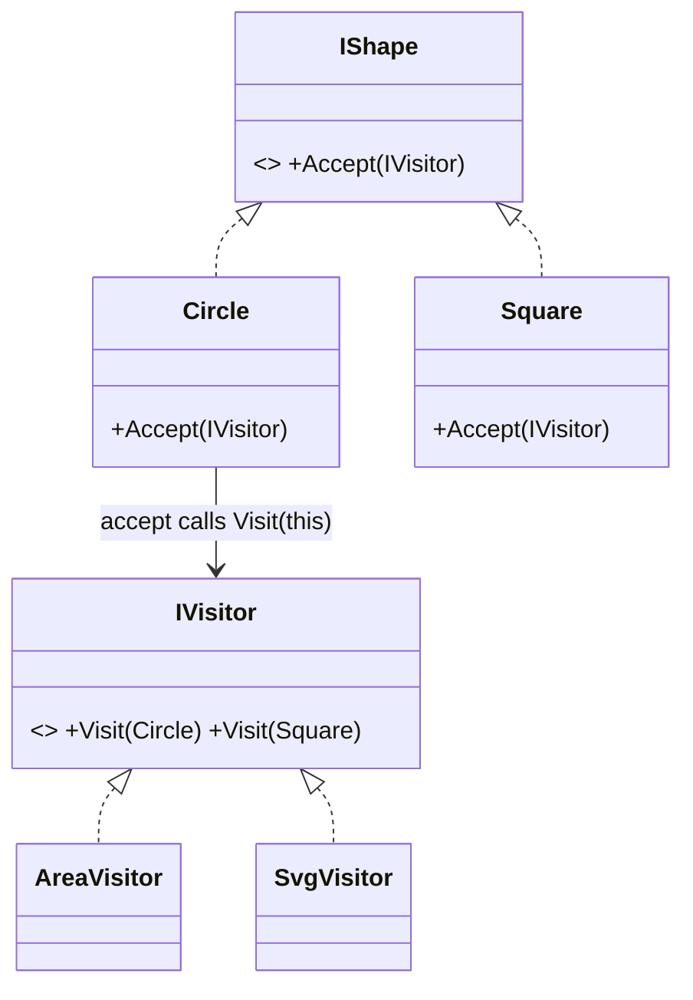

# Visitor: Add Operations Without Changing the Classes

> **Intent:** Represent an operation to be performed on the elements of an object structure, letting
> you add new operations without modifying those elements.

## 🧠 Intuition

You have a stable set of element classes (shapes, AST nodes, file types) and you keep needing to add
*new operations* over all of them (export, calculate area, validate). Adding each operation as a
method means editing every element class every time. Visitor flips it: put each operation in its own
**visitor** object, and have elements "accept" a visitor that does the work.

> 💡 **Analogy — a tax auditor visiting businesses.** The businesses (elements) don't change. The
> auditor (visitor) knows how to process each type of business. Next year a *different* inspector
> (health, safety) visits the same unchanged businesses. New operation = new visitor, not new code
> in every business.

## 🎯 The Problem

You have `Circle`, `Square`, `Triangle`. First you need area; then perimeter; then SVG export. Each
new operation forces edits across *all* shape classes:

```csharp
// ❌ Before: every new operation adds a method to EVERY element class
class Circle { double Area() {} double Perimeter() {} string ToSvg() {} /* edited again & again */ }
class Square { double Area() {} double Perimeter() {} string ToSvg() {} }
```

## 📐 Structure



**Participants:** `Element` (IShape) — declares `Accept(visitor)` · `ConcreteElements` (Circle…) —
implement `Accept` by calling `visitor.Visit(this)` · `Visitor` (IVisitor) — a `Visit` overload per
element type · `ConcreteVisitors` (Area, Svg…) — one operation each.

## 💻 C# Implementation

```csharp
public interface IShape { void Accept(IShapeVisitor v); }

public class Circle : IShape {
    public double Radius;
    public void Accept(IShapeVisitor v) => v.Visit(this);    // double dispatch
}
public class Square : IShape {
    public double Side;
    public void Accept(IShapeVisitor v) => v.Visit(this);
}

public interface IShapeVisitor {
    void Visit(Circle c);
    void Visit(Square s);
}

public class AreaVisitor : IShapeVisitor {                    // one operation = one visitor
    public double Total;
    public void Visit(Circle c) => Total += Math.PI * c.Radius * c.Radius;
    public void Visit(Square s) => Total += s.Side * s.Side;
}
public class SvgVisitor : IShapeVisitor {                     // a NEW operation, no element edits
    public void Visit(Circle c) => Console.WriteLine($"<circle r='{c.Radius}'/>");
    public void Visit(Square s) => Console.WriteLine($"<rect side='{s.Side}'/>");
}

// Usage
IShape[] shapes = { new Circle { Radius = 1 }, new Square { Side = 2 } };
var area = new AreaVisitor();
foreach (var s in shapes) s.Accept(area);
Console.WriteLine(area.Total);
```

The trick is **double dispatch**: `Accept` knows the element's real type, then `Visit(this)` picks
the right overload — so the operation is resolved by *both* element type and visitor type.

## ⚖️ Trade-offs

**Pros:** add **new operations** easily (a new visitor, no element changes); gathers related behavior
in one visitor; can accumulate state across a traversal.
**Cons:** add a **new element type** and you must update *every* visitor — the exact opposite
trade-off; breaks encapsulation (visitors often need element internals); verbose.

## ✅ When to Use / 🚫 When to Avoid

- **Use when** the element classes are **stable** but you frequently add **new operations** over
  them (AST processing, document/shape exporters, compilers).
- **Avoid when** element types change often (every new element breaks all visitors), or there are few
  operations — plain methods are simpler.
- **Misuse:** using Visitor over a hierarchy that's still growing in *types* — you'll churn every
  visitor constantly.

## 🔗 Related Patterns

- **[Composite](../02-Structural/05.Composite.md):** Visitor is commonly used to run operations over
  a composite tree.
- **[Iterator](06.Iterator.md):** traverse the structure; Visitor defines what to *do* at each node.
- Trade-off mirror image of just adding methods: methods make new *operations* costly; Visitor makes
  new *types* costly. (The "expression problem.")

## 🌍 Real-World & .NET Examples

- Compilers/interpreters walking an AST (type-check visitor, codegen visitor, pretty-print visitor).
- Roslyn's `CSharpSyntaxVisitor`; `ExpressionVisitor` in LINQ expression trees.
- Document object models exporting to multiple formats.

## 🎯 Practice (with full solutions)

### 1. Add an operation without touching elements — `Medium`
**Scenario:** You have `AreaVisitor` over `Circle`/`Square`. Add a **perimeter** calculation without
editing the shape classes.
**Solution:** a new visitor:
```csharp
class PerimeterVisitor : IShapeVisitor {
    public double Total;
    public void Visit(Circle c) => Total += 2 * Math.PI * c.Radius;
    public void Visit(Square s) => Total += 4 * s.Side;
}
// foreach (var s in shapes) s.Accept(new PerimeterVisitor());
```
**Why it's better:** the new operation lives entirely in one class; `Circle`/`Square` are untouched —
the core Visitor payoff.

### 2. Understand the trade-off — `Easy`
**Task:** Your shape set will soon gain `Triangle`, `Hexagon`, `Ellipse`, but operations rarely
change. Is Visitor a good fit?
**Solution:** **No.** Visitor makes adding *operations* cheap but adding *element types* expensive
(every visitor must add a `Visit(Triangle)` etc.). With a growing type set and stable operations,
plain polymorphic methods are better.
**Why it matters:** choosing Visitor hinges on *which axis changes* — operations (use Visitor) vs
types (don't).

## ✅ Key Takeaways

- Visitor adds **new operations** to a class hierarchy **without modifying** the element classes.
- It relies on **double dispatch** (`Accept` → `Visit(this)`).
- Trade-off: cheap to add operations, **expensive to add element types** (every visitor changes).
- Use it when **types are stable but operations grow** (ASTs, exporters).

**Self-check:**
1. What is double dispatch and why does Visitor need it?
2. What's the exact trade-off Visitor makes (operations vs types)?
3. When is Visitor the *wrong* choice?

---
◀ Prev: [Memento](09.Memento.md) · ▲ [Module index](README.md) · ▶ Next: [Interpreter](11.Interpreter.md)
