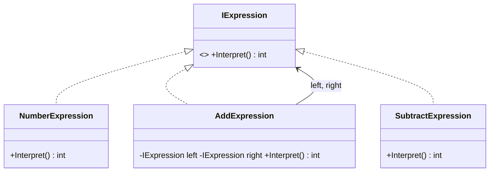

# Interpreter: Represent and Evaluate a Grammar

> **Intent:** Given a language, define a representation for its grammar and an interpreter that uses
> the representation to evaluate sentences in the language.
>
> *(This pattern was missing from the original repo — it completes the GoF 23.)*

## 🧠 Intuition

When you have a simple "mini-language" — arithmetic expressions, boolean rules, search filters — you
can model each grammar rule as a class, build expressions as a tree of those classes, and
**evaluate** the tree by asking each node for its value. Each rule knows how to interpret itself.

> 💡 **Analogy — reading a math expression aloud.** "(5 + 3) × 2" is a tree: a multiply whose left
> child is an add. To evaluate, you evaluate the children first, then combine. Each operation node
> knows its own rule. Interpreter builds that tree of rule-objects and walks it.

It's a niche, advanced pattern — for *small, stable* grammars. For anything serious you'd use a real
parser/parser-generator, but the pattern teaches how expression evaluation works (and underpins
LINQ expression trees, rules engines, etc.).

## 🎯 The Problem

You need to evaluate arithmetic expressions like `5 + 3 - 2` at runtime. A pile of string parsing
and `if`s is fragile and unextensible:

```csharp
// ❌ Before: ad-hoc string munging — hard to extend with new operations or nesting
int Evaluate(string expr) {
    // split on spaces, loop, branch on "+"/"-"... brittle, no nesting, no reuse
    return 0;
}
```

## 📐 Structure



**Participants:** `AbstractExpression` (IExpression) — declares `Interpret()` · `TerminalExpression`
(NumberExpression) — a leaf (literal value) · `NonterminalExpression` (Add/Subtract) — a rule
combining sub-expressions · `Context` (optional) — holds variables/global info during interpretation.

## 💻 C# Implementation

```csharp
public interface IExpression { int Interpret(); }

public class Number : IExpression {                 // terminal
    private readonly int value;
    public Number(int value) => this.value = value;
    public int Interpret() => value;
}
public class Add : IExpression {                     // non-terminal rule
    private readonly IExpression left, right;
    public Add(IExpression l, IExpression r) { left = l; right = r; }
    public int Interpret() => left.Interpret() + right.Interpret();   // evaluate children, combine
}
public class Subtract : IExpression {
    private readonly IExpression left, right;
    public Subtract(IExpression l, IExpression r) { left = l; right = r; }
    public int Interpret() => left.Interpret() - right.Interpret();
}

// Usage — build the expression tree for "5 + 3 - 2", then evaluate
IExpression expr = new Subtract(new Add(new Number(5), new Number(3)), new Number(2));
Console.WriteLine(expr.Interpret());   // 6
```

Each node interprets itself by interpreting its children — a recursive tree-walk. New operations
(`Multiply`, `Variable`) are new classes implementing `IExpression`.

## ⚖️ Trade-offs

**Pros:** each grammar rule is its own class — easy to add new rules; expressions compose naturally
into trees; clean for small DSLs and rules engines.
**Cons:** **does not scale** — complex grammars produce an unwieldy mountain of classes; parsing the
input into the tree is a separate (often harder) problem; performance is modest. For real languages,
use a parser generator (ANTLR) instead.

## ✅ When to Use / 🚫 When to Avoid

- **Use when** you have a **simple, stable** grammar to evaluate repeatedly: arithmetic/boolean
  expressions, search/filter rules, configuration mini-languages, formula evaluation.
- **Avoid when** the grammar is large or evolving — class count explodes; reach for a real parser.
- **Misuse:** building a programming language with it (that's what compilers/parser generators are for).

## 🔗 Related Patterns

- **[Composite](../02-Structural/05.Composite.md):** the expression tree *is* a composite; Interpreter
  adds the `Interpret()` operation over it.
- **[Visitor](10.Visitor.md):** an alternative — keep the node classes, put interpretation (and other
  operations like pretty-printing) in visitors.
- **[Flyweight](../02-Structural/07.Flyweight.md):** share terminal symbols that repeat.

## 🌍 Real-World & .NET Examples

- LINQ **expression trees** (`Expression<Func<...>>`) — interpreted/translated at runtime (e.g. to SQL).
- Regular-expression engines; rules engines; spreadsheet formula evaluation.
- `System.Linq.Dynamic`, search-query parsers.

## 🎯 Practice (with full solutions)

### 1. Add multiplication — `Easy`
**Task:** Extend the interpreter with a `Multiply` rule, without changing existing classes.
**Solution:**
```csharp
public class Multiply : IExpression {
    private readonly IExpression left, right;
    public Multiply(IExpression l, IExpression r) { left = l; right = r; }
    public int Interpret() => left.Interpret() * right.Interpret();
}
// (5 + 3) * 2:
IExpression e = new Multiply(new Add(new Number(5), new Number(3)), new Number(2)); // 16
```
**Why it's better:** a new grammar rule is one new class implementing `IExpression` — existing rules
untouched (Open/Closed).

### 2. Boolean rules with context — `Medium`
**Scenario:** Evaluate access rules like `isAdmin OR isOwner` where the variables come from a context.
**Solution:** terminals read from a context dictionary; non-terminals combine:
```csharp
interface IRule { bool Eval(Dictionary<string, bool> ctx); }
class Var : IRule {
    private readonly string name; public Var(string name) => this.name = name;
    public bool Eval(Dictionary<string, bool> ctx) => ctx.GetValueOrDefault(name);
}
class Or : IRule {
    private readonly IRule a, b; public Or(IRule a, IRule b) { this.a = a; this.b = b; }
    public bool Eval(Dictionary<string, bool> ctx) => a.Eval(ctx) || b.Eval(ctx);
}
// var rule = new Or(new Var("isAdmin"), new Var("isOwner"));
// rule.Eval(new() { ["isAdmin"] = false, ["isOwner"] = true });  // true
```
**Why it's better:** rules compose into a reusable tree and a **context** supplies runtime values —
the foundation of a small rules engine.

## ✅ Key Takeaways

- Interpreter models each **grammar rule as a class** and evaluates an **expression tree** by walking
  it recursively.
- Terminals (literals) + non-terminals (operations) compose; a context supplies variables.
- Great for **small, stable** DSLs/rules; it **doesn't scale** to real languages (use a parser).
- The tree is a [Composite](../02-Structural/05.Composite.md); [Visitor](10.Visitor.md) is an
  alternative way to add operations over it.

**Self-check:**
1. What's the difference between a terminal and a non-terminal expression?
2. Why does Interpreter not scale to complex grammars?
3. How is the expression tree related to the Composite pattern?

---
◀ Prev: [Visitor](10.Visitor.md) · ▲ [Module index](README.md) · ▶ Next module: [04 — Modern & Enterprise](../04-Modern-and-Enterprise/01.Dependency-Injection.md)
