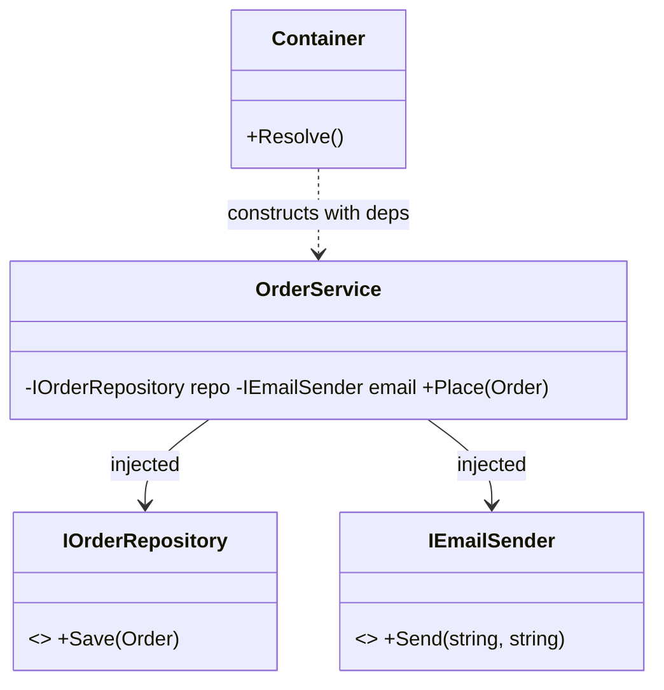

# Dependency Injection: Give Objects Their Dependencies

> **Intent:** Supply an object's dependencies from the outside (inversion of control) instead of
> having it create them — the practical realization of the [Dependency Inversion Principle](../00-Foundations/03.SOLID-Principles.md).

## 🧠 Intuition

When a class `new`s up its own collaborators, it's welded to those concrete types — hard to test,
hard to swap. Dependency Injection (DI) flips control: the class **declares what it needs** (usually
via constructor parameters), and something external **provides** it. The class no longer decides
*which* implementation it gets.

> 💡 **Analogy — a coffee machine vs a barista.** A machine with built-in, unremovable beans can
> only make one coffee and you can't test it with decaf. A barista who's *handed* beans can make
> anything and you can hand them test beans. DI hands dependencies in rather than hard-wiring them.

This is the backbone of modern application architecture (ASP.NET Core, Spring, Angular) and the
single biggest lever for **testability**.

## 🎯 The Problem

```csharp
// ❌ Before: OrderService is welded to concrete dependencies — untestable, inflexible
class OrderService {
    private readonly SqlOrderRepository repo = new();      // hard-coded concrete type
    private readonly SmtpEmailSender email = new();         // can't swap or mock
    public void Place(Order o) { repo.Save(o); email.Send(o.Customer, "confirmed"); }
}
// To unit-test Place(), you'd hit a real database and send real emails. Ouch.
```

## 📐 Structure



**Concepts:** *Inversion of Control (IoC)* — the framework controls creation/wiring · *DI container*
— a registry that knows how to build and supply dependencies · *Lifetimes* — transient (new each
time), scoped (per request), singleton (one for the app).

## 💻 C# Implementation

### Constructor injection (the preferred form)

```csharp
public interface IOrderRepository { void Save(Order o); }
public interface IEmailSender { void Send(string to, string msg); }

public class OrderService {
    private readonly IOrderRepository repo;
    private readonly IEmailSender email;
    public OrderService(IOrderRepository repo, IEmailSender email) {   // dependencies declared & injected
        this.repo = repo;
        this.email = email;
    }
    public void Place(Order o) { repo.Save(o); email.Send(o.Customer, "confirmed"); }
}
```

### Wiring with the built-in .NET container

```csharp
var services = new ServiceCollection();
services.AddScoped<IOrderRepository, SqlOrderRepository>();   // map interface → implementation
services.AddScoped<IEmailSender, SmtpEmailSender>();
services.AddScoped<OrderService>();

var provider = services.BuildServiceProvider();
var orderService = provider.GetRequiredService<OrderService>();  // container builds the whole graph
orderService.Place(new Order());
```

### Why testability falls out for free

```csharp
// In a unit test — inject fakes, no database or SMTP needed
var service = new OrderService(new FakeRepo(), new FakeEmail());
service.Place(new Order());
// assert against the fakes
```

## ⚖️ Trade-offs

**Pros:** loose coupling; trivially testable (inject mocks/fakes); swap implementations via config;
centralized lifetime management; supports cross-cutting concerns.
**Cons:** indirection can obscure what's wired to what; container misconfiguration → runtime errors;
overkill for tiny apps/scripts; lifetime bugs (e.g. injecting a scoped service into a singleton).

## ✅ When to Use / 🚫 When to Avoid

- **Use when** building anything beyond a trivial program — services with collaborators, anything you
  want to unit-test, apps needing swappable implementations (real vs fake, SQL vs in-memory).
- **Prefer constructor injection**; use property/method injection only for genuinely optional deps.
- **Avoid/keep light** in tiny scripts where the wiring outweighs the benefit.
- **Misuse:** the **Service Locator** anti-pattern — injecting the container itself and calling
  `container.Resolve<T>()` inside classes (hides dependencies, just like a [Singleton](../01-Creational/05.Singleton.md)).

## 🔗 Related Patterns

- **[Dependency Inversion Principle](../00-Foundations/03.SOLID-Principles.md):** DI is how you *apply*
  DIP. (DIP = the principle; DI = the technique; a container = the tool.)
- **[Singleton](../01-Creational/05.Singleton.md):** "singleton lifetime" in DI replaces the
  Singleton pattern's downsides with an injected, testable single instance.
- **[Abstract Factory](../01-Creational/02.Abstract-Factory.md)/[Strategy](../03-Behavioral/01.Strategy.md):**
  DI supplies the concrete strategy/factory implementations.

## 🌍 Real-World & .NET Examples

- ASP.NET Core is built on DI (`builder.Services.Add...`, constructor-injected controllers/services).
- `Microsoft.Extensions.DependencyInjection`; Autofac; Spring (Java); Angular's injector.

## 🎯 Practice (with full solutions)

### 1. Make a class testable — `Easy`
**Task:** Refactor the welded `OrderService` from the Problem so it can be unit-tested without a DB.
**Solution:** depend on interfaces, inject via constructor (the `OrderService` above). Tests pass
`FakeRepo`/`FakeEmail`.
**Why it's better:** the class no longer creates its dependencies → you control them in tests, and
can swap real implementations via configuration.

### 2. Pick the right lifetime — `Medium`
**Scenario:** You register a `DbContext` (per-request state) and a `IClock` (stateless). What
lifetimes, and what's the classic bug?
**Solution:**
```csharp
services.AddScoped<AppDbContext>();          // per request — has per-request state
services.AddSingleton<IClock, SystemClock>(); // stateless → one instance is fine
```
The classic bug — the **captive dependency**: injecting a *scoped* `DbContext` into a *singleton*
would keep one DbContext alive for the whole app, shared across requests (data corruption / threading
bugs). A singleton must only depend on singletons.
**Why it matters:** lifetime mismatches are the most common real DI bug; matching lifetimes is a
senior-level detail.

## ✅ Key Takeaways

- DI **supplies** dependencies from outside (IoC) instead of a class creating them — the practical
  form of **DIP**.
- **Constructor injection** is the default; it makes dependencies explicit and code **testable**.
- A **container** wires the object graph and manages **lifetimes** (transient/scoped/singleton).
- Avoid the **Service Locator** anti-pattern and **captive dependencies** (scoped-into-singleton).

**Self-check:**
1. How does DI make a class testable?
2. What's the difference between transient, scoped, and singleton lifetimes?
3. Why is injecting the container (Service Locator) considered an anti-pattern?

---
◀ Prev: [Module index](README.md) · ▲ [Module index](README.md) · ▶ Next: [Repository & Unit of Work](02.Repository-and-Unit-of-Work.md)
