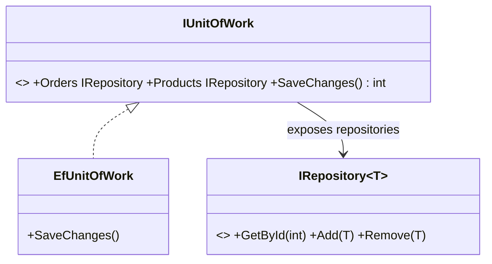

# Repository & Unit of Work: Abstracting Data Access

> **Intent:** *Repository* — mediate between the domain and data layers via a collection-like
> interface. *Unit of Work* — track a set of changes and commit them as one transaction.

## 🧠 Intuition

Scattering SQL or `DbContext` calls throughout your business logic couples it to the database and
makes it impossible to test without one. A **Repository** hides data access behind a simple,
collection-like interface (`Add`, `GetById`, `Remove`) so the domain code reads like it's working
with an in-memory list. A **Unit of Work** groups several repository changes into a single,
all-or-nothing commit.

> 💡 **Analogy — a librarian and a checkout desk.** You ask the librarian (repository) "get me book
> #42" or "add this book" — you don't rummage the shelves (the database) yourself. The checkout desk
> (unit of work) batches all your borrow/return actions and finalizes them together, so either the
> whole transaction goes through or none of it does.

## 🎯 The Problem

```csharp
// ❌ Before: business logic littered with data-access details, untestable, no transaction boundary
class OrderService {
    public void PlaceOrder(Order o) {
        using var conn = new SqlConnection("...");           // SQL leaks into business logic
        conn.Execute("INSERT INTO Orders ...", o);
        conn.Execute("UPDATE Inventory ...", o.Items);       // if THIS fails, the order is orphaned
    }
}
```

## 📐 Structure



**Participants:** `Repository<T>` — collection-like access for one aggregate/entity type · `Unit of
Work` — holds the repositories and a single `SaveChanges()`/commit that wraps them in one transaction.

## 💻 C# Implementation

```csharp
public interface IRepository<T> where T : class {
    T? GetById(int id);
    IEnumerable<T> GetAll();
    void Add(T entity);
    void Remove(T entity);
}

public interface IUnitOfWork : IDisposable {
    IRepository<Order> Orders { get; }
    IRepository<Product> Products { get; }
    int SaveChanges();                 // commit ALL tracked changes as one transaction
}

// EF Core implementation — note EF's DbContext is itself a Unit of Work + repositories
public class EfUnitOfWork : IUnitOfWork {
    private readonly AppDbContext db;
    public EfUnitOfWork(AppDbContext db) {
        this.db = db;
        Orders = new EfRepository<Order>(db);
        Products = new EfRepository<Product>(db);
    }
    public IRepository<Order> Orders { get; }
    public IRepository<Product> Products { get; }
    public int SaveChanges() => db.SaveChanges();   // one commit for everything
    public void Dispose() => db.Dispose();
}

// Business logic now reads cleanly and is transactional
public class OrderService {
    private readonly IUnitOfWork uow;
    public OrderService(IUnitOfWork uow) => this.uow = uow;   // injected (see DI)
    public void PlaceOrder(Order order) {
        uow.Orders.Add(order);
        foreach (var item in order.Items) {
            var product = uow.Products.GetById(item.ProductId)!;
            product.Stock -= item.Quantity;
        }
        uow.SaveChanges();     // order + inventory committed together, or not at all
    }
}
```

`OrderService` has zero SQL, is unit-testable (inject a fake `IUnitOfWork`), and changes commit
atomically.

## ⚖️ Trade-offs

**Pros:** decouples domain from persistence; testable (swap a fake repo/UoW); centralizes query
logic; transaction boundary is explicit; can swap the data store.
**Cons:** **EF Core's `DbContext` already is a repository + unit of work**, so wrapping it again is
often **redundant** and adds a leaky abstraction; generic repositories can hide useful query
capabilities (e.g. `IQueryable` composition); extra layers for little gain in simple apps.

## ✅ When to Use / 🚫 When to Avoid

- **Use when** you want to isolate domain logic from a specific ORM/DB, need to unit-test business
  logic without a database, or must coordinate multi-entity changes in one transaction.
- **Avoid/skip when** you're already using an ORM whose context *is* a UoW+repository — wrapping it
  can be needless indirection. Many teams just inject `DbContext` directly.
- **Misuse:** a generic `IRepository<T>` that exposes `IQueryable` everywhere (the abstraction leaks);
  or building it reflexively without a real need.

## 🔗 Related Patterns

- **[Dependency Injection](01.Dependency-Injection.md):** repositories/UoW are injected into services.
- **[Facade](../02-Structural/02.Facade.md):** a repository is essentially a facade over data access.
- **[Specification](05.Specification.md):** encapsulate query criteria passed to repositories.

## 🌍 Real-World & .NET Examples

- EF Core's `DbContext` (UoW) + `DbSet<T>` (repository); Spring Data repositories.
- Domain-Driven Design layered architectures; clean architecture data layers.

## 🎯 Practice (with full solutions)

### 1. Make business logic DB-free and testable — `Medium`
**Task:** Refactor the SQL-laden `OrderService` from the Problem to use a repository + unit of work.
**Solution:** the injected `IUnitOfWork` version above. In tests:
```csharp
var fakeUow = new FakeUnitOfWork();            // in-memory repos, no DB
new OrderService(fakeUow).PlaceOrder(order);
// assert on fakeUow.Orders / Products and that SaveChanges was called
```
**Why it's better:** business rules are tested without a database, and the order+inventory changes
commit atomically.

### 2. When NOT to add it — `Easy`
**Task:** You're building a small app directly on EF Core. A teammate insists on a generic
`IRepository<T>` wrapping `DbSet<T>`. Push back or agree?
**Solution:** push back (politely). EF's `DbContext`/`DbSet` already provide UoW + repository
semantics; a thin generic wrapper usually adds indirection without benefit and can hide `IQueryable`
power. Add the abstraction only if you need to swap data stores or isolate the domain for testing.
**Why it matters:** knowing when a pattern is *redundant* is as senior as knowing when to use it
(YAGNI).

## ✅ Key Takeaways

- **Repository** = collection-like abstraction over data access; **Unit of Work** = one atomic commit
  across repositories.
- Together they **decouple** domain logic from persistence and make it **testable**.
- **EF Core's `DbContext` already is** a UoW + repositories — don't wrap it reflexively.
- Beware leaky generic repositories; add the layer only when it earns its keep.

**Self-check:**
1. What does a Repository hide from business logic?
2. What guarantee does Unit of Work provide across multiple changes?
3. Why can adding Repository/UoW on top of EF Core be redundant?

---
◀ Prev: [Dependency Injection](01.Dependency-Injection.md) · ▲ [Module index](README.md) · ▶ Next: [CQRS](03.CQRS.md)
