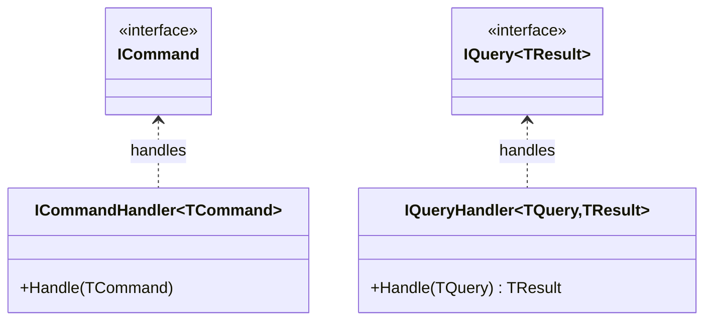

# CQRS: Separate the Write Model From the Read Model

> **Intent:** Command Query Responsibility Segregation — use different models (and often different
> paths) for writing data (commands) and reading data (queries).

## 🧠 Intuition

In many systems, the way you *change* data and the way you *read* it have very different needs.
Writes care about validation, business rules, and consistency; reads care about fast, shaped-for-the-
screen data. CQRS says: stop forcing one model to do both — split **commands** (do something, change
state) from **queries** (return data, change nothing).

> 💡 **Analogy — a restaurant kitchen vs the menu.** Placing an order (command) goes through the
> kitchen with all its rules and checks. Reading the menu (query) is a fast, read-only, nicely
> formatted view. Different concerns, different optimized paths — you wouldn't route a menu lookup
> through the whole cooking process.

It builds on the [Command](../03-Behavioral/03.Command.md) pattern and the CQS principle ("a method
should either change state *or* return data, not both").

## 🎯 The Problem

```csharp
// ❌ Before: one fat service/model does writes AND complex reads, pulling in opposite directions
class ProductService {
    public void UpdatePrice(int id, decimal price) { /* validation, business rules */ }
    public ProductDashboardDto GetDashboard() {      // joins 5 tables, shaped for UI
        /* heavy read query crammed into the same model as the write logic */
    }
}
// The domain model is bloated with read-shaping concerns; reads and writes can't scale separately.
```

## 📐 Structure



**Concepts:** *Command* — an intent to change state (`UpdatePriceCommand`), handled by a command
handler, returns nothing (or just an id/ack). *Query* — a request for data (`GetDashboardQuery`),
handled by a query handler, returns a read-optimized DTO and changes nothing.

## 💻 C# Implementation

```csharp
// --- Command side (writes) ---
public record UpdatePriceCommand(int ProductId, decimal NewPrice);

public class UpdatePriceHandler {
    private readonly IUnitOfWork uow;
    public UpdatePriceHandler(IUnitOfWork uow) => this.uow = uow;
    public void Handle(UpdatePriceCommand cmd) {
        var product = uow.Products.GetById(cmd.ProductId)!;
        if (cmd.NewPrice <= 0) throw new ArgumentException("price must be positive"); // business rule
        product.Price = cmd.NewPrice;
        uow.SaveChanges();
    }
}

// --- Query side (reads) ---
public record GetProductDashboardQuery(int ProductId);
public record ProductDashboardDto(string Name, decimal Price, int UnitsSold);   // shaped for the UI

public class GetProductDashboardHandler {
    private readonly AppDbContext db;
    public GetProductDashboardHandler(AppDbContext db) => this.db = db;
    public ProductDashboardDto Handle(GetProductDashboardQuery q) =>
        db.Products.Where(p => p.Id == q.ProductId)
          .Select(p => new ProductDashboardDto(p.Name, p.Price, p.Orders.Sum(o => o.Qty)))
          .Single();      // read-optimized projection, no domain model needed
}

// Usage (often dispatched via a mediator like MediatR)
updateHandler.Handle(new UpdatePriceCommand(42, 19.99m));
var dto = dashboardHandler.Handle(new GetProductDashboardQuery(42));
```

> **Levels of CQRS:** the simplest is just *separate handlers/models in the same database* (above).
> Advanced CQRS uses **separate read and write databases** kept in sync via events — powerful but far
> more complex. Start simple.

## ⚖️ Trade-offs

**Pros:** read and write models each stay focused and optimizable; reads can be denormalized for
speed; scales reads and writes independently; pairs naturally with event sourcing and task-based UIs.
**Cons:** **more moving parts** (two models, handlers, dispatching); eventual consistency if read/
write stores are separate; real overkill for simple CRUD.

## ✅ When to Use / 🚫 When to Avoid

- **Use when** reads and writes have very different shapes/loads, you need to scale them
  independently, the domain is complex, or you're doing event sourcing/task-based UIs.
- **Avoid when** the app is simple CRUD — CQRS adds ceremony with no payoff (YAGNI). Most apps never
  need the *separate-database* form.
- **Misuse:** applying full event-sourced CQRS to a basic admin panel.

## 🔗 Related Patterns

- **[Command](../03-Behavioral/03.Command.md):** CQRS's command side generalizes the Command pattern.
- **[Mediator](../03-Behavioral/08.Mediator.md):** MediatR dispatches commands/queries to handlers.
- **[Repository & Unit of Work](02.Repository-and-Unit-of-Work.md):** typically used on the write side.

## 🌍 Real-World & .NET Examples

- **MediatR**-based ASP.NET Core apps with `IRequest`/`IRequestHandler` command & query handlers.
- Event-sourced systems; high-scale platforms with read replicas / materialized views.

## 🎯 Practice (with full solutions)

### 1. Split a fat service — `Medium`
**Task:** Refactor the `ProductService` from the Problem into command and query handlers.
**Solution:** the `UpdatePriceCommand`/`UpdatePriceHandler` (write) and
`GetProductDashboardQuery`/`...Handler` (read) above.
**Why it's better:** the write handler holds business rules; the read handler returns a UI-shaped DTO
via a direct projection — neither pollutes the other, and each can evolve/scale separately.

### 2. Right-size it — `Easy`
**Task:** A small CRUD app manages a list of tags (create, rename, list). Should you adopt CQRS with
MediatR, command/query buses, and separate read DB?
**Solution:** No — plain CRUD with a service or directly with EF is simpler and sufficient. CQRS's
benefits (independent scaling, complex read/write divergence) don't apply here; the ceremony is pure
cost (KISS/YAGNI).
**Why it matters:** CQRS is a *scaling/complexity* tool; applying it to simple CRUD is a common
over-engineering trap.

## ✅ Key Takeaways

- CQRS **separates writes (commands)** from **reads (queries)** into distinct models/handlers.
- Commands change state and enforce rules; queries return read-optimized data and change nothing.
- It can be as light as separate handlers, or as heavy as separate read/write databases — **start
  simple**.
- Great for complex/high-scale domains; **overkill for simple CRUD**.

**Self-check:**
1. What's the difference between a command and a query in CQRS?
2. What does the simplest form of CQRS look like vs the advanced form?
3. When is CQRS over-engineering?

---
◀ Prev: [Repository & Unit of Work](02.Repository-and-Unit-of-Work.md) · ▲ [Module index](README.md) · ▶ Next: [Null Object](04.Null-Object.md)
