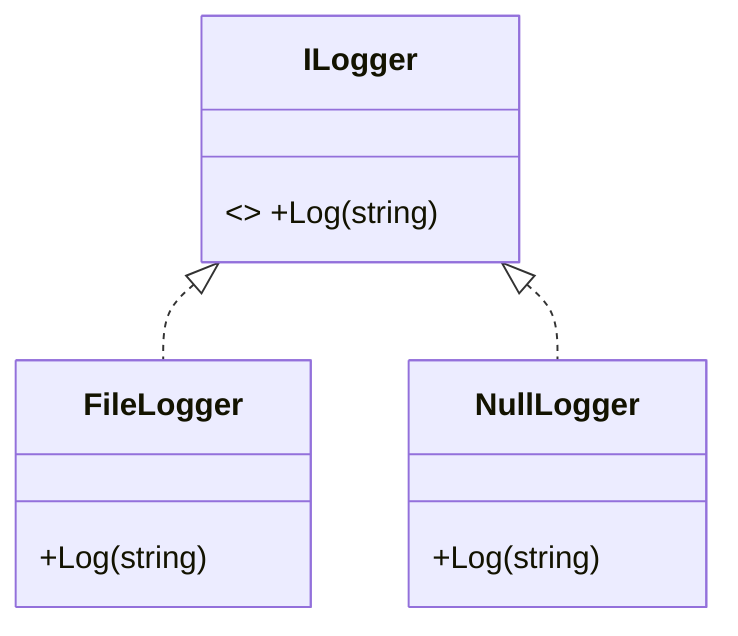

# Null Object: A Do-Nothing Object Instead of null

> **Intent:** Provide an object with neutral ("do nothing") behavior to represent the absence of a
> real object — eliminating null checks.

## 🧠 Intuition

`null` is a landmine: forget one check and you get a `NullReferenceException` (Tony Hoare called null
his "billion-dollar mistake"). The Null Object pattern replaces "no object" with a real object that
implements the same interface but does nothing harmless. Callers stop checking for null because there
*is* no null — just an object that safely does nothing.

> 💡 **Analogy — a substitute teacher who keeps order but teaches nothing.** The class still has *a*
> teacher in the room, so the routine ("teacher, take attendance") works without anyone checking "is
> there a teacher today?" The null object fills the slot harmlessly.

## 🎯 The Problem

```csharp
// ❌ Before: null checks everywhere, and one miss = crash
ILogger? logger = GetLogger();           // might be null
logger?.Log("starting");                  // must remember ?. every single time
if (logger != null) logger.Log("done");   // forget once → NullReferenceException
```

## 📐 Structure



**Participants:** `Abstraction` (ILogger) — the interface · `RealObject` (FileLogger) — does the work
· `NullObject` (NullLogger) — implements the interface with empty/neutral behavior.

## 💻 C# Implementation

```csharp
public interface ILogger { void Log(string message); }

public class FileLogger : ILogger {
    public void Log(string message) => Console.WriteLine($"[file] {message}");
}

public class NullLogger : ILogger {
    public static readonly NullLogger Instance = new();   // one shared, stateless instance
    public void Log(string message) { /* intentionally does nothing */ }
}

// Provider returns a Null Object instead of null
ILogger GetLogger(bool enabled) => enabled ? new FileLogger() : NullLogger.Instance;

// Usage — no null checks anywhere
ILogger logger = GetLogger(enabled: false);
logger.Log("starting");   // safely does nothing; no `?.`, no exception
logger.Log("done");
```

The caller is simpler and **can't** crash on a missing logger — the absence is represented by a safe
object, not `null`.

## ⚖️ Trade-offs

**Pros:** removes scattered null checks; no `NullReferenceException` from this dependency; cleaner
caller code; a sensible default behavior.
**Cons:** can **hide bugs** — a silently-do-nothing object may mask that something genuinely went
wrong (you wanted a logger, got a no-op, and never noticed); not appropriate when "absence" truly
needs handling; one more class.

## ✅ When to Use / 🚫 When to Avoid

- **Use when** "no object" has a sensible neutral behavior (a no-op logger, an empty collection, a
  guest user with no permissions) and you want to eliminate null checks.
- **Avoid when** absence is exceptional and must be handled explicitly — silently doing nothing would
  hide a real error.
- **Misuse:** using a null object to swallow errors that should surface; returning a null object where
  the caller genuinely needs to know the value was missing.

## 🔗 Related Patterns

- **[Strategy](../03-Behavioral/01.Strategy.md):** a null object is a "do-nothing strategy."
- **[Singleton](../01-Creational/05.Singleton.md):** stateless null objects are usually shared as a
  single instance.
- **[State](../03-Behavioral/05.State.md):** a neutral state can be modeled as a null object.

## 🌍 Real-World & .NET Examples

- `Microsoft.Extensions.Logging.Abstractions.NullLogger` / `NullLogger<T>` — the canonical example.
- `Enumerable.Empty<T>()` / returning an empty collection instead of null.
- Guava's `Optional`/C# `Nullable`/`Maybe` types are related "no null" ideas (different mechanism).

## 🎯 Practice (with full solutions)

### 1. Replace null-checking with a null object — `Easy`
**Scenario:** A `Customer` may or may not have a `DiscountPolicy`. Code is full of
`if (policy != null)`. Clean it up.
**Solution:**
```csharp
interface IDiscountPolicy { decimal Apply(decimal price); }
class PercentageDiscount : IDiscountPolicy {
    private readonly decimal pct; public PercentageDiscount(decimal pct) => this.pct = pct;
    public decimal Apply(decimal price) => price * (1 - pct);
}
class NoDiscount : IDiscountPolicy {                 // null object
    public static readonly NoDiscount Instance = new();
    public decimal Apply(decimal price) => price;    // neutral: no change
}
// Customer always has a policy; default to NoDiscount.Instance instead of null.
decimal final = customer.Discount.Apply(price);      // no null check needed
```
**Why it's better:** every customer has *a* policy; the "no discount" case is a real object, so
pricing code never branches on null.

### 2. Know when NOT to use it — `Easy`
**Task:** `FindUserById` returns a `NullUser` (does nothing) when the id doesn't exist. Good idea?
**Solution:** Usually **no** — "user not found" is meaningful and the caller often must react (404,
error). A silent `NullUser` hides the failure. Prefer returning `null`/`User?` or a `Result`/
`Maybe` so the caller handles absence explicitly.
**Why it matters:** Null Object suits *neutral-behavior* absence, not *must-be-handled* absence.

## ✅ Key Takeaways

- Null Object replaces `null` with a real object that **safely does nothing**, removing null checks.
- Best when "absence" has a sensible **neutral behavior** (no-op logger, empty list, guest user).
- Risk: it can **hide genuine errors** — don't use it where absence must be handled.
- Stateless null objects are typically shared as a **single instance**.

**Self-check:**
1. What problem does Null Object eliminate, and how?
2. When does a null object *hide* a bug instead of preventing one?
3. Name a .NET type that is a built-in null object.

---
◀ Prev: [CQRS](03.CQRS.md) · ▲ [Module index](README.md) · ▶ Next: [Specification](05.Specification.md)
