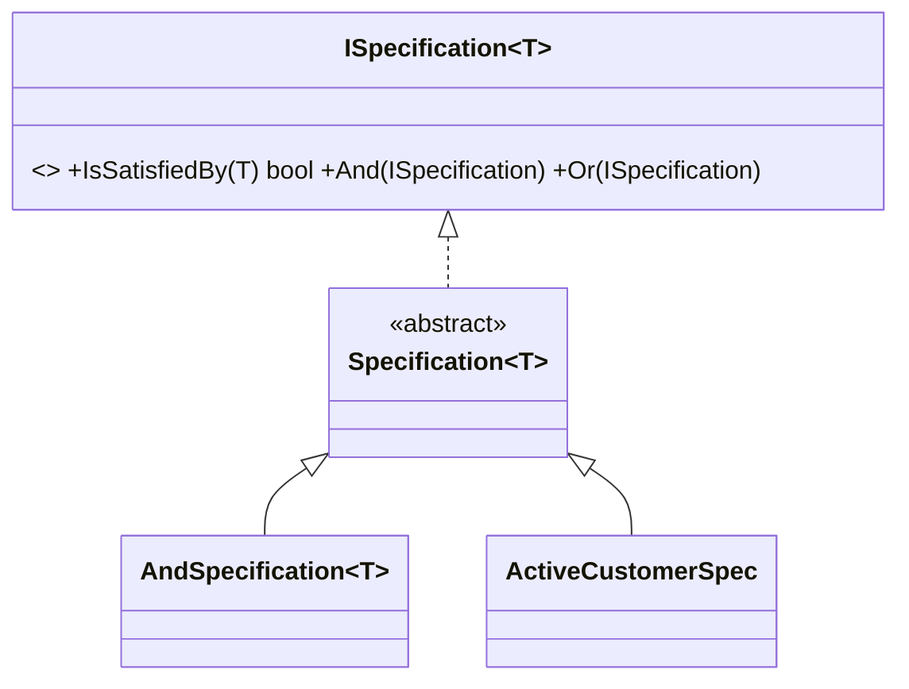

# Specification: Business Rules as Composable Objects

> **Intent:** Encapsulate a business rule (a yes/no test on an object) in its own object that can be
> combined with others using boolean logic.

## 🧠 Intuition

Business rules like "is this customer eligible for a discount?" or "is this product in stock and
on-sale?" tend to get duplicated and tangled across the codebase. The Specification pattern packages
each rule as an object with an `IsSatisfiedBy(candidate)` method — and lets you **combine** rules
with `And`, `Or`, `Not`, like building blocks.

> 💡 **Analogy — a job-application filter.** Each requirement ("5+ years experience", "lives in the
> EU", "knows C#") is a checkbox. You combine them — "(C# AND 5+ years) OR referred" — to filter
> candidates. Each checkbox is reusable; you assemble them per situation.

## 🎯 The Problem

```csharp
// ❌ Before: the same rule logic copy-pasted and combined ad-hoc everywhere
var eligible = customers.Where(c =>
    c.Age >= 18 && c.IsActive && c.TotalSpent > 1000);     // repeated in 6 places, slightly differently
// change the "premium" definition → hunt down every copy
```

## 📐 Structure



**Participants:** `Specification<T>` — defines `IsSatisfiedBy(T)` and combinators (`And`/`Or`/`Not`) ·
`Concrete specifications` — one business rule each · *composite* specs (And/Or/Not) combine others.

## 💻 C# Implementation

```csharp
public interface ISpecification<T> {
    bool IsSatisfiedBy(T candidate);
}

// Base class providing combinators
public abstract class Specification<T> : ISpecification<T> {
    public abstract bool IsSatisfiedBy(T candidate);
    public Specification<T> And(Specification<T> other) => new AndSpecification<T>(this, other);
    public Specification<T> Or(Specification<T> other) => new OrSpecification<T>(this, other);
    public Specification<T> Not() => new NotSpecification<T>(this);
}

public class AndSpecification<T> : Specification<T> {
    private readonly Specification<T> a, b;
    public AndSpecification(Specification<T> a, Specification<T> b) { this.a = a; this.b = b; }
    public override bool IsSatisfiedBy(T c) => a.IsSatisfiedBy(c) && b.IsSatisfiedBy(c);
}
public class OrSpecification<T> : Specification<T> {
    private readonly Specification<T> a, b;
    public OrSpecification(Specification<T> a, Specification<T> b) { this.a = a; this.b = b; }
    public override bool IsSatisfiedBy(T c) => a.IsSatisfiedBy(c) || b.IsSatisfiedBy(c);
}
public class NotSpecification<T> : Specification<T> {
    private readonly Specification<T> inner;
    public NotSpecification(Specification<T> inner) => this.inner = inner;
    public override bool IsSatisfiedBy(T c) => !inner.IsSatisfiedBy(c);
}

// Concrete rules — each named, reusable, testable
public class AdultSpec : Specification<Customer> {
    public override bool IsSatisfiedBy(Customer c) => c.Age >= 18;
}
public class ActiveSpec : Specification<Customer> {
    public override bool IsSatisfiedBy(Customer c) => c.IsActive;
}
public class BigSpenderSpec : Specification<Customer> {
    public override bool IsSatisfiedBy(Customer c) => c.TotalSpent > 1000;
}

// Usage — compose the "premium" rule once, reuse it everywhere
var premium = new AdultSpec().And(new ActiveSpec()).And(new BigSpenderSpec());
var eligible = customers.Where(premium.IsSatisfiedBy);
```

The "premium customer" rule now has **one definition**, is unit-testable in isolation, and is built
from reusable parts.

## ⚖️ Trade-offs

**Pros:** business rules become named, reusable, testable objects; combine them with And/Or/Not;
single source of truth for each rule; great for validation, filtering, eligibility.
**Cons:** more classes/ceremony than an inline lambda; can be over-engineering for one-off checks;
naive in-memory specs don't translate to SQL (need expression-based specs for `IQueryable`/EF).

## ✅ When to Use / 🚫 When to Avoid

- **Use when** complex business rules are **reused and combined** across the app, need to be tested in
  isolation, or are selected/composed at runtime (eligibility, validation, search filters).
- **Avoid when** a rule is a simple one-off — a `Func<T,bool>`/lambda is lighter (KISS).
- **Misuse:** building a specification framework for a single trivial predicate; or using in-memory
  specs where you actually need them translated to a database query.

## 🔗 Related Patterns

- **[Strategy](../03-Behavioral/01.Strategy.md):** a specification is essentially a boolean strategy.
- **[Composite](../02-Structural/05.Composite.md):** And/Or/Not specs compose into a tree like a
  composite.
- **[Interpreter](../03-Behavioral/11.Interpreter.md):** combining specs builds a small boolean
  expression tree.
- **[Repository](02.Repository-and-Unit-of-Work.md):** specs are often passed to repositories to
  shape queries.

## 🌍 Real-World & .NET Examples

- Domain-Driven Design (Eric Evans introduced the pattern); validation rule engines.
- EF Core query specifications (`Expression<Func<T,bool>>`-based specs used with repositories).
- Search/filter builders; eligibility/pricing rule systems.

## 🎯 Practice (with full solutions)

### 1. De-duplicate a business rule — `Medium`
**Task:** "In-stock AND on-sale" products are queried in several places with copy-pasted lambdas.
Encapsulate it.
**Solution:**
```csharp
class InStockSpec : Specification<Product> {
    public override bool IsSatisfiedBy(Product p) => p.Stock > 0;
}
class OnSaleSpec : Specification<Product> {
    public override bool IsSatisfiedBy(Product p) => p.IsOnSale;
}
var featured = new InStockSpec().And(new OnSaleSpec());
var toShow = products.Where(featured.IsSatisfiedBy);
```
**Why it's better:** the "featured" rule is defined once, named, testable, and reusable; changing it
updates every usage.

### 2. Compose at runtime — `Easy`
**Scenario:** A UI lets users toggle filters ("adults", "active", "big spenders"). Combine the chosen
ones dynamically.
**Solution:**
```csharp
var chosen = new List<Specification<Customer>>();
if (filterAdults) chosen.Add(new AdultSpec());
if (filterActive) chosen.Add(new ActiveSpec());
Specification<Customer> combined = chosen.Aggregate((a, b) => a.And(b));
var results = customers.Where(combined.IsSatisfiedBy);
```
**Why it's better:** rules are first-class objects, so they can be selected and combined at runtime —
impossible with hard-coded conditionals.

## ✅ Key Takeaways

- Specification packages a **business rule** as an object with `IsSatisfiedBy`, **combinable** via
  And/Or/Not.
- It gives each rule a **single definition** that's reusable, testable, and runtime-composable.
- It's a boolean [Strategy](../03-Behavioral/01.Strategy.md) that composes like a
  [Composite](../02-Structural/05.Composite.md).
- For one-off checks a lambda is simpler; for DB queries use expression-based specs.

**Self-check:**
1. What does `IsSatisfiedBy` represent, and why package rules as objects?
2. How do And/Or/Not specifications compose?
3. When is a plain `Func<T,bool>` the better choice?

---
◀ Prev: [Null Object](04.Null-Object.md) · ▲ [Module index](README.md) · ▶ Next module: [05 — Practice & Beyond](../05-Practice-and-Beyond/01.Anti-Patterns.md)
