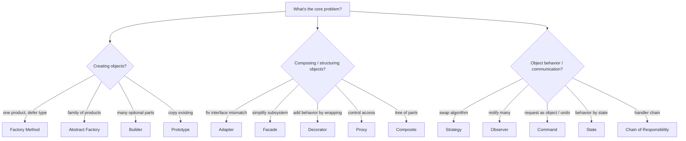

# Choosing a Pattern: From Problem Signals to the Right Tool

## 🧠 Intuition

The hard part of design patterns isn't implementing them — it's **recognizing which one a problem
wants**, and not confusing the lookalikes. This page is your decision aid: a signal→pattern table, a
decision flow, and crisp disambiguations of the pairs interviewers love.

> 💡 Golden rule: **start from the problem, not the pattern.** Patterns are answers; if you don't have
> the matching question, you don't need the answer. When unsure, the simplest code that works wins.

## 📐 Signal → Pattern

| When the problem is about… | Consider | Category |
|----------------------------|----------|----------|
| Creating objects without naming concrete classes | [Factory Method](../01-Creational/01.Factory-Method.md) | Creational |
| Creating *families* of matching objects | [Abstract Factory](../01-Creational/02.Abstract-Factory.md) | Creational |
| Building a complex object with many optional parts | [Builder](../01-Creational/03.Builder.md) | Creational |
| Copying an expensive/configured object | [Prototype](../01-Creational/04.Prototype.md) | Creational |
| Guaranteeing exactly one instance | [Singleton](../01-Creational/05.Singleton.md) / DI singleton | Creational |
| Making a mismatched interface usable | [Adapter](../02-Structural/01.Adapter.md) | Structural |
| Simplifying a complex subsystem | [Facade](../02-Structural/02.Facade.md) | Structural |
| Adding behavior dynamically by wrapping | [Decorator](../02-Structural/03.Decorator.md) | Structural |
| Controlling access (lazy/cache/security/remote) | [Proxy](../02-Structural/04.Proxy.md) | Structural |
| Treating trees (part-whole) uniformly | [Composite](../02-Structural/05.Composite.md) | Structural |
| Two dimensions varying independently | [Bridge](../02-Structural/06.Bridge.md) | Structural |
| Sharing many objects to save memory | [Flyweight](../02-Structural/07.Flyweight.md) | Structural |
| Swapping interchangeable algorithms | [Strategy](../03-Behavioral/01.Strategy.md) | Behavioral |
| One-to-many change notification | [Observer](../03-Behavioral/02.Observer.md) | Behavioral |
| Undo/redo, queues, requests as objects | [Command](../03-Behavioral/03.Command.md) | Behavioral |
| Fixed algorithm skeleton, varying steps | [Template Method](../03-Behavioral/04.Template-Method.md) | Behavioral |
| Behavior depends on internal state/mode | [State](../03-Behavioral/05.State.md) | Behavioral |
| Traversing a collection without exposing it | [Iterator](../03-Behavioral/06.Iterator.md) | Behavioral |
| A request handled by one of many handlers | [Chain of Responsibility](../03-Behavioral/07.Chain-of-Responsibility.md) | Behavioral |
| Untangling many-to-many object communication | [Mediator](../03-Behavioral/08.Mediator.md) | Behavioral |
| Capturing/restoring state (snapshots) | [Memento](../03-Behavioral/09.Memento.md) | Behavioral |
| Adding operations to a stable type set | [Visitor](../03-Behavioral/10.Visitor.md) | Behavioral |
| Evaluating a small grammar/expression | [Interpreter](../03-Behavioral/11.Interpreter.md) | Behavioral |
| Decoupling/testing dependencies | [Dependency Injection](../04-Modern-and-Enterprise/01.Dependency-Injection.md) | Modern |
| Abstracting data access / atomic commits | [Repository & Unit of Work](../04-Modern-and-Enterprise/02.Repository-and-Unit-of-Work.md) | Modern |
| Diverging read vs write models at scale | [CQRS](../04-Modern-and-Enterprise/03.CQRS.md) | Modern |
| Removing null checks | [Null Object](../04-Modern-and-Enterprise/04.Null-Object.md) | Modern |
| Reusable, composable business rules | [Specification](../04-Modern-and-Enterprise/05.Specification.md) | Modern |

## 🧭 A Decision Flow

## 🆚 The Lookalikes (know these cold)

### Strategy vs State
Same structure (hold an interface, delegate). **Strategy:** the *client* picks the algorithm; it
usually doesn't change itself. **State:** the object *changes its own* behavior as its internal state
evolves, and states often drive transitions.

### Strategy vs Template Method
Both vary an algorithm. **Strategy** = *composition* (inject the whole algorithm; runtime-swappable).
**Template Method** = *inheritance* (base class fixes the skeleton, subclasses override steps).

### Adapter vs Facade vs Decorator vs Proxy
| | Changes the interface? | Adds behavior? | Purpose |
|--|------------------------|----------------|---------|
| **Adapter** | Yes (to an expected one) | No | Fix an interface mismatch |
| **Facade** | Yes (new, simpler) | No | Simplify a whole subsystem |
| **Decorator** | No (same interface) | **Yes** | Add behavior by wrapping |
| **Proxy** | No (same interface) | No (controls access) | Lazy/cache/security/remote |

### Factory Method vs Abstract Factory
**Factory Method:** one method, one product, subclass decides the type. **Abstract Factory:** an
object with several factory methods producing a *family* of related products.

### Decorator vs Composite
Both recurse. **Decorator** = a *chain* that wraps one object to add behavior. **Composite** = a
*tree* that treats groups and leaves uniformly.

### Mediator vs Observer
**Observer** = one-to-many *broadcast* (subject → observers). **Mediator** = many-to-many
*coordination* through a hub that holds the interaction logic.

### Adapter vs Bridge
**Adapter** fixes a mismatch *after the fact*. **Bridge** is *designed up front* to let two
dimensions vary independently.

### Proxy vs Decorator
Identical structure. **Proxy controls access**; **Decorator adds features**. Intent is the divider.

## 🚫 When to Use *No* Pattern

- The code is simple and stable → plain methods/classes win ([KISS](../00-Foundations/04.Composition-and-Principles.md)).
- You're guessing at future needs → [YAGNI](../00-Foundations/04.Composition-and-Principles.md); add
  the pattern when the need is real.
- A single implementation that never varies → an interface+factory is just ceremony.

See [Anti-Patterns](01.Anti-Patterns.md) for "Pattern Fever."

## 🎯 Practice (with full solutions)

### 1. Name the pattern — `Easy`
**Task:** Identify the best-fit pattern:
(a) "Add caching to an existing service without changing it."
(b) "An order behaves differently when New, Paid, or Shipped."
(c) "Build a complex `HttpRequest` with many optional headers."
(d) "Notify several widgets when a value changes."
**Solution:** (a) [Proxy](../02-Structural/04.Proxy.md) (caching proxy) — or [Decorator](../02-Structural/03.Decorator.md)
if you frame it as *adding behavior*; the *access-control/caching* framing makes it Proxy. (b)
[State](../03-Behavioral/05.State.md). (c) [Builder](../01-Creational/03.Builder.md). (d)
[Observer](../03-Behavioral/02.Observer.md).
**Why it matters:** mapping signals → patterns is the whole skill; note (a) shows intent decides
between structural lookalikes.

### 2. Disambiguate — `Easy`
**Task:** A class holds an `ICompressor` purely so the caller can choose gzip vs zip; it never changes
during the object's life. State or Strategy?
**Solution:** **Strategy** — externally chosen, stable, no self-transitions. State is for
self-changing behavior over a lifecycle.
**Why it matters:** same structure, different intent — the classic interview trap.

## ✅ Key Takeaways

- **Start from the problem**; use the signal→pattern table to shortlist, then pick by *intent*.
- Memorize the **lookalike distinctions** — they're the most common interview questions.
- Structural lookalikes split on two axes: *changes the interface?* and *adds behavior?*.
- **Sometimes the right answer is no pattern** — favor simplicity until a real need appears.

**Self-check:**
1. How do Decorator and Proxy differ given identical structure?
2. Strategy vs State — what's the deciding factor?
3. When should you deliberately *not* apply a pattern?

---
◀ Prev: [Anti-Patterns](01.Anti-Patterns.md) · ▲ [Module index](README.md) · ▶ Next: [Study Plan](03.Study-Plan.md)
